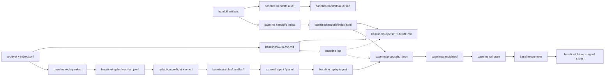

# Baseline Knowledge + Replay Plan

> **Status:** `IN PROGRESS` - execution tracker for issues #23, #25, and #26. **Owner:** `avidullu`. **Created:** `2026-07-07`. **Last updated:** `2026-07-07`
> **Lifecycle:** `DRAFT -> IN PROGRESS -> DONE -> archived`
> **Tracking anchors:** Section 7 is the source of truth; indexed in `docs/README.md`; pointer in `SESSION_HANDOFF.md`.
> **Relation to existing docs:** extends `docs/BASELINE_LOOP_CLOSURE.md`, `docs/CALIBRATION_EFFICACY.md`, and `docs/COMPOSE_STACK.md`; treats issue #19 as a shared provenance dependency.
> **Honesty note:** claims marked `[verified]` were checked against this repo or the linked issue text; `[researched]` items come from external sources in Section 10; `[design]` items are not implemented yet.

---

## 0. TL;DR

Build the compounding knowledge layer, report-only handoff audit, and replay
pipeline as one safety-first program. The shared substrate is a deterministic,
human-gated `baseline/SCHEMA.md`, #19-aligned trace fields, marker-owned project
pages, and lint gates. Report-only handoff coverage can ship early; any generated
knowledge writes or replay egress wait for schema, provenance, ingest-integrity,
and redaction contracts.

## 1. Problem & goal

**Problem:** the baseline loop can ingest structured proposals and publish
reviewed guardrails, but it does not yet compound project knowledge, mine the
repo's own handoff conventions, or replay archived sessions to compare alternate
agent outputs. Issues #23, #25, and #26 are three faces of the same product:
turn archived work into reviewable knowledge that improves future sessions
without giving an LLM silent write access to policy.

**Goal:** a safe knowledge-and-replay pipeline where:

1. Project pages accumulate durable, cross-linked knowledge with explicit
   provenance.
2. Session handoffs become normalized evidence records and proposal inputs.
3. Replay packets can be generated deterministically, executed out-of-band by a
   different agent or panel, and ingested only as human-reviewable proposals.
4. Lint, calibration, and promotion gates prove the loop compounds knowledge
   instead of rewriting history.

## 2. Decisions locked

| # | Decision | Source / date | Implication |
|---|---|---|---|
| D1 | Do `baseline/SCHEMA.md` before generated knowledge writes or replay egress. | #26 + research, 2026-07-07 | Derived pages, proposals, replay bundles, and ingested replay results get ownership, provenance, and lint rules before they write. A report-only handoff coverage audit may ship earlier. |
| D2 | Keep raw sources immutable and derived pages deterministic. | LLM-wiki prior art `[researched]` | Use marker-block upserts and generated sections; do not let an LLM freely rewrite project pages. |
| D3 | Ship handoff mining before replay. | #23/#25 scope comparison `[design]` | Handoffs are already summary artifacts, so they validate schema/provenance with less execution risk. |
| D4 | Replay execution is out-of-band in v1. | #25 + eval tooling research `[researched]` | This repo selects and bundles sessions; another agent/panel runs the replay and submits structured output. |
| D5 | Exclude coding sessions from replay v1. | #25 non-goal `[verified]` | No workspace snapshots means code replay would be misleading until commit/worktree provenance exists. |
| D6 | Align lightweight provenance to #19 trace fields now. | #19 dependency `[design]` | Use `source`, `source_file`, `markdown_path`, `session_id`, `timestamp`, `project_slug`, `repo`, and evidence anchors so v1 is a subset of the eventual trace model. |
| D7 | Do not build search or embeddings for v1. | `docs/COMPOSE_STACK.md` + #23/#26 non-goals `[verified]` | Use deterministic indexes, JSONL manifests, and markdown pages; search/live memory stays external. |
| D8 | Reuse the shipped marker grammar and content-preserving upsert. | `baseline_promote.py`, TD4 #31 `[verified]` | Do not introduce a second `baseline:knowledge:*` marker family; extend helpers around `baseline:begin/end`. |
| D9 | Keep existing tracker rows as shared capability owners. | `docs/BASELINE_LOOP_CLOSURE.md` §7 `[verified]` | K rows implement #23/#25/#26 slices, but P5/P6/P10/P11 remain the umbrella rows for shared loop capabilities. |
| D10 | Treat replay bundle redaction as a first-class safety deliverable. | PR #45 review, 2026-07-07 | K10 cannot create egress bundles until deterministic secret scanning, bundle gitignore coverage, and a redaction report exist. |
| D11 | External proposals need provenance-integrity checks before becoming candidates. | `baseline_ingest.py`, PR #45 review `[verified]` | Replay/handoff proposal ingest must verify `replay_of` and evidence trace references against `archive/index.jsonl`, not rely only on human promote review. |

## 3. Foundation - research and prior art

| Source | Useful takeaway | Design consequence |
|---|---|---|
| LLM-wiki concept `[researched]` | Keep raw sources as immutable input, maintain structured interlinked markdown, and use schema/index/lint conventions. | `baseline/SCHEMA.md`, project-page marker blocks, page indexes, stale/orphan/contradiction lint. |
| Reflexion `[researched]` | Verbal reflections can improve later agent behavior without changing model weights. | Treat handoffs and replay judgments as reflection-like evidence, not as automatic policy. |
| Generative Agents `[researched]` | Experiences can be stored, reflected into higher-level summaries, and retrieved for planning. | Separate raw archive, normalized records, synthesized project pages, and future prompt packets. |
| Contextual Experience Replay `[researched]` | Past experiences can be accumulated and synthesized into a memory buffer for training-free improvement. | Replay and handoff outputs should land as structured, reviewable experience records. |
| AgentRR `[researched]` | Recording and summarizing agent trajectories supports replay for similar tasks. | `baseline replay select` should emit deterministic manifests and bundles tied to session identity. |
| AgentHER `[researched]` | Failed trajectories can be relabeled into useful training data when classification and confidence gates are explicit. | Replay ingest needs rubrics, confidence, judge identity, and human gates; no blind promotion. |
| Helicone replay / LangSmith trajectory evals / OpenAI agent evals `[researched]` | Production replay/eval systems rely on traces, graders, and full interaction context. | Because this repo has archived transcripts but not always full tool traces, v1 replay stays conservative. |
| W3C PROV-DM `[researched]` | Provenance models connect entities, activities, agents, derivations, and bundles. | Use the concept of derivation, but keep field names aligned to issue #19's concrete breadcrumb vocabulary. |

## 4. Architecture



### 4.1 Relation to existing tracker rows and code

This doc is the execution tracker for issues #23, #25, and #26, but it must not
fork shared baseline-loop work already tracked in `docs/BASELINE_LOOP_CLOSURE.md`.

| This plan | Existing owner | Reconciliation |
|---|---|---|
| K3 project-page upserts | TD4 content-preserving promote, shipped in #31 | Reuse or generalize `upsert_promoted_content()` and `parse_promoted_blocks()` instead of writing a second marker-block system. |
| K4 `baseline lint` | P6 contradiction detection | K4 is the #26 implementation slice for P6 plus link/staleness/orphan checks; close or cross-link P6 when K4 lands. |
| K8/K11 replay select/ingest | P5 cross-agent project correlation | Replay provenance should feed P5 once correlation exists; K8 can start without P5, but K11 must preserve agent/lineage fields for it. |
| K9/K10 replay redaction and bundles | P10/P11 watchlist + tombstone/redaction design | K10 is hard-blocked on K9's deterministic redaction preflight. K9 may reuse P10/P11 helpers when they exist, but this tracker owns the replay-bundle egress gate. |

### 4.2 Knowledge layer (#26)

Add `baseline/SCHEMA.md` as the contract for derived knowledge:

- Page types: global guardrail, project page, handoff index, replay manifest,
  proposal, candidate, calibration report.
- Ownership: human-owned prose, generated marker blocks, append-only ledgers.
- Trace/provenance fields aligned to #19: `source`, `source_file`,
  `markdown_path`, `session_id`, `timestamp`, `project_slug`, `repo`,
  `evidence_anchor`, `evidence_excerpt`, `transform`, `bundle_id`, and
  optional `calibration_effect`.
- Link rules: every generated block links to source evidence or a proposal id.
- Lint rules: schema conformance, broken links, orphan pages, stale generated
  blocks, duplicate claims, and contradiction candidates.
- Validation mechanism: `baseline/SCHEMA.md` is the human-readable contract;
  conformance is enforced by `baseline lint` and command-specific validators.
  `baseline/proposals/proposal.schema.json` is currently an illustrative example,
  while `agent_sessions/baseline_ingest.py` is the actual proposal validator.

Project pages remain markdown, but generated regions are bounded:

```markdown
<!-- baseline:begin id="knowledge.handoff-patterns" -->
...
<!-- baseline:end id="knowledge.handoff-patterns" -->
```

The first pass should update only marker-owned blocks. Human prose remains
outside generated blocks. Metadata such as `generated_by` should live inside the
block body or in structured sidecars unless K1 deliberately extends the existing
parser grammar used by both promote and publish.

### 4.3 Handoff mining (#23)

Handoff mining should be deterministic and auditable:

- Discover `SESSION_HANDOFF.md`, `session-handoff.md`, `MEMORY.md` start-here
  pointers, and agent-specific handoff sections in archived sessions.
- K2 `baseline handoffs audit` writes only `baseline/handoffs/audit.md` as a
  coverage/freshness report; it does not write pages, proposals, or indexes.
- K6 `baseline handoffs index` normalizes records into
  `baseline/handoffs/index.jsonl`.
- Feed stable patterns into project pages and K7 proposal JSON. Project-page
  feed dates should change only when the generated feed content changes, so
  periodic runs do not create date-only diffs.
- K7 `baseline handoffs proposals` converts indexed records for configured or
  already-scaffolded projects into deterministic proposal JSON under
  `baseline/proposals/`; it refuses to overwrite hand-written proposals and
  leaves promotion to the existing review/ingest flow.
- Extract structured fields with heading/marker scraping only. This is
  deterministic for repo handoffs that follow the local convention (`## Next
  Steps / Open Threads`, ramp-up kit, decisions), but arbitrary formats are
  best-effort: non-conforming handoffs are flagged with parse warnings, not
  silently summarized or mis-parsed.
- Derive project slugs explicitly: `archive/index.jsonl` carries `messages`,
  `sha256`, and `markdown` at top level, but `cwd` and `project` live under
  each record's `metadata`. The current `metadata.project` value is a
  URL-encoded absolute path, so K6/K8 need a decode-and-slug step with tests.

Suggested normalized handoff record:

```json
{
  "id": "handoff.agent-sessions.2026-07-07.codex",
  "project_slug": "agent-sessions",
  "project_raw": "%2FC%3A%2FUsers%2Favidu%2FProjects%2FAgent%20Sessions",
  "repo": "https://github.com/avidullu/agent-sessions",
  "source_kind": "repo-handoff",
  "observed_at": "2026-07-07T00:00:00Z",
  "open_threads": ["baseline knowledge + replay design"],
  "key_decisions": ["schema before replay"],
  "ramp_up_links": ["docs/BASELINE_KNOWLEDGE_REPLAY_PLAN.md"],
  "parse_warnings": [],
  "trace": [
    {
      "source": "codex",
      "source_file": "SESSION_HANDOFF.md",
      "markdown_path": "SESSION_HANDOFF.md",
      "session_id": null,
      "timestamp": "2026-07-07T00:00:00Z",
      "project_slug": "agent-sessions",
      "repo": "https://github.com/avidullu/agent-sessions",
      "evidence_anchor": "## Next Steps / Open Threads",
      "evidence_excerpt": "schema/compiled wiki first, handoff mining as the first producer",
      "transform": "handoff-heading-extraction"
    }
  ]
}
```

### 4.4 Replay loop (#25)

Replay v1 is selection, packaging, and ingest - not local autonomous execution.

Proposed CLI:

- `baseline replay select --kind planning --limit 20`
  - deterministically picks sessions with enough self-contained context,
    excludes coding sessions, and writes a manifest.
- `baseline replay bundle --manifest <path>`
  - runs redaction preflight, writes a redaction report, then creates gitignored
    prompt/evidence packets with rubric files only if the safety gate passes.
- `baseline replay ingest --result <path>`
  - validates an external replay result, verifies archive references, and
    converts improvements into structured proposals or candidate records.

The nested CLI shape is intentional in this design for readability. The current
baseline CLI is flat (`suggest`, `promote`, `publish`, `ingest`, `bundle`, etc.),
so K7 must either add nested subparsers deliberately or choose flat names such as
`replay-select` / `replay-bundle` and document the convention.

Replay result minimum fields:

- `replay_of`: original archive/session id.
- `replayer`: agent, model family if known, and lineage different from original.
- `rubric_version`: versioned scoring prompt or panel rubric.
- `claim`: what the alternate run improves.
- `evidence`: original excerpt ids plus replay output ids.
- `confidence`: numeric or enum, with explanation.
- `recommended_action`: `proposal`, `watchlist`, or `reject`.

Replay ingest cannot rely on the current shallow `validate_proposal()` alone.
For `source_kind = "replay"` or `source_kind = "handoff"`, ingest must:

- verify `replay_of`, when present, resolves to an `archive/index.jsonl` record;
- verify each structured trace `markdown_path` or `session_id` resolves to an
  archive record, or report a rejected proposal with the missing reference;
- thread accepted trace fields through `Prediction`, `proposal_to_prediction()`,
  `prediction_to_dict()`, and prediction sidecars so provenance survives ingest.

Existing free-text `evidence` entries can remain valid for hand-written
proposals, but external replay/handoff producers must supply structured trace
records before their outputs become candidates.

Daily automation follows #25: it may run only deterministic queueing stages
(`replay select` and `replay bundle`) after R1-select, R2-dedup, and R5-safety
pass on fixtures/sampled bundles. Replay execution, judging, ingest review, and
promotion stay human-triggered.

Replay gate names keep issue #25's vocabulary:

| Gate | Meaning |
|---|---|
| R1-select | Reviewed selected sessions are genuinely replayable. |
| R2-dedup | Re-running select/bundle with no new sessions produces zero new manifest entries. |
| R3-signal | At least one replay-derived proposal validates end to end. |
| R4-value | Acceptance rate of `replay.*` candidates is measured against keyword-derived and handoff-derived candidates in the ledger. Pause replay expansion if the first 20 reviewed replay candidates produce zero accepts, or if replay acceptance is less than half the baseline candidate acceptance rate. |
| R5-safety | Bundles are redacted, gitignored, and contain no sampled secrets. |

### 4.5 Redaction and egress safety

Replay bundles are the only planned artifact that can carry full archived task
prompts and original deliverables to an external replayer or judge. That makes
redaction a first-class deliverable, not an implementation detail inside K10.

V0 redaction is deterministic and fail-closed:

- Scan task prompts, original deliverables, selected excerpts, filenames, and
  bundle metadata before writing any external packet.
- Detect common high-confidence secret forms: GitHub tokens (`ghp_`, `gho_`,
  `github_pat_`), OpenAI-style `sk-` keys, AWS access keys, private-key blocks,
  Slack `xox*` tokens, connection strings with passwords, and environment
  assignments for names containing `TOKEN`, `SECRET`, `PASSWORD`, `API_KEY`, or
  `PRIVATE_KEY`.
- Replace lower-risk private paths/emails with stable placeholders when doing so
  does not destroy task meaning; block the bundle when a high-confidence secret
  appears.
- Write a `redaction-report.json` beside the gitignored bundle with counts,
  placeholder ids, blocked reasons, source refs, and scanner version.
- Add gitignore coverage for replay bundles before any bundle-writing command
  exists.

K10 is blocked until this preflight has fixture coverage and R5-safety is
passing. If P10/P11 redaction helpers land first, K9 reuses them; otherwise this
tracker ships the minimal deterministic scanner as the replay egress gate.

## 5. Artifacts and contracts

| Path | Writer | Reader | Notes |
|---|---|---|---|
| `baseline/SCHEMA.md` | Human-reviewed docs PR | all baseline producers | Required before generated knowledge writes. |
| `baseline/projects/<slug>/README.md` | humans + marker-block upserts | agents and reviewers | Existing page shape is reused. |
| `baseline/handoffs/index.jsonl` | `baseline handoffs index` | project page updater, proposal generator | Deterministic, append/upsert by source id. |
| `baseline/handoffs/audit.md` | `baseline handoffs audit` | human reviewer | Human-readable gaps and confidence. |
| `baseline/replay/manifest.jsonl` | `baseline replay select` | bundle command | Tracked only if it contains session refs/exclusion reasons and no excerpts. |
| `baseline/replay/bundles/*` | `baseline replay bundle` | external replayer/panel | Gitignored; bundles may contain session excerpts. |
| `baseline/replay/bundles/*/redaction-report.json` | redaction preflight | human reviewer, R5-safety | Gitignored by default; records scanner version, replacements, and blocked reasons. |
| `baseline/replay/ledger.jsonl` | `baseline replay ingest` | calibration/eval | Append-only replay result history. |
| `baseline/proposals/*.json` | humans, `baseline handoffs proposals`, replay ingest | `baseline ingest` | Replay/handoff producers include structured trace fields that ingest validates against `archive/index.jsonl`. |

## 6. Honest limits - what this does NOT do

- No embeddings or semantic search in v1.
- No automatic promotion from handoff or replay findings.
- No free-form LLM rewrite of `baseline/projects/*`.
- No coding-session replay until snapshots or commit/worktree provenance exist.
- No replacement for the existing promote, publish, calibrate, and efficacy gates.

## 7. Deliverables & progress tracker

Legend: `Todo`, `In progress`, `Done`, `Blocked/gated`. One small PR per row.

| ID | Deliverable | Issue | Depends on | Gated? | Status | PR |
|---|---|---|---|---|---|---|
| K0 | Tracked design plan, docs index, and handoff pointer | #23/#25/#26 | - | No | Done | #45 |
| K1 | `baseline/SCHEMA.md` with page types, existing marker grammar, #19-aligned trace fields, and lint/validator contract | #26/#19 | K0 | Yes | Done | #46 |
| K2 | Report-only `baseline handoffs audit` coverage/freshness report; writes `baseline/handoffs/audit.md` only and no page/proposal/index writes | #23 | K0 | No | Done | #47 |
| K3 | Reuse/extend `upsert_promoted_content()` for project-page generated sections | #26 | K1, TD4 #31 | Yes | Done | #48 |
| K4 | `baseline lint` skeleton for schema, links, stale blocks, orphan pages, and P6 contradiction checks | #26 | K1,K3 | Yes | Done | #49 |
| K5 | Proposal + `Prediction` trace-field extension and ingest reference validation against `archive/index.jsonl` | #19/#23/#25 | K1 | Yes | Done | #50 |
| K6 | `baseline handoffs index` discovery records in `baseline/handoffs/index.jsonl` and project-page feed | #23/#26 | K2,K3,K5 | No | Done | #51 |
| K7 | Handoff-derived proposal generation with trace records | #23 | K5,K6 | Yes | In progress | - |
| K8 | `baseline replay select` deterministic manifests, excluding coding sessions | #25 | K1 | No | Todo | - |
| K9 | Replay redaction v0: deterministic scanner, redaction report, fixture tests, and bundle gitignore coverage | #25 | K0, P10/P11 design | Yes | Todo | - |
| K10 | `baseline replay bundle` gitignored packets with rubric files after redaction preflight | #25 | K8,K9 | Yes | Todo | - |
| K11 | `baseline replay ingest` validates external replay results into proposals/candidates | #25 | K5,K10 | Yes | Todo | - |
| K12 | Efficacy gates for schema lint, handoff precision, replay R1-R5, and proposal acceptance | #23/#25/#26 | K4,K7,K11 | Yes | Todo | - |

Additional gate names:

- `W1-schema`: `baseline lint` validates marker grammar, generated-block
  ownership, and schema references.
- `W2-links`: generated cross-links resolve and no project page is orphaned.
- `H1-handoff-precision`: fixture handoff patterns are detected while irrelevant
  docs are ignored.
- `H2-handoff-freshness`: stale and missing handoffs are reported with reasons.
- `R1-select` through `R5-safety`: replay gates from issue #25. Watchlist/tombstone
  `E7` remains owned by P11 in `docs/BASELINE_WATCHLIST_TOMBSTONES.md`.

## 8. Related issue triage

| Issue | Fold into this plan? | Reason |
|---|---|---|
| #19 - provenance trace logs | Yes, as substrate | Replay and handoff evidence need trace ids; v1 trace fields should be a strict subset of #19's breadcrumb vocabulary. |
| #23 - mine handoffs | Yes, primary | First producer for the knowledge layer. |
| #25 - replay loop | Yes, primary | Second producer after schema, handoff mining, and redaction contracts. |
| #26 - wiki-style knowledge layer | Yes, primary | Foundation for both handoff mining and replay output. |
| #32 - backfill/regenerate | No, boundary | Useful for archive identity quality and any future `baseline/handoffs/index.jsonl --prune` semantics, but too broad for this project; keep it separate unless replay selection needs exact regenerated ids. |

## 9. Open questions - owner / external

1. Should `baseline/SCHEMA.md` be entirely hand-authored, or should commands also
   print machine-readable schema fragments from code?
2. Should the default stale threshold be configurable per project, with 90 days
   as the v1 default?
3. Should K1 formalize `baseline/proposals/proposal.schema.json` as real JSON
   Schema, or keep validation in Python and treat the file as an example?
   **Keep validation in Python for K5; the schema JSON remains illustrative.**
4. Should structured trace fields live directly on proposal objects, or in a
   sibling sidecar only if existing proposal writers need strict compatibility?
   **K5 puts `trace` directly on proposal objects and copies it into
   `Prediction.trace` / prediction sidecars.**
5. Should K6 write project pages for every discovered raw project slug?
   **No. K6 persists all discovered handoff candidates in
   `baseline/handoffs/index.jsonl`, but writes `handoffs.index` marker blocks
   only to configured or already-scaffolded project pages.**
6. Should K7 generated proposal files be auto-promoted?
   **No. K7 writes deterministic proposal JSON for configured or existing
   project pages only, with structured trace and human review via
   `baseline ingest`; generated proposal overwrites are limited to files already
   marked with `generated_by = "baseline handoffs proposals"`.**
7. Which session classes are allowed for replay v1 besides planning, writing,
   documentation, and research?
8. Should R5-safety allow a manual override for blocked bundles, or should v1
   remain strictly fail-closed with no override?

## 10. Definition of done

- [ ] `baseline/SCHEMA.md` exists and `baseline lint` plus command-specific
      validators enforce it for new producers.
- [ ] Project pages have deterministic generated blocks with evidence links.
- [ ] `baseline lint` fails on broken generated links and stale/orphan blocks.
- [ ] `baseline handoffs audit` finds repo and archive handoff artifacts, reports
      missing/stale/non-conforming handoffs, and does not require generated page
      writes.
- [ ] At least one handoff-derived finding reaches candidate/proposal review with
      #19-aligned trace records.
- [ ] Handoff/replay proposal ingest rejects unresolved `replay_of`,
      `markdown_path`, and `session_id` references before candidate creation.
- [ ] Redaction preflight is deterministic, fail-closed for high-confidence
      secrets, covered by fixtures, and records a redaction report for every
      attempted bundle.
- [ ] `baseline replay select` and `baseline replay bundle` produce reviewed,
      redacted packets for self-contained non-coding sessions.
- [ ] `baseline replay ingest` accepts an external replay result and converts it
      into the existing proposal/candidate/calibration flow.
- [ ] Efficacy gates prove no auto-promotion, no silent page rewrites, and a
      measured replay value signal versus non-replay candidates.

## 11. References

**Internal `[verified]`:** `docs/BASELINE_LOOP_CLOSURE.md`, `docs/CALIBRATION_EFFICACY.md`, `docs/COMPOSE_STACK.md`, `docs/BASELINE_WATCHLIST_TOMBSTONES.md`, `docs/archives/TECH_DEBT_PLAN.md`, `agent_sessions/baseline_agent.py`, `agent_sessions/baseline_ingest.py`, `agent_sessions/baseline_promote.py`, `agent_sessions/baseline_publish.py`, `baseline/proposals/proposal.schema.json`.

**Issues `[verified]`:** [#23](https://github.com/avidullu/agent-sessions/issues/23), [#25](https://github.com/avidullu/agent-sessions/issues/25), [#26](https://github.com/avidullu/agent-sessions/issues/26), related [#19](https://github.com/avidullu/agent-sessions/issues/19) and [#32](https://github.com/avidullu/agent-sessions/issues/32).

**External `[researched]`:** [LLM Wiki gist](https://gist.github.com/karpathy/442a6bf555914893e9891c11519de94f), [Reflexion](https://arxiv.org/abs/2303.11366), [Generative Agents](https://arxiv.org/abs/2304.03442), [Contextual Experience Replay](https://arxiv.org/abs/2506.06698), [AgentRR](https://arxiv.org/abs/2505.17716), [AgentHER](https://arxiv.org/abs/2603.21357), [Helicone session replay](https://docs.helicone.ai/guides/cookbooks/replay-session), [LangSmith trajectory evals](https://docs.langchain.com/langsmith/trajectory-evals), [OpenAI agent evals](https://developers.openai.com/api/docs/guides/agent-evals), [W3C PROV-DM](https://www.w3.org/TR/prov-dm/).

### Changelog

- 2026-07-07 - Merged PR #51 for K6, recorded its non-blocking review follow-ups, and started K7 handoff-derived proposal generation; K7 also keeps `handoffs.index` dates stable when feed content is unchanged.
- 2026-07-07 - Merged PR #50 for K5 and started K6 persistent handoff index/project-page feed work; K6 also folds in the small optional #49 invalid-date lint warning and #50 path-prefix normalization follow-ups.
- 2026-07-07 - Opened PR #51 for K6 persistent handoff index records and configured project-page feeds.
- 2026-07-07 - Merged PR #49 for K4 and started K5 trace reference validation.
- 2026-07-07 - Opened PR #50 for K5 proposal trace reference validation.
- 2026-07-07 - Opened PR #49 for K4 `baseline lint` skeleton.
- 2026-07-07 - Merged PR #48 for K3 and started K4 `baseline lint` skeleton.
- 2026-07-07 - Opened PR #48 for K3 shared project-page marker-block upsert helpers.
- 2026-07-07 - Merged PR #47 for K2 and started K3 project-page marker-block upsert helpers.
- 2026-07-07 - Opened PR #47 for K2 `baseline handoffs audit` report-only coverage/freshness work.
- 2026-07-07 - Merged PR #46 for K1 and started K2 `baseline handoffs audit` report-only coverage/freshness work.
- 2026-07-07 - Opened PR #46 for K1 by adding `baseline/SCHEMA.md`, wiring schema references into bundle packets, and separating K2 report-only handoff audit from K6 persistent handoff indexing.
- 2026-07-07 - Addressed consolidated PR #45 review by promoting replay redaction to a first-class deliverable, aligning trace fields with #19, adding ingest provenance-integrity validation, factoring shared provenance plumbing, allowing report-only handoff audit before schema writes, and defining replay value kill criteria.
- 2026-07-07 - Addressed PR #45 review by reconciling K rows with P5/P6/P10/P11, reusing shipped marker/upsert code, restoring replay R1-R5 gate names, and clarifying schema validation.
- 2026-07-07 - Opened draft PR #45 for the design tracker.
- 2026-07-07 - Created design tracker, indexed it in docs, updated the handoff pointer, and proposed execution sequence for #23, #25, and #26.
