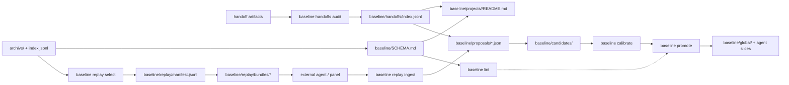

# Baseline Knowledge + Replay Plan

> **Status:** `DRAFT` - design review for issues #23, #25, and #26. **Owner:** `avidullu`. **Created:** `2026-07-07`. **Last updated:** `2026-07-07`
> **Lifecycle:** `DRAFT -> IN PROGRESS -> DONE -> archived`
> **Tracking anchors:** Section 7 is the source of truth; indexed in `docs/README.md`; pointer in `SESSION_HANDOFF.md`.
> **Relation to existing docs:** extends `docs/BASELINE_LOOP_CLOSURE.md`, `docs/CALIBRATION_EFFICACY.md`, and `docs/COMPOSE_STACK.md`; treats issue #19 as a shared provenance dependency.
> **Honesty note:** claims marked `[verified]` were checked against this repo or the linked issue text; `[researched]` items come from external sources in Section 10; `[design]` items are not implemented yet.

---

## 0. TL;DR

Build the compounding knowledge layer first, then handoff mining, then replay.
The shared substrate is a deterministic, human-gated `baseline/SCHEMA.md` plus
compiled project pages with marker-owned blocks and lint gates. Handoff mining is
the lowest-risk first producer because handoffs are already distilled session
memory; replay comes after schema, provenance, redaction, and bundle contracts are
in place.

## 1. Problem & goal

**Problem:** the baseline loop can ingest structured proposals and publish
reviewed guardrails, but it does not yet compound project knowledge, mine the
repo's own handoff conventions, or replay archived sessions to compare alternate
agent outputs. Issues #23, #25, and #26 are three faces of the same product:
turn archived work into reviewable knowledge that improves future sessions
without giving an LLM silent write access to policy.

**Goal:** a safe knowledge-and-replay pipeline where:

1. Project pages accumulate durable, cross-linked knowledge with explicit
   provenance.
2. Session handoffs become normalized evidence records and proposal inputs.
3. Replay packets can be generated deterministically, executed out-of-band by a
   different agent or panel, and ingested only as human-reviewable proposals.
4. Lint, calibration, and promotion gates prove the loop compounds knowledge
   instead of rewriting history.

## 2. Decisions locked

| # | Decision | Source / date | Implication |
|---|---|---|---|
| D1 | Do `baseline/SCHEMA.md` before mining or replay. | #26 + research, 2026-07-07 | Every derived artifact gets ownership, provenance, and lint rules before new producers write into it. |
| D2 | Keep raw sources immutable and derived pages deterministic. | LLM-wiki prior art `[researched]` | Use marker-block upserts and generated sections; do not let an LLM freely rewrite project pages. |
| D3 | Ship handoff mining before replay. | #23/#25 scope comparison `[design]` | Handoffs are already summary artifacts, so they validate schema/provenance with less execution risk. |
| D4 | Replay execution is out-of-band in v1. | #25 + eval tooling research `[researched]` | This repo selects and bundles sessions; another agent/panel runs the replay and submits structured output. |
| D5 | Exclude coding sessions from replay v1. | #25 non-goal `[verified]` | No workspace snapshots means code replay would be misleading until commit/worktree provenance exists. |
| D6 | Add lightweight provenance now; integrate deeper #19 traces later. | #19 dependency `[design]` | Record source entity, activity, agent, derivation, and bundle ids without blocking on a full trace system. |
| D7 | Do not build search or embeddings for v1. | `docs/COMPOSE_STACK.md` + #23/#26 non-goals `[verified]` | Use deterministic indexes, JSONL manifests, and markdown pages; search/live memory stays external. |
| D8 | Reuse the shipped marker grammar and content-preserving upsert. | `baseline_promote.py`, TD4 #31 `[verified]` | Do not introduce a second `baseline:knowledge:*` marker family; extend helpers around `baseline:begin/end`. |
| D9 | Keep existing tracker rows as shared capability owners. | `docs/BASELINE_LOOP_CLOSURE.md` §7 `[verified]` | K rows implement #23/#25/#26 slices, but P5/P6/P10/P11 remain the umbrella rows for shared loop capabilities. |

## 3. Foundation - research and prior art

| Source | Useful takeaway | Design consequence |
|---|---|---|
| LLM-wiki concept `[researched]` | Keep raw sources as immutable input, maintain structured interlinked markdown, and use schema/index/lint conventions. | `baseline/SCHEMA.md`, project-page marker blocks, page indexes, stale/orphan/contradiction lint. |
| Reflexion `[researched]` | Verbal reflections can improve later agent behavior without changing model weights. | Treat handoffs and replay judgments as reflection-like evidence, not as automatic policy. |
| Generative Agents `[researched]` | Experiences can be stored, reflected into higher-level summaries, and retrieved for planning. | Separate raw archive, normalized records, synthesized project pages, and future prompt packets. |
| Contextual Experience Replay `[researched]` | Past experiences can be accumulated and synthesized into a memory buffer for training-free improvement. | Replay and handoff outputs should land as structured, reviewable experience records. |
| AgentRR `[researched]` | Recording and summarizing agent trajectories supports replay for similar tasks. | `baseline replay select` should emit deterministic manifests and bundles tied to session identity. |
| AgentHER `[researched]` | Failed trajectories can be relabeled into useful training data when classification and confidence gates are explicit. | Replay ingest needs rubrics, confidence, judge identity, and human gates; no blind promotion. |
| Helicone replay / LangSmith trajectory evals / OpenAI agent evals `[researched]` | Production replay/eval systems rely on traces, graders, and full interaction context. | Because this repo has archived transcripts but not always full tool traces, v1 replay stays conservative. |
| W3C PROV-DM `[researched]` | Provenance models connect entities, activities, agents, derivations, and bundles. | Use a small provenance envelope for handoff records, replay manifests, and proposal sidecars. |

## 4. Architecture



### 4.1 Relation to existing tracker rows and code

This doc is the execution tracker for issues #23, #25, and #26, but it must not
fork shared baseline-loop work already tracked in `docs/BASELINE_LOOP_CLOSURE.md`.

| This plan | Existing owner | Reconciliation |
|---|---|---|
| K2 project-page upserts | TD4 content-preserving promote, shipped in #31 | Reuse or generalize `upsert_promoted_content()` and `parse_promoted_blocks()` instead of writing a second marker-block system. |
| K3 `baseline lint` | P6 contradiction detection | K3 is the #26 implementation slice for P6 plus link/staleness/orphan checks; close or cross-link P6 when K3 lands. |
| K7/K9 replay select/ingest | P5 cross-agent project correlation | Replay provenance should feed P5 once correlation exists; K7 can start without P5, but K9 must preserve agent/lineage fields for it. |
| K8 replay bundles | P10/P11 watchlist + tombstone/redaction design | K8 depends on the P11 redaction/fingerprint substrate, or must explicitly split out a small redaction prerequisite before bundling. |

### 4.2 Knowledge layer (#26)

Add `baseline/SCHEMA.md` as the contract for derived knowledge:

- Page types: global guardrail, project page, handoff index, replay manifest,
  proposal, candidate, calibration report.
- Ownership: human-owned prose, generated marker blocks, append-only ledgers.
- Provenance envelope: `source_entity`, `source_activity`, `source_agent`,
  `derived_from`, `evidence_ids`, `bundle_id`, `created_at`.
- Link rules: every generated block links to source evidence or a proposal id.
- Lint rules: schema conformance, broken links, orphan pages, stale generated
  blocks, duplicate claims, and contradiction candidates.
- Validation mechanism: `baseline/SCHEMA.md` is the human-readable contract;
  conformance is enforced by `baseline lint` and command-specific validators.
  `baseline/proposals/proposal.schema.json` is currently an illustrative example,
  while `agent_sessions/baseline_ingest.py` is the actual proposal validator.

Project pages remain markdown, but generated regions are bounded:

```markdown
<!-- baseline:begin id="knowledge.handoff-patterns" -->
...
<!-- baseline:end id="knowledge.handoff-patterns" -->
```

The first pass should update only marker-owned blocks. Human prose remains
outside generated blocks. Metadata such as `generated_by` should live inside the
block body or in structured sidecars unless K1 deliberately extends the existing
parser grammar used by both promote and publish.

### 4.3 Handoff mining (#23)

Handoff mining should be deterministic and auditable:

- Discover `SESSION_HANDOFF.md`, `session-handoff.md`, `MEMORY.md` start-here
  pointers, and agent-specific handoff sections in archived sessions.
- Normalize records into `baseline/handoffs/index.jsonl`.
- Render `baseline handoffs audit` as markdown for human review.
- Feed stable patterns into project pages and optional proposal JSON.
- Derive project slugs explicitly: `archive/index.jsonl` carries `messages`,
  `sha256`, and `markdown` at top level, but `cwd` and `project` live under
  each record's `metadata`. The current `metadata.project` value is a
  URL-encoded absolute path, so K4/K7 need a decode-and-slug step with tests.

Suggested normalized handoff record:

```json
{
  "id": "handoff.agent-sessions.2026-07-07.codex",
  "project_slug": "agent-sessions",
  "project_raw": "%2FC%3A%2FUsers%2Favidu%2FProjects%2FAgent%20Sessions",
  "repo": "https://github.com/avidullu/agent-sessions",
  "agent": "codex",
  "source_path": "SESSION_HANDOFF.md",
  "source_kind": "repo-handoff",
  "observed_at": "2026-07-07T00:00:00Z",
  "open_threads": ["baseline knowledge + replay design"],
  "key_decisions": ["schema before replay"],
  "ramp_up_links": ["docs/BASELINE_KNOWLEDGE_REPLAY_PLAN.md"],
  "evidence_ids": ["archive:..."],
  "provenance": {
    "source_entity": "SESSION_HANDOFF.md",
    "source_activity": "handoff-mining",
    "source_agent": "codex",
    "derived_from": ["git:b6251f3"]
  }
}
```

### 4.4 Replay loop (#25)

Replay v1 is selection, packaging, and ingest - not local autonomous execution.

Proposed CLI:

- `baseline replay select --kind planning --limit 20`
  - deterministically picks sessions with enough self-contained context,
    excludes coding sessions, and writes a manifest.
- `baseline replay bundle --manifest <path>`
  - creates gitignored prompt/evidence packets with redaction and rubric files.
- `baseline replay ingest --result <path>`
  - validates an external replay result and converts improvements into structured
    proposals or candidate records.

The nested CLI shape is intentional in this design for readability. The current
baseline CLI is flat (`suggest`, `promote`, `publish`, `ingest`, `bundle`, etc.),
so K7 must either add nested subparsers deliberately or choose flat names such as
`replay-select` / `replay-bundle` and document the convention.

Replay result minimum fields:

- `replay_of`: original archive/session id.
- `replayer`: agent, model family if known, and lineage different from original.
- `rubric_version`: versioned scoring prompt or panel rubric.
- `claim`: what the alternate run improves.
- `evidence`: original excerpt ids plus replay output ids.
- `confidence`: numeric or enum, with explanation.
- `recommended_action`: `proposal`, `watchlist`, or `reject`.

Daily automation follows #25: it may run only deterministic queueing stages
(`replay select` and `replay bundle`) after R1-select, R2-dedup, and R5-safety
pass on fixtures/sampled bundles. Replay execution, judging, ingest review, and
promotion stay human-triggered.

Replay gate names keep issue #25's vocabulary:

| Gate | Meaning |
|---|---|
| R1-select | Reviewed selected sessions are genuinely replayable. |
| R2-dedup | Re-running select/bundle with no new sessions produces zero new manifest entries. |
| R3-signal | At least one replay-derived proposal validates end to end. |
| R4-value | Acceptance rate of `replay.*` candidates is measured beside other candidates. |
| R5-safety | Bundles are redacted, gitignored, and contain no sampled secrets. |

## 5. Artifacts and contracts

| Path | Writer | Reader | Notes |
|---|---|---|---|
| `baseline/SCHEMA.md` | Human-reviewed docs PR | all baseline producers | Required before generated knowledge writes. |
| `baseline/projects/<slug>/README.md` | humans + marker-block upserts | agents and reviewers | Existing page shape is reused. |
| `baseline/handoffs/index.jsonl` | `baseline handoffs audit` | project page updater, proposal generator | Deterministic, append/upsert by source id. |
| `baseline/handoffs/audit.md` | `baseline handoffs audit` | human reviewer | Human-readable gaps and confidence. |
| `baseline/replay/manifest.jsonl` | `baseline replay select` | bundle command | Tracked only if it contains session refs/exclusion reasons and no excerpts. |
| `baseline/replay/bundles/*` | `baseline replay bundle` | external replayer/panel | K8 must add gitignore coverage; bundles may contain session excerpts. |
| `baseline/replay/ledger.jsonl` | `baseline replay ingest` | calibration/eval | Append-only replay result history. |
| `baseline/proposals/*.json` | humans, handoff miner, replay ingest | `baseline ingest` | Extend schema or add sidecars for provenance fields. |

## 6. Honest limits - what this does NOT do

- No embeddings or semantic search in v1.
- No automatic promotion from handoff or replay findings.
- No free-form LLM rewrite of `baseline/projects/*`.
- No coding-session replay until snapshots or commit/worktree provenance exist.
- No replacement for the existing promote, publish, calibrate, and efficacy gates.

## 7. Deliverables & progress tracker

Legend: `Todo`, `In progress`, `Done`, `Blocked/gated`. One small PR per row.

| ID | Deliverable | Issue | Depends on | Gated? | Status | PR |
|---|---|---|---|---|---|---|
| K0 | Tracked design plan, docs index, and handoff pointer | #23/#25/#26 | - | No | Done | #45 |
| K1 | `baseline/SCHEMA.md` with page types, existing marker grammar, provenance, and lint/validator contract | #26 | K0 | Yes | Todo | - |
| K2 | Reuse/extend `upsert_promoted_content()` for project-page generated sections | #26 | K1, TD4 #31 | Yes | Todo | - |
| K3 | `baseline lint` skeleton for schema, links, stale blocks, orphan pages, and P6 contradiction checks | #26 | K1,K2 | Yes | Todo | - |
| K4 | Handoff discovery and normalized `baseline/handoffs/index.jsonl` records | #23 | K1 | No | Todo | - |
| K5 | `baseline handoffs audit` markdown report and project-page feed | #23/#26 | K2,K4 | No | Todo | - |
| K6 | Handoff-derived proposal generation with evidence/provenance | #23 | K4,K5 | Yes | Todo | - |
| K7 | `baseline replay select` deterministic manifests, excluding coding sessions | #25 | K1 | No | Todo | - |
| K8 | `baseline replay bundle` gitignored packets with P10/P11 redaction/fingerprint checks and rubric files | #25 | K7, P10/P11 | Yes | Todo | - |
| K9 | `baseline replay ingest` validates external replay results into proposals/candidates | #25 | K6,K8 | Yes | Todo | - |
| K10 | Efficacy gates for schema lint, handoff precision, replay R1-R5, and proposal acceptance | #23/#25/#26 | K3,K5,K9 | Yes | Todo | - |

Additional gate names:

- `W1-schema`: `baseline lint` validates marker grammar, generated-block
  ownership, and schema references.
- `W2-links`: generated cross-links resolve and no project page is orphaned.
- `H1-handoff-precision`: fixture handoff patterns are detected while irrelevant
  docs are ignored.
- `H2-handoff-freshness`: stale and missing handoffs are reported with reasons.
- `R1-select` through `R5-safety`: replay gates from issue #25. Watchlist/tombstone
  `E7` remains owned by P11 in `docs/BASELINE_WATCHLIST_TOMBSTONES.md`.

## 8. Related issue triage

| Issue | Fold into this plan? | Reason |
|---|---|---|
| #19 - provenance trace logs | Yes, as substrate | Replay and handoff evidence need trace ids, but v1 can start with a lightweight provenance envelope. |
| #23 - mine handoffs | Yes, primary | First producer for the knowledge layer. |
| #25 - replay loop | Yes, primary | Second producer after schema, handoff mining, and redaction contracts. |
| #26 - wiki-style knowledge layer | Yes, primary | Foundation for both handoff mining and replay output. |
| #32 - backfill/regenerate | No, boundary | Useful for archive identity quality, but too broad for this project; keep it separate unless replay selection needs exact regenerated ids. |

## 9. Open questions - owner / external

1. Should `baseline/SCHEMA.md` be entirely hand-authored, or should commands also
   print machine-readable schema fragments from code?
2. Should the default stale threshold be configurable per project, with 90 days
   as the v1 default?
3. Should K1 formalize `baseline/proposals/proposal.schema.json` as real JSON
   Schema, or keep validation in Python and treat the file as an example?
4. Should replay provenance extend proposal objects directly, or live in a
   sibling sidecar only if existing proposal writers need strict compatibility?
5. Which session classes are allowed for replay v1 besides planning, writing,
   documentation, and research?

## 10. Definition of done

- [ ] `baseline/SCHEMA.md` exists and `baseline lint` plus command-specific
      validators enforce it for new producers.
- [ ] Project pages have deterministic generated blocks with evidence links.
- [ ] `baseline lint` fails on broken generated links and stale/orphan blocks.
- [ ] `baseline handoffs audit` finds repo and archive handoff artifacts and
      writes normalized records.
- [ ] At least one handoff-derived finding reaches candidate/proposal review with
      provenance.
- [ ] `baseline replay select` and `baseline replay bundle` produce reviewed,
      redacted packets for self-contained non-coding sessions.
- [ ] `baseline replay ingest` accepts an external replay result and converts it
      into the existing proposal/candidate/calibration flow.
- [ ] Efficacy gates prove no auto-promotion and no silent page rewrites.

## 11. References

**Internal `[verified]`:** `docs/BASELINE_LOOP_CLOSURE.md`, `docs/CALIBRATION_EFFICACY.md`, `docs/COMPOSE_STACK.md`, `docs/BASELINE_WATCHLIST_TOMBSTONES.md`, `docs/archives/TECH_DEBT_PLAN.md`, `agent_sessions/baseline_agent.py`, `agent_sessions/baseline_ingest.py`, `agent_sessions/baseline_promote.py`, `agent_sessions/baseline_publish.py`, `baseline/proposals/proposal.schema.json`.

**Issues `[verified]`:** [#23](https://github.com/avidullu/agent-sessions/issues/23), [#25](https://github.com/avidullu/agent-sessions/issues/25), [#26](https://github.com/avidullu/agent-sessions/issues/26), related [#19](https://github.com/avidullu/agent-sessions/issues/19) and [#32](https://github.com/avidullu/agent-sessions/issues/32).

**External `[researched]`:** [LLM Wiki gist](https://gist.github.com/karpathy/442a6bf555914893e9891c11519de94f), [Reflexion](https://arxiv.org/abs/2303.11366), [Generative Agents](https://arxiv.org/abs/2304.03442), [Contextual Experience Replay](https://arxiv.org/abs/2506.06698), [AgentRR](https://arxiv.org/abs/2505.17716), [AgentHER](https://arxiv.org/abs/2603.21357), [Helicone session replay](https://docs.helicone.ai/guides/cookbooks/replay-session), [LangSmith trajectory evals](https://docs.langchain.com/langsmith/trajectory-evals), [OpenAI agent evals](https://developers.openai.com/api/docs/guides/agent-evals), [W3C PROV-DM](https://www.w3.org/TR/prov-dm/).

### Changelog

- 2026-07-07 - Addressed PR #45 review by reconciling K rows with P5/P6/P10/P11, reusing shipped marker/upsert code, restoring replay R1-R5 gate names, and clarifying schema validation.
- 2026-07-07 - Opened draft PR #45 for the design tracker.
- 2026-07-07 - Created design tracker, indexed it in docs, updated the handoff pointer, and proposed execution sequence for #23, #25, and #26.
