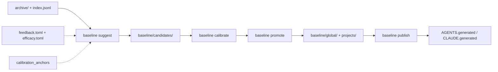

# Baseline Loop Closure

> **Status:** `IN PROGRESS` · **Owner:** avidullu · **Created:** 2026-07-05 · **Last updated:** 2026-07-05
> **Lifecycle:** `DRAFT → IN PROGRESS → DONE → archived`
> **Tracking anchors:** §7 is source of truth; indexed in `docs/README.md`; `SESSION_HANDOFF.md` points here.
> **Relation to existing docs:** implements the differentiated path in `docs/COMPOSE_STACK.md`; closes PRs 5–7 in `docs/BASELINE_PLANNING.md`.
> **Honesty note:** `[verified]` items checked against repo code; `[design]` items not implemented yet.

---

## 0. TL;DR

Close the engineering-baseline loop so `agent-sessions` turns multi-agent session
evidence into **reviewed, versioned guardrails** — not just candidate reports.
This repo eats its own cooking: iteration is tracked here using the user's
standard `PROJECT_DOC_TEMPLATE` pattern (sourced from `badminton-highlight-indexer`),
and tool efficacy is measured in `docs/CALIBRATION_EFFICACY.md`.

## 1. Problem & goal

**Problem:** Archive + `baseline suggest` exist, but `baseline/global/` is still
empty and no agent-facing slices are published. Competitors search or capture
sessions; none close the promote → publish → calibrate loop.

**Goal:** A measurable end-to-end proof that session history becomes durable
engineering policy with human approval and provenance.

**Good looks like:**

1. At least three guardrails promoted from archive evidence.
2. Generated Codex/Claude slices exist and are usable in a pilot repo.
3. Calibration feedback changes the next `baseline suggest` run.
4. The tool correctly identifies the user's tracked-project-doc standard from archive.

## 2. Decisions locked

| # | Decision | Source / date | Implication |
|---|----------|---------------|-------------|
| D1 | Search/memory delegated to compose stack | `docs/COMPOSE_STACK.md` | Do not build SQLite search here |
| D2 | Baseline promotion stays `strict` by default | `config/baseline.toml` | No auto-promote for policy |
| D3 | Standard project template = `badminton-highlight-indexer` `PROJECT_DOC_TEMPLATE` | Archive evidence `[verified]` | Use as calibration anchor + for this project's §7 |
| D4 | Efficacy measured in `baseline/calibration/efficacy.toml` | This doc | Every phase has a pass/fail metric |
| D5 | Dogfood on `agent-sessions` first, then pilot repos | `config/baseline.toml` pilots | Prove loop before org scale |

## 3. Foundation — archive evidence `[verified]`

Identified via `agent_archive.py` over `archive/`:

| Signal | Archive hits | Source repo evidence |
|--------|--------------|----------------------|
| `PROJECT_DOC_TEMPLATE` | 237 sessions | `badminton-highlight-indexer/docs/PROJECT_DOC_TEMPLATE.md` |
| `session-handoff` / ramp-up kit | 943 sessions | `CLAUDE.md`, `SESSION_HANDOFF.md`, working-agreement skills |
| Tracked §7 progress rows | Widespread in engine + khelsutra repos | `DECISION_SNAPSHOT_REGRESSION.md`, `CODE_CLEANUP_AUDIT_2026-06-24.md` |

Bundle command used to focus evidence:

```powershell
python .\tools\agent_archive.py baseline bundle --focus badminton-highlight-indexer --focus PROJECT_DOC_TEMPLATE --focus session-handoff
```

## 4. Design / architecture



Reuse map:

- `agent_sessions/baseline.py` — suggest, calibrate, future promote/publish
- `agent_sessions/baseline_agent.py` — evidence bundles
- `config/baseline.toml` — pilots + calibration anchors
- `baseline/calibration/efficacy.toml` — measurable closure metrics

## 5. Threat model / risk table

| Risk | Mitigation |
|------|------------|
| Promoting secrets from transcripts | Redaction rules in `docs/ENGINEERING_BASELINE.md`; manual promote |
| Template detection false positive | Calibration anchor + user feedback on `guardrail.tracked-project-docs` |
| Scope creep into search/TUI | `docs/COMPOSE_STACK.md` scope boundaries |
| Efficacy metrics gaming | Metrics require promoted files + generated slices, not keyword counts alone |

## 6. Honest limits — what this does NOT do

- Does not replace cass for search or agentmemory for runtime memory.
- Does not auto-apply generated slices into project `AGENTS.md` until trust is earned.
- Does not prove org-scale onboarding (PR 7) until personal pilot passes efficacy gates.

## 7. Deliverables & progress tracker   ⟵ **source of truth**

| ID | Deliverable | Depends on | Gated? | Status | PR |
|----|-------------|-----------|--------|--------|----|
| P0 | Tracked project + efficacy framework (this doc, template, `efficacy.toml`) | — | No | ☑ | — |
| P1 | `baseline promote` — write accepted candidates to `baseline/global/` or `projects/` | P0 | Yes | ☑ | #13 |
| P2 | `baseline publish` — generate `baseline/agents/*/ *.generated.md` | P1 | Yes | ☑ | #14 |
| P3 | Calibration loop — `suggest` reads feedback + ledger; adjusts confidence | P0 | No | ☑ | #15 |
| P4 | `baseline ingest` — structured proposals from `baseline/proposals/` | P0 | No | ☑ | #16 |
| P10 | Watchlist tier + `baseline backlog` — promotability backlog for non-promoted predictions | P3 | No | ☐ | [design](BASELINE_WATCHLIST_TOMBSTONES.md) |
| P11 | Rejection tombstones + deterministic dedup — block relearned rejects | P3 | No | ☐ | [design](BASELINE_WATCHLIST_TOMBSTONES.md) |
| P5 | Cross-agent project correlation in `archive/index.jsonl` | P0 | No | ☐ | — |
| P6 | Contradiction detection vs promoted baseline | P1 | Yes | ☐ | — |
| P7 | `baseline onboard --project <slug>` ramp-up packet | P1,P2 | No | ☐ | — |
| P8 | Promote top 3 existing predictions (PR-only, regression gates, handoff) | P1 | Yes | ☐ | — |
| P9 | Efficacy gate E1–E6 all `pass` in `efficacy.toml` | P1–P4,P8 | Yes | ☐ | — |

## 8. Open questions — owner / external

1. Which pilot repo gets the first published `CLAUDE.generated.md` mirror — `badminton-highlight-indexer` or `muneem`?
2. Should `baseline promote` open a PR automatically or only write files locally first?
3. Exact Telegram repo slug for `config/baseline.toml` pilot entry?

## 9. Definition of done

- [ ] P1–P4 and P8 rows are ☑ with linked PRs.
- [ ] `baseline/global/engineering-guardrails.md` contains promoted text (not placeholder).
- [ ] `baseline/agents/claude/CLAUDE.generated.md` exists with ≥3 promoted rules.
- [ ] `baseline calibrate` + `feedback.toml` measurably changes a subsequent `baseline suggest`.
- [ ] `efficacy.toml` metrics E1–E6 marked `pass`.
- [ ] `guardrail.tracked-project-docs` prediction accepted in calibration feedback.

## 10. References

**Internal `[verified]`:** `docs/COMPOSE_STACK.md`, `docs/BASELINE_PLANNING.md`, `docs/CALIBRATION_EFFICACY.md`, `config/baseline.toml`, `agent_sessions/baseline.py`, `baseline/candidates/2026-07-05-extraction.md`.

**Proposed `[design]`:** `docs/BASELINE_WATCHLIST_TOMBSTONES.md` — watchlist + rejection tombstones (P10/P11 PR plan).

**Template source `[verified]`:** `badminton-highlight-indexer/docs/PROJECT_DOC_TEMPLATE.md`, `badminton-highlight-indexer/CLAUDE.md` (workflow conventions §).

### Changelog

- 2026-07-06 — Added P10/P11 design reference (`BASELINE_WATCHLIST_TOMBSTONES.md`); marked P1–P4 ☑.
- 2026-07-05 — Created tracked project; linked template provenance and archive hit counts.
