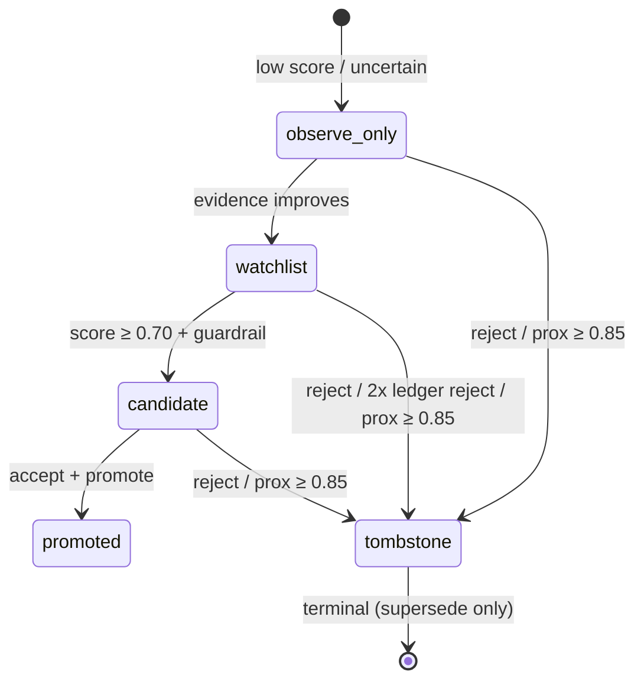
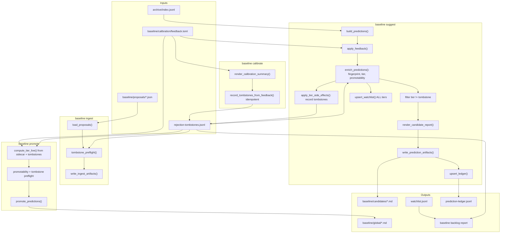

# Design: Prediction Watchlist + Rejection Tombstone System

> **Status:** `PROPOSED FOR REVIEW (rev 2.1)` · **Repo:** `agent-sessions` · **Date:** 2026-07-06
> **Tracking:** Proposed as P10 + P11 in `docs/BASELINE_LOOP_CLOSURE.md` §7
> **Honesty:** `[verified]` = exists in repo today; `[design]` = proposed in this doc
> **Rev 2:** Addresses design review (20 issues) · **Rev 2.1:** N1–N3 re-review amendments

---

## 0. TL;DR

The baseline loop today promotes only **accepted `guardrail.*` predictions** and suppresses rejections by **exact prediction id**. That leaves two gaps:

1. **No backlog tier** for “plausible but not promotable yet” patterns that future sessions should strengthen or retire.
2. **No tombstone registry** — a rejected guardrail can reappear under a new id with the **same normalized text** on the next `baseline suggest` or `baseline ingest`.

This design adds:

- `baseline/metacognition/watchlist.jsonl` — current-tier state for **all** predictions including suppressed/tombstoned
- `baseline/metacognition/rejection-tombstones.jsonl` — durable rejection fingerprints
- A deterministic **promotability score** and five-tier model: `promoted | candidate | watchlist | observe-only | tombstone`
- Hook points in **suggest**, **calibrate**, **ingest**, and **promote**
- New CLI: `baseline backlog`

**Scope honesty (v1):** Fingerprinting provides **deterministic dedup** (exact text, same keywords, new id) — **not** broad paraphrase detection. True semantic resurrection is an accepted blind spot deferred to P6 embedding similarity.

---

## 1. Problem statement

### 1.1 What works today `[verified]`

| Artifact | Path | Writer | Reader |
|----------|------|--------|--------|
| Prediction ledger (run history) | `baseline/metacognition/prediction-ledger.jsonl` | `upsert_ledger()` in `agent_sessions/baseline.py` | `load_ledger_entries()` → `summarize_ledger()` in `agent_sessions/baseline_calibration.py` |
| Calibration feedback | `baseline/calibration/feedback.toml` | Human reviewer | `load_feedback()` → `apply_feedback()` |
| Calibration loop | — | — | `apply_calibration_loop()` suppresses `reject` verdicts and ids with ≥2 ledger rejections; adjusts confidence via `ledger_confidence_adjustment()` |
| Promotion gate | — | — | `select_promotable_predictions()` — only `guardrail.*` with `verdict == "accept"` |
| Proposal ingest | `baseline/proposals/*.json` | `baseline_ingest()` in `agent_sessions/baseline_ingest.py` | Validates schema; no tombstone or tier logic |
| Observe-only approval mode | `config/baseline.toml` `[approval_modes.observe-only]`, `baseline/proposals/proposal.schema.json` | Config only | **Not wired** into `build_predictions()` or `baseline_suggest()` |

### 1.2 Gaps

| Gap | Symptom | Example |
|-----|---------|---------|
| **No watchlist tier** | Non-rejected predictions appear in candidate reports but **without ranked backlog tier** — no cross-run promotability ranking | `harness.predict-then-calibrate` at 0.75 confidence: visible in report, not promotable, no structured backlog state |
| **Exact-id rejection only** | **Deterministic** text duplicates bypass suppression under new ids | Reject `profile.business-productivity-engineer`; ingest `profile.productivity-oriented-builder` with identical `suggested_baseline_text` |
| **observe-only unused** | Uncertain patterns have no structured non-publish path | `approval_mode: observe-only` in schema never affects tier |
| **No promotability composite** | Promotion is binary (accept + guardrail); no ranked backlog | User cannot see “almost ready” items across runs |
| **Ingest lacks preflight** | `load_proposals()` accepts any valid JSON | Tombstoned concepts re-enter via `baseline/proposals/` |
| **Promote lacks preflight** | `baseline_promote()` trusts feedback id only | `--id` override could promote text matching a tombstone fingerprint |

**Clarification:** Only **rejected** predictions vanish from candidate reports today (`should_suppress_prediction()` in `baseline_calibration.py`). Non-rejected items always render (`render_candidate_report()` at `baseline.py:799–801`). The watchlist addresses **ranking and tier state**, not visibility of accepted-path items.

### 1.3 User goals (from task)

1. **Backlog:** Capture “not high confidence but still high probability” guardrails/preferences so oncoming sessions can improve or suppress promotability over time.
2. **Tombstones:** Track rejected guardrails/preferences so new suggestions cross-check and do not relearn failures (deterministic v1; paraphrase deferred).

---

## 2. Goals and non-goals

### 2.1 Goals

- Deterministic tier assignment on every `baseline suggest` run (no ML v1).
- Upsert `watchlist.jsonl` for **all** predictions processed in a run, including `tier=tombstone` stubs.
- Append/update `rejection-tombstones.jsonl` on explicit `reject` feedback, ≥2 ledger rejects, during **`baseline suggest --feedback`** (not only calibrate).
- Block or demote tombstone-near predictions in suggest, ingest, and promote.
- `baseline backlog` renders a human-readable watchlist report.
- Extend efficacy with **E7** (deterministic dedup); optionally note watchlist in E6 detail.
- Integrate as **P10** (watchlist) and **P11** (tombstones) in `docs/BASELINE_LOOP_CLOSURE.md` §7.

### 2.2 Non-goals (this phase)

- **Paraphrase / semantic similarity** — synonym substitution or structural rewrites bypass v1 fingerprints (accepted blind spot). Upgrade path: P6 contradiction audit with embedding similarity in **shadow mode** before hard suppress.
- Embedding / vector similarity as primary gate (defer to P6).
- Auto-promote from watchlist (promotion stays `strict`; human `accept` still required).
- Cross-repo tombstone federation.
- UI beyond CLI markdown report.
- Rewriting `prediction-ledger.jsonl` schema (append-only history preserved).

---

## 3. Tier model

Five tiers form a **partial order** (not a strict ladder — `tombstone` is terminal):



| Tier | Meaning | Visible in candidate MD | In watchlist.jsonl | Promotable | Published to agents |
|------|---------|-------------------------|--------------------|------------|---------------------|
| **promoted** | Written to `baseline/global/` | Optional reference | Yes (`tier=promoted`) | N/A (already promoted) | Yes via `baseline publish` |
| **candidate** | Ready for human accept → promote | Yes, highlighted | Yes | Yes (with accept feedback) | No |
| **watchlist** | Plausible backlog; needs evidence or edit | Yes, in “Backlog” section | Yes | No (until tier rises) | No |
| **observe-only** | Track evidence only; do not surface as guardrail | Yes, collapsed/annotated | Yes | No | No |
| **tombstone** | Rejected or duplicate text; block resurrection | **No** (suppressed) | Yes (`tier=tombstone` stub) | **Blocked** | No |

### 3.1 Unified proximity → tier → suppression table

**Single source of truth** used by `assign_tier()`, suggest suppression filter, ingest preflight, and promote preflight:

| `tombstone_proximity` | Tier assigned | Visible in candidate MD | Promotable | Tombstone record |
|---------------------|---------------|-------------------------|------------|------------------|
| `≥ 1.0` (exact fingerprint) | `tombstone` | No | Blocked | Match existing / create on reject |
| `≥ 0.85` (same `text_hash` + `category`, new id) | `tombstone` | No | Blocked | Match existing / create on reject |
| `0.60 – 0.84` (keyword Jaccard overlap) | `observe-only` | Yes, with `⚠ near tombstone` | Blocked | No |
| `< 0.60` | Normal tier rules (§3.2) | Per tier | Per tier | Per reject triggers |

**Suppress threshold:** `tier == tombstone` (equivalent to `prox >= 0.85` OR explicit reject OR ≥2 ledger rejects).

### 3.2 Tier assignment rules (deterministic)

Inputs per prediction `p` (after `apply_feedback()`, **before** suppression filter):

- `confidence` — post-feedback; ledger confidence adjustment applied in enrichment step
- `promotability_score` — composite (§4)
- `prediction.id` prefix — `guardrail.*`, `profile.*`, `harness.*`
- `feedback_verdict` — from `feedback.toml` if present
- `ledger_summary` — from `summarize_ledger()`
- `tombstone_proximity` — from fingerprint match (§5)
- `approval_mode` — on `Prediction` dataclass (§8.3); default `"strict"`
- `is_promoted` — `prediction.id` in `parse_promoted_blocks()` of `baseline/global/*.md`

**Assignment algorithm** (`assign_tier(p) -> Tier`):

```
if is_promoted(p.id):
    return PROMOTED

if tombstone_proximity(p) >= 0.85:         # exact fingerprint OR text_hash+category
    return TOMBSTONE

if feedback_verdict == "reject"
   or p.status == "rejected-feedback"
   or (ledger_summary and ledger_summary.rejected_runs >= 2):
    return TOMBSTONE

if tombstone_proximity(p) >= 0.60:         # keyword overlap band
    return OBSERVE_ONLY

# Prefix caps (resolves Open Question #1)
if p.id.startswith("profile.") or p.id.startswith("harness."):
    if approval_mode == "observe-only" or promotability_score < watchlist_min:
        return OBSERVE_ONLY
    return WATCHLIST                          # profile/harness never reach candidate

if p.id.startswith("guardrail.")
   and promotability_score >= candidate_min
   and feedback_verdict != "reject":
    return CANDIDATE

if promotability_score >= watchlist_min or feedback_verdict == "edit":
    return WATCHLIST

if approval_mode == "observe-only" or promotability_score < watchlist_min:
    return OBSERVE_ONLY

return OBSERVE_ONLY                           # unreachable if thresholds are exhaustive; explicit fallback
```

**Prefix rule (locked):** `profile.*` and `harness.*` are **capped at `watchlist`** — they cannot reach `candidate` or `promoted` without re-ingest as `guardrail.*`.

### 3.3 Suppression model (replaces calibration-only suppression)

`apply_calibration_loop()` remains **pure** (no filesystem writes, no input mutation — preserves `test_apply_calibration_loop_does_not_mutate_input`).

New orchestration in `baseline_suggest()`:

1. `apply_feedback()` — mutates prediction status/confidence in place (existing).
2. `enrich_predictions()` — pure: fingerprint, proximity, promotability, `assign_tier()`, ledger confidence adjustment.
3. `apply_tier_side_effects()` — impure: `record_tombstone()` for new rejects / ledger auto-tombstones; gated by `[tombstones] enabled`.
4. **Suppression filter:** `visible = [e for e in enriched if e.tier != TOMBSTONE]` — single suppression signal.
5. `upsert_watchlist()` — **all** enriched rows, including `tier=tombstone` stubs.
6. `render_candidate_report(visible, tier_by_id=...)` — sectioned by tier.

`apply_calibration_loop()` is refactored to expose `apply_ledger_confidence_adjustment()` only; suppression logic migrates to `assign_tier()`.

#### E6 regression gate (shared suppression path)

`evaluate_e6_calibrate()` in `agent_sessions/baseline_eval.py` currently calls `apply_calibration_loop()` for suppression (`baseline_eval.py:165–167`). After PR 2b, E6 must exercise the **same path as `baseline_suggest()`** or it will stop testing real behavior.

Add a shared helper in `baseline_tiers.py` used by both suggest and E6:

```python
def visible_predictions(
    enriched: list[EnrichedPrediction],
) -> list[Prediction]:
    """Single suppression signal: tier != tombstone."""
    return [e.prediction for e in enriched if e.tier != Tier.TOMBSTONE]

def calibration_delta_from_enriched(
    before: list[Prediction],
    enriched: list[EnrichedPrediction],
) -> dict[str, Any]:
    """Drop-in replacement for calibration_delta() using tier filter."""
    visible = visible_predictions(enriched)
    return calibration_delta(before, visible)
```

**PR 2b updates `evaluate_e6_calibrate()`** to:

```python
feedback_applied = [apply_feedback(p, feedback_map) for p in base_predictions]
enriched = enrich_predictions(
    predictions=feedback_applied,
    feedback_map=feedback_map,
    ledger_entries=ledger_entries,
    ledger_summaries=summarize_ledger(ledger_entries),
    tombstones=load_tombstones(settings.tombstones_path),
    settings=settings,
    run_id="e6-eval",
    apply_ledger_adjustment=True,
)
delta = calibration_delta_from_enriched(feedback_applied, enriched)
# Assert: rejected ids in delta["suppressed_ids"]; accepted ids in visible set;
# confidence_moved via enriched prediction confidence vs feedback_applied
```

E6 remains the **regression gate for suppression semantics** — rejected ids suppressed, accepted ids visible, confidence movement detected. `apply_calibration_loop()` may remain as a thin deprecated wrapper delegating to `enrich_predictions()` + `visible_predictions()` for backward compatibility in unit tests until fully removed.

---

## 4. Promotability score

### 4.1 Purpose

Single deterministic float in `[0.0, 1.0]` ranking how close a prediction is to promotion. Used for tier boundaries and `baseline backlog` sorting.

### 4.2 Formula

```python
promotability = clamp(0.0, 1.0,
    W_CONF   * confidence
  + W_LEDGER * ledger_component
  + W_EVID   * evidence_component
  + W_TOMB   * (1.0 - tombstone_proximity)
)

# Default weights (configurable in config/baseline.toml [promotability])
W_CONF   = 0.35
W_LEDGER = 0.25
W_EVID   = 0.25
W_TOMB   = 0.15
```

#### 4.2.1 `ledger_component` ∈ [0, 1]

From `LedgerSummary` in `baseline_calibration.py`:

```
raw = 0.0
raw += min(accepted_runs, 3) * 0.15
raw -= min(rejected_runs, 3) * 0.20
raw -= min(edited_runs, 2)   * 0.10
if latest_status == "accepted-feedback": raw += 0.10
if feedback_verdict == "accept":         raw += 0.20
if feedback_verdict == "edit":          raw -= 0.05
if feedback_verdict == "reject":        raw -= 0.40

ledger_component = clamp(0.0, 1.0, (raw + 0.40) / 0.85)
```

#### 4.2.2 `evidence_component` ∈ [0, 1]

```
evidence_count = len(prediction.evidence)
base = min(1.0, evidence_count / 10.0)

# evidence_delta vs prior ledger entry (§4.2.3)
prior_count = len(prior_entry.get("evidence", [])) if prior_entry else evidence_count
delta = (evidence_count - prior_count) / max(prior_count, 1)
delta_bonus = clamp(-0.10, 0.10, delta * 0.05)

evidence_component = clamp(0.0, 1.0, base + delta_bonus)
```

#### 4.2.3 `prior_ledger_entry()` helper

Ledger stores multiple lines per id across `run_id`s (`upsert_ledger()` replaces same `run_id`, appends new runs).

```python
def prior_ledger_entry(
    entries: list[dict],
    prediction_id: str,
    current_run_id: str,
) -> dict | None:
    """Last ledger entry for prediction_id from a different run_id, by recorded_at."""
    candidates = [
        e for e in entries
        if e.get("id") == prediction_id and e.get("run_id") != current_run_id
    ]
    if not candidates:
        return None
    return max(candidates, key=lambda e: e.get("recorded_at", ""))
```

#### 4.2.4 `tombstone_proximity` ∈ [0, 1]

See §5.3.

### 4.3 Thresholds (defaults)

| Constant | Value | Config key |
|----------|-------|------------|
| Candidate minimum | `0.70` | `[tier_thresholds] candidate_min` |
| Watchlist minimum | `0.45` | `[tier_thresholds] watchlist_min` |
| Tombstone keyword overlap | `0.60` | `[tier_thresholds] tombstone_keyword_overlap` |
| Tombstone suppress proximity | `0.85` | `[tier_thresholds] tombstone_suppress_min` |

### 4.4 Worked example `[verified inputs, rev 2]`

`harness.predict-then-calibrate` from `prediction-ledger.jsonl` (not promoted; `guardrail.handoff-and-resume` is already in `baseline/global/engineering-guardrails.md`):

- `confidence = 0.75`, `evidence_count = 5`, no feedback, no prior rejects
- `ledger_component ≈ 0.47`, `evidence_component ≈ 0.50`, `tombstone_proximity = 0`
- `promotability ≈ 0.35*0.75 + 0.25*0.47 + 0.25*0.50 + 0.15*1.0 ≈ 0.63`
- **Tier: `watchlist`** — prefix cap prevents `candidate` regardless of score

---

## 5. Fingerprint strategy

### 5.1 Design principles

- **Deterministic** — same input text → same fingerprint across runs and machines.
- **No ML** — hash + category + keyword set only.
- **No secrets** — normalize and redact before hashing (§9).
- **Stable across ids** — `guardrail.foo` and `guardrail.bar` with same text → same fingerprint.
- **Deterministic dedup, not semantic dedup** — catches identical normalized text and high keyword overlap; misses paraphrase.

### 5.2 Fingerprint components

#### 5.2.1 Category → signal group mapping

`Prediction.category` values (`docs`, `checkpointing`, `metacognition`, etc. in `build_predictions()`) do **not** match `KEYWORD_GROUPS` keys 1:1. Define explicit mapping in `baseline_fingerprint.py`:

```python
CATEGORY_TO_SIGNAL_GROUPS: dict[str, tuple[str, ...]] = {
    "repo-governance": ("repo-governance",),
    "regression-frameworks": ("regression-frameworks",),
    "checkpointing": ("checkpointing",),
    "docs": ("tracked-project-docs", "docs-freshness"),
    "metacognition": ("metacognition",),
    "architecture": ("architecture-decisions",),
    "architecture-decisions": ("architecture-decisions",),
    "prompt-patterns": ("metacognition",),
    "docs-freshness": ("docs-freshness",),
    "tracked-project-docs": ("tracked-project-docs",),
}
# Unknown category → empty tuple (token extraction only)
```

Unit tests required for each built-in `build_predictions()` category.

#### 5.2.2 Computation

```python
def normalize_text(text: str) -> str:
    # apply SECRET_REDACTION (§9); lowercase; collapse whitespace; strip punctuation

def extract_keywords(text: str, category: str) -> tuple[str, ...]:
    # 1. For each group in CATEGORY_TO_SIGNAL_GROUPS[category], include KEYWORD_GROUPS
    #    keywords found in text
    # 2. Alphanumeric tokens length ≥ 4 from normalized text
    # 3. Remove STOP_WORDS frozenset (~100 English function words)
    # 4. Sort unique, take first 12 lexicographically

def compute_fingerprint(text: str, category: str) -> dict:
    normalized = normalize_text(text)
    text_hash = sha256(normalized.encode()).hexdigest()[:16]
    keywords = extract_keywords(normalized, category)
    payload = f"{text_hash}:{category}:{','.join(keywords)}"
    return {
        "fingerprint": sha256(payload.encode()).hexdigest()[:32],
        "text_hash": text_hash,
        "category": category,
        "keywords": list(keywords),
    }
```

### 5.3 Proximity scoring

When checking prediction `p` against tombstone set `T`:

| Condition | `tombstone_proximity` | Tier (via §3.1) |
|-----------|----------------------|-----------------|
| `p.fingerprint == t.fingerprint` | `1.0` | `tombstone` |
| `p.text_hash == t.text_hash` and `p.category == t.category` | `0.85` | `tombstone` |
| `p.category == t.category` and Jaccard(`p.keywords`, `t.keywords`) ≥ `tombstone_keyword_overlap` | `0.60 + 0.25 * jaccard` | `observe-only` |
| Otherwise | `0.0` | normal rules |

Use **max** proximity across active tombstones (`superseded_by` is null).

### 5.4 Tombstone creation triggers

| Trigger | Source | Function hook | When |
|---------|--------|---------------|------|
| User `verdict = "reject"` in feedback | `baseline suggest --feedback` | `apply_tier_side_effects()` → `record_tombstone_from_feedback()` | **Primary hot path** |
| User `verdict = "reject"` in feedback | `baseline calibrate` | `record_tombstones_from_feedback()` | Idempotent replay / audit |
| `ledger_summary.rejected_runs >= 2` | `baseline suggest` enrichment | `apply_tier_side_effects()` → `record_tombstone_from_ledger()` | When `[tombstones] auto_from_ledger = true` |
| Manual CLI (future) | `baseline backlog --tombstone <id>` | Optional | Post-v1 |

**Not a tombstone source:** ingest preflight blocks proposals but does **not** append tombstones (user did not reject — see §6.2).

Idempotency: upsert by `fingerprint`; append new `tombstone_id` only if fingerprint unseen.

---

## 6. Schemas

### 6.1 `baseline/metacognition/watchlist.jsonl`

One **current-state** record per `prediction_id` (latest wins on upsert). JSON Lines, UTF-8.

```jsonc
{
  // Required
  "prediction_id": "harness.predict-then-calibrate",
  "tier": "watchlist",
  "promotability_score": 0.6312,
  "confidence": 0.75,
  "fingerprint": "a1b2c3...",
  "updated_at": "2026-07-06T12:00:00+00:00",
  "last_seen_run_id": "2026-07-06-extraction",

  // Provenance (redacted — §9)
  "title": "Predict Then Calibrate",
  "scope": "global",
  "category": "metacognition",
  "risk": "medium",
  "text_excerpt": "The baseline system should regularly make explicit predictions...",  // ≤200 chars, redacted
  "evidence_count": 5,

  // Score breakdown
  "promotability_components": {
    "confidence": 0.75,
    "ledger_component": 0.47,
    "evidence_component": 0.50,
    "tombstone_proximity": 0.0,
    "weights": {"conf": 0.35, "ledger": 0.25, "evid": 0.25, "tomb": 0.15}
  },

  "ledger_summary": { "total_runs": 1, "accepted_runs": 0, "rejected_runs": 0, "edited_runs": 0, "latest_status": "proposed" },
  "feedback_verdict": "",

  "first_seen_run_id": "2026-07-05-extraction",
  "run_count": 2,
  "evidence_delta": 0.0,
  "suppression_reason": "",               // e.g. "feedback:reject" or "tombstone:prox=1.0" for tier=tombstone
  "approval_mode": "strict"
}
```

**Upsert semantics:** On each suggest run, for **every** prediction in `enrich_predictions()` output (including `tier=tombstone`):

1. Read existing watchlist entries into `dict[prediction_id]`.
2. Merge: preserve `first_seen_run_id`, increment `run_count`, update scores/tier.
3. **Tombstone-tier entries are retained** with `tier=tombstone` and `suppression_reason` — excluded from `baseline backlog` default filter but present for audit.

Full prediction text remains in sidecar / ledger; watchlist stores **`text_excerpt` only** (same redaction as tombstones).

### 6.2 `baseline/metacognition/rejection-tombstones.jsonl`

Append-only log; logical upsert by `fingerprint` (latest record per fingerprint is authoritative).

```jsonc
{
  "tombstone_id": "ts-7f3a9c2e1b",
  "fingerprint": "d4e5f6...",
  "fingerprint_components": {
    "text_hash": "abc123...",
    "category": "metacognition",
    "keywords": ["business", "productivity", "engineer", "workflow"]
  },
  "rejected_at": "2026-07-06T12:00:00+00:00",
  "rejection_source": "feedback",           // feedback | ledger  (NOT ingest)

  "prediction_id": "profile.business-productivity-engineer",
  "title": "Business/Productivity-Oriented Engineer",
  "scope": "user-profile",
  "category": "metacognition",
  "risk": "medium",
  "text_excerpt": "The user looks like a builder who blends software engineering...",
  "rejection_reason": "Too vague; not actionable as guardrail.",

  "rejected_run_id": "2026-07-05-extraction",
  "related_prediction_ids": ["profile.business-productivity-engineer"],
  "superseded_by": null
}
```

**Ingest blocked proposals:** Report-only reason `ingest-blocked: tombstone <id>` in ingest report — **no** tombstone append.

---

## 7. Architecture and data flow

### 7.1 End-to-end flow (rev 2 hook order)



**Key change:** Tier enrichment runs **before** suppression. `apply_calibration_loop()` suppression is replaced by `tier == tombstone` filter. Tombstones written in `apply_tier_side_effects()` during suggest when `--feedback` is loaded.

### 7.2 New module layout `[design]`

| Module | Responsibility |
|--------|----------------|
| `agent_sessions/baseline_fingerprint.py` | `CATEGORY_TO_SIGNAL_GROUPS`, `normalize_text`, `extract_keywords`, `compute_fingerprint`, `tombstone_proximity` |
| `agent_sessions/baseline_tiers.py` | `promotability_score`, `assign_tier`, `enrich_predictions()`, `compute_tier_live()`, `visible_predictions()`, `calibration_delta_from_enriched()` |
| `agent_sessions/baseline_watchlist.py` | `load_watchlist`, `upsert_watchlist`, `render_backlog_report`, `baseline_backlog()` |
| `agent_sessions/baseline_tombstones.py` | `load_tombstones`, `record_tombstone`, `tombstone_preflight`, `apply_tier_side_effects()`, redaction |

`apply_calibration_loop()` stays in `baseline_calibration.py` — **pure**, confidence-only; suppression delegated to tiers module.

### 7.3 Config extensions (`config/baseline.toml`) `[design]`

```toml
[baseline]
watchlist_path = "baseline/metacognition/watchlist.jsonl"
tombstones_path = "baseline/metacognition/rejection-tombstones.jsonl"

[tier_thresholds]
candidate_min = 0.70
watchlist_min = 0.45
tombstone_keyword_overlap = 0.60
tombstone_suppress_min = 0.85

[promotability]
weight_confidence = 0.35
weight_ledger = 0.25
weight_evidence = 0.25
weight_tombstone = 0.15

[tombstones]
enabled = false          # PR1: false; flip true in PR2b when suggest integration lands
auto_from_ledger = true

[tiers]
enabled = false          # PR2b: flip true to enable sectioned candidate report
```

Extend `BaselineSettings` and `Prediction` dataclass:

```python
@dataclass
class Prediction:
    # existing fields...
    approval_mode: str = "strict"
```

Map in `prediction_to_dict()`, `proposal_to_prediction()`, and `build_predictions()` (default `"strict"`).

---

## 8. Hook points (detailed)

### 8.1 `baseline suggest` — `baseline_suggest()` in `agent_sessions/baseline.py`

**Rev 2 pipeline (replaces old post-calibration enrichment):**

```python
predictions = build_predictions(...)
predictions = [apply_feedback(p, feedback_map) for p in predictions]

ledger_entries = load_ledger_entries(settings.ledger_path)
tombstones = load_tombstones(settings.tombstones_path)
ledger_summaries = summarize_ledger(ledger_entries)
run_id = f"{dt.date.today().isoformat()}-extraction"

enriched = enrich_predictions(
    predictions=predictions,
    feedback_map=feedback_map,
    ledger_entries=ledger_entries,
    ledger_summaries=ledger_summaries,
    tombstones=tombstones,
    settings=settings,
    run_id=run_id,
    apply_ledger_adjustment=use_calibration,
)

if use_calibration and settings.tombstones_enabled:
    apply_tier_side_effects(enriched, settings, run_id=run_id)

visible = visible_predictions(enriched)

markdown = render_candidate_report(..., predictions=visible, tier_by_id={e.prediction.id: e for e in enriched})

write_prediction_artifacts(..., predictions=visible, ...)
upsert_watchlist(settings.watchlist_path, run_id, enriched)  # ALL tiers
```

**`render_candidate_report()` changes** (behind `[tiers] enabled`):

- **“Promotion candidates”** (`tier == candidate`)
- **“Watchlist backlog”** (`tier == watchlist`) — sorted by `promotability_score` desc
- **“Observe only”** (`tier == observe-only`) — collapsed; `⚠ near tombstone <id>` when applicable
- Promoted items: optional footnote in backlog report, not primary candidate body

#### 8.1.1 When `use_calibration=False` (`--no-calibration`)

Existing CLI flag (`cli.py:54–58`) sets `use_calibration=False`, which today skips the entire `apply_calibration_loop()` including suppression and ledger confidence adjustment (`baseline.py:136–143`).

**Rev 2.1 semantics** — enrichment always runs; calibration flag gates ledger adjustment and side effects only:

| Step | `use_calibration=True` (default) | `use_calibration=False` |
|------|----------------------------------|-------------------------|
| `apply_feedback()` | Yes | Yes |
| `enrich_predictions()` (fingerprint, tier, promotability) | Yes | Yes |
| Ledger confidence adjustment inside enrich | Yes (`apply_ledger_adjustment=True`) | **No** (`apply_ledger_adjustment=False`) |
| `apply_tier_side_effects()` (tombstone file writes) | Yes (if `[tombstones] enabled`) | **No** |
| `visible_predictions()` tier filter (`tier != tombstone`) | **Yes — always** | **Yes — always** |
| `upsert_watchlist()` | Yes (if `[tiers] enabled`) | Yes (if `[tiers] enabled`) |

**Rationale:** `--no-calibration` means “skip ledger confidence nudges and tombstone file writes” — not “show rejected predictions.” When `--feedback` is loaded, feedback rejects and tombstone proximity matches (`prox >= 0.85`) still assign `tier=tombstone` and are filtered from the candidate report. This is a **safety improvement** over today where `--no-calibration` + feedback reject leaves rejected ids visible.

**Cross-run persistence:** In-run suppression still applies when `--feedback` is loaded, but tombstones are not written to disk without the default calibration path or a subsequent `baseline calibrate` replay. A later `baseline suggest` run without `--feedback` can resurrect those patterns until tombstones are persisted.

**Tests (PR 2b):** Extend `tests/test_baseline.py` — `baseline suggest --no-calibration --feedback` suppresses rejected ids but skips confidence adjustment vs calibrated run. Extend `tests/test_cli.py` if needed for flag wiring.

### 8.2 `baseline calibrate` — `baseline_calibrate()` in `agent_sessions/baseline.py`

`baseline calibrate` remains a **summary + idempotent tombstone replay** — not the primary write path.

```python
for prediction_id in rejected:
    prediction = find_prediction(prediction_data, prediction_id)
    record_tombstone_from_feedback(settings, prediction, feedback_map[prediction_id])
    # no-op if fingerprint already recorded during suggest
```

Extend `render_calibration_summary()`:

```markdown
## Tombstones recorded (idempotent)
- `ts-7f3a9c2e1b` ← `profile.business-productivity-engineer` (already exists | newly written)
```

README note: users who edit `feedback.toml` and run `baseline suggest --feedback` get tombstones immediately; `calibrate` is optional for human-readable summary.

### 8.3 `baseline ingest` — `baseline_ingest()` in `agent_sessions/baseline_ingest.py`

Extend `Prediction` with `approval_mode`; map in `proposal_to_prediction()`:

```python
def proposal_to_prediction(data: dict[str, Any]) -> Prediction:
    return Prediction(
        ...
        approval_mode=str(data.get("approval_mode", "strict")),
    )
```

In `load_proposals()`, after `validate_proposal()`:

```python
fp = compute_fingerprint(data["suggested_baseline_text"], data["category"])
prox = max_tombstone_proximity(fp, tombstones)
if prox >= settings.tombstone_suppress_min:  # 0.85
    rejected.append((path, [f"ingest-blocked: tombstone {nearest_tombstone_id}"]))
elif prox >= settings.tombstone_keyword_overlap:
    data["approval_mode"] = "observe-only"   # before Prediction construction
accepted.append(proposal_to_prediction(data))
```

Ingest parity: when writing sidecar, call `upsert_ledger()` + `upsert_watchlist()` after `enrich_predictions()` on accepted proposals.

### 8.4 `baseline promote` — `select_promotable_predictions()` / `baseline_promote()`

**Promote always computes tier live** — `watchlist.jsonl` is a **cache for backlog CLI**, not a promotion gate.

```python
def select_promotable_predictions(
    predictions: list[dict],
    feedback_map: dict,
    settings: BaselineSettings,
    tombstones: list[dict],
    ledger_entries: list[dict],
) -> list[dict]:
    selected = []
    for prediction in predictions:
        prediction_id = str(prediction.get("id", ""))
        if not prediction_id.startswith("guardrail."):
            continue
        feedback = feedback_map.get(prediction_id)
        if not feedback or feedback.get("verdict", "").lower() != "accept":
            continue

        live = compute_tier_live(
            prediction=prediction,
            feedback_map=feedback_map,
            ledger_entries=ledger_entries,
            tombstones=tombstones,
            settings=settings,
        )
        if live.tier not in ("candidate", "promoted"):
            continue
        if live.tombstone_proximity >= settings.tombstone_suppress_min:
            continue
        if live.promotability_score < settings.candidate_min:
            continue
        selected.append(prediction)
    return selected
```

**Test requirement:** `baseline promote` with **empty or missing** `watchlist.jsonl` still blocks tombstone `text_hash` match.

`baseline_promote()` prints skipped ids + reasons on `--dry-run`.

---

## 9. Security: no secrets in persisted metacognition

### 9.1 Threat

Archive evidence and proposal text can contain API keys, tokens, connection strings, or private paths. Tombstones and watchlist are long-lived machine-readable files.

### 9.2 Redaction pipeline

Apply in `baseline_tombstones.py` (shared by watchlist excerpts and fingerprint input):

```python
SECRET_PATTERNS = [
    r"(?i)(api[_-]?key|secret|token|password|passwd)\s*[:=]\s*\S+",
    r"sk-[a-zA-Z0-9]{20,}",
    r"ghp_[a-zA-Z0-9]{36,}",
    r"-----BEGIN [A-Z ]+ PRIVATE KEY-----",
]
```

### 9.3 Storage rules

| Field | Artifact | Rule |
|-------|----------|------|
| `text_excerpt` | tombstones, watchlist | Max 200 chars after redaction |
| `text` (full) | watchlist | **Removed** — use `text_excerpt` only |
| `rejection_reason` | tombstones | Truncate 500 chars; redact |
| `evidence` | tombstones | **Omit** |
| `keywords` / `fingerprint` | both | Derived from redacted normalized text |
| Full text | sidecar / ledger | Unchanged (existing behavior) |

---

## 10. CLI: `baseline backlog`

### 10.1 Command

```
python tools/agent_archive.py baseline backlog [OPTIONS]
```

### 10.2 Options

| Flag | Description |
|------|-------------|
| `--tier {watchlist,candidate,observe-only,all}` | Filter (default: `watchlist`; excludes `tombstone` unless `--tier all`) |
| `--format {markdown,json}` | Output format (default: `markdown`) |
| `--output PATH` | Write report file (default: stdout) |
| `--min-score FLOAT` | Filter `promotability_score >=` |
| `--include-tombstones` | Appendix of active tombstones |
| `--dry-run` | Print path only |

**Backfill:** Not a CLI flag. Use `scripts/backfill-tombstones.py` (PR 4) — see §15.

### 10.3 Default markdown report

```markdown
# Baseline Backlog (2026-07-06)

## Summary
- Watchlist: 2 | Candidate: 1 | Observe-only: 1 | Active tombstones: 4

## Watchlist (sorted by promotability)
| ID | Score | Conf | Last run | Note |
|----|-------|------|----------|------|
| harness.predict-then-calibrate | 0.63 | 0.75 | 2026-07-06-extraction | prefix cap: harness.* |

## Near tombstone warnings
- (none)
```

---

## 11. Efficacy: E7 metric (deterministic dedup)

### 11.1 Scope reframe

E7 measures **deterministic dedup resilience** — not paraphrase immunity.

| Case | E7 covers? |
|------|------------|
| Same id + reject | Existing E6 / `assign_tier` |
| Same normalized text, new id (`prox >= 0.85`) | **Yes** |
| Same fingerprint, new id | **Yes** |
| Keyword overlap ≥ 0.6, new id | **Partial** — observe-only, not suppress |
| Paraphrase with low keyword overlap | **No** — negative test documents miss |

### 11.2 E7 definition

| ID | Gate | Pass condition |
|----|------|----------------|
| **E7** | **Deterministic dedup** | (1) Synthetic prediction with same `text_hash` + `category` as seeded tombstone → `tier=tombstone`, excluded from visible suggest list and `select_promotable_predictions()`; (2) Controlled keyword-overlap fixture → `tier=observe-only`; (3) **Negative test:** known paraphrase pair → `tier != tombstone` (documents blind spot) |

### 11.3 Implementation in `baseline_eval.py`

```python
def evaluate_e7_deterministic_dedup(repo_root: Path) -> EfficacyCheck:
    # Fixture A: exact text_hash duplicate → tombstone tier
    # Fixture B: keyword overlap → observe-only
    # Fixture C: paraphrase ("never push to main" vs "do not commit to shared branches") → NOT tombstone
```

Update `baseline/calibration/efficacy.toml`:

```toml
[[metrics]]
id = "E7.backlog.deterministic-dedup"
phase = "calibrate"
status = "pending"
target = "text_hash duplicate suppressed; paraphrase documented as miss"
measure = "baseline eval E7 three-fixture suite"
```

---

## 12. Integration with `docs/BASELINE_LOOP_CLOSURE.md` §7

| ID | Deliverable | Depends on | Gated? | Description |
|----|-------------|-----------|--------|-------------|
| **P10** | Watchlist tier + `baseline backlog` | P3, PR2 | No | `watchlist.jsonl`, promotability, tier assignment, backlog CLI |
| **P11** | Rejection tombstones + deterministic dedup | P3, PR1, PR3 | No | `rejection-tombstones.jsonl`, fingerprint preflight, E7; **not** blocked on P10 |

P11 ingest/promote preflight ships in PR3; watchlist (P10) is orthogonal cache.

---

## 13. Alternatives considered

### 13.1 Alternative A: Extend ledger only (no watchlist file)

**Rejected:** Ledger is run history; watchlist is current tier state.

### 13.2 Alternative B: ML embedding similarity

**Rejected for v1;** P6 shadow mode upgrade path.

### 13.3 Alternative C: Hard suppress on any tombstone proximity

**Rejected:** v1 suppress at `prox >= 0.85`; `0.60–0.84` → observe-only with warning.

### 13.4 Alternative D: Single combined `backlog.jsonl`

**Rejected:** Different retention semantics.

### 13.5 Alternative E: Fingerprint-keyed `feedback.toml` entries

**Approach:** Extend `feedback.toml` with `[fingerprint."<hash>"]` reject entries alongside id-keyed entries — no new tombstone file.

| Pros | Cons |
|------|------|
| No new artifact | Cannot track evidence delta / run_count / promotability ranking |
| Simpler migration | No backlog CLI source for cross-run tier state |
| | Mixes human feedback with machine dedup state |

**Rejected:** Fingerprint-keyed feedback solves dedup but not **backlog ranking** — the user's primary watchlist goal. Two-file model (watchlist state + tombstone registry) kept; fingerprint-keyed feedback could complement tombstones later as optional index.

---

## 14. Testing strategy

| Test file | Coverage |
|-----------|----------|
| `tests/test_baseline_fingerprint.py` | `CATEGORY_TO_SIGNAL_GROUPS`, normalize, keyword extract, redaction |
| `tests/test_baseline_tiers.py` | Promotability, tier boundaries, prefix caps, `prior_ledger_entry()` |
| `tests/test_baseline_tombstones.py` | Record, proximity ladder, preflight, side effects |
| `tests/test_baseline_watchlist.py` | Upsert all tiers including tombstone stubs, backlog render |
| Extend `tests/test_baseline.py` | Suggest hook order; `--no-calibration` semantics; promote blocks without watchlist file |
| Extend `tests/test_baseline_calibration.py` | `apply_calibration_loop()` remains pure |
| Extend `tests/test_baseline_eval.py` | E6 uses `enrich_predictions()` + `visible_predictions()` path (PR 2b) |
| Extend `tests/test_baseline_ingest.py` | Ingest-blocked report; `approval_mode` on Prediction |

**CI gates `[verified]`:** `pytest` with `fail_under = 80` coverage (`pyproject.toml`). No ruff/mypy config in repo today — adopt as follow-up if desired.

---

## 15. Migration and rollout

1. **Empty files:** Scaffold via `baseline scaffold` (extend `baseline_files()`).
2. **Backfill:** `python scripts/backfill-tombstones.py` (PR 4) seeds tombstones from `feedback.toml` rejects — not a `baseline backlog` flag.
3. **Feature flags:** `[tombstones] enabled = false` in PR1; `[tiers] enabled = false` until PR2b — flip on in integration PR.
4. **First suggest after PR2b:** Watchlist populated; promoted guardrails detected via `parse_promoted_blocks()` → `tier=promoted`.
5. **Docs:** Update `baseline/metacognition/README.md`, `docs/CALIBRATION_EFFICACY.md`, `README.md`.

---

## 16. Open questions (resolved in rev 2)

| # | Question | Decision |
|---|----------|----------|
| 1 | `profile.*` → candidate? | **No** — capped at `watchlist` |
| 2 | Auto-tombstone on ≥2 ledger rejects? | **Yes**, via `apply_tier_side_effects()`, `[tombstones] auto_from_ledger = true` |
| 3 | E7 in P9 gate? | **Deferred** — track E7 `pending` until P11 merges |

---

## Key Decisions

1. **Two new JSONL artifacts:** `watchlist.jsonl` (upsert tier state) + `rejection-tombstones.jsonl` (append-by-fingerprint).
2. **Five-tier model** with unified §3.1 proximity → tier → suppression table.
3. **Promotability score:** confidence (0.35) + ledger (0.25) + evidence (0.25) + inverse proximity (0.15).
4. **Fingerprint** with `CATEGORY_TO_SIGNAL_GROUPS` mapping; no ML in v1.
5. **Proximity ladder (unified):** `prox >= 0.85` → `tombstone` + suppress; `0.60–0.84` → `observe-only`; promote blocked at `prox >= 0.85`.
6. **Hook order:** `apply_feedback` → `enrich_predictions` (tier assignment) → `apply_tier_side_effects` → filter `tier != tombstone` → render; **not** post-`apply_calibration_loop` enrichment.
7. **Tombstone write timing:** primary path = `baseline suggest --feedback`; `calibrate` = idempotent replay.
8. **`apply_calibration_loop()` stays pure** — side effects in `apply_tier_side_effects()` only.
9. **Watchlist upserts ALL tiers** including `tombstone` stubs with `suppression_reason`.
10. **Promote preflight computes tier live** via `compute_tier_live()` — watchlist is cache, not gate.
11. **Ingest blocks at `prox >= 0.85`** with report-only `ingest-blocked` — no tombstone append.
12. **`Prediction.approval_mode`** field added; mapped from ingest proposals and used in `assign_tier()`.
13. **Watchlist stores `text_excerpt` only** — same redaction as tombstones.
14. **`prior_ledger_entry()`** = last entry for id where `run_id != current`, by `recorded_at`.
15. **v1 paraphrase blind spot** accepted; E7 includes negative test; P6 embedding shadow mode = upgrade path.
16. **Feature flags:** `[tombstones] enabled` and `[tiers] enabled` default `false` until integration PR.
17. **P11 depends on PR1+PR3**, not P10; P10 depends on PR2.
18. **E6 regression gate** uses shared `visible_predictions()` / `enrich_predictions()` path — updated in PR 2b, not PR 3.
19. **`--no-calibration`** skips ledger adjustment and tombstone side effects only; tier enrichment and suppression filter always run. Cross-run dedup requires the default calibration path or `baseline calibrate` replay.

---

## PR Plan — ordered, independently mergeable PRs

### PR 1 — Tombstone registry + fingerprint core (no hot-path writes)

**Title:** `feat(baseline): rejection tombstones and deterministic fingerprints`

**Depends on:** P3 (#15)

**Files:**
- `agent_sessions/baseline_fingerprint.py` (new) — includes `CATEGORY_TO_SIGNAL_GROUPS`
- `agent_sessions/baseline_tombstones.py` (new) — pure load/record/preflight; `apply_tier_side_effects()` stub
- `agent_sessions/baseline.py` — extend `BaselineSettings`, `Prediction.approval_mode`, scaffold paths
- `config/baseline.toml` — paths, thresholds, `[tombstones] enabled = false`
- `baseline/metacognition/rejection-tombstones.jsonl` — empty scaffold
- `tests/test_baseline_fingerprint.py`, `tests/test_baseline_tombstones.py` (new)

**Description:** Fingerprint computation, category mapping, secret redaction, tombstone load/record helpers. **`apply_calibration_loop()` untouched.** No user-visible suggest report changes. On-disk tombstone writes gated behind `[tombstones] enabled = false` until PR2b. Unit tests prove record + proximity ladder including `0.85 → tombstone`.

---

### PR 2a — Promotability + tier model (pure logic)

**Title:** `feat(baseline): promotability score and tier assignment (pure)`

**Depends on:** PR 1

**Files:**
- `agent_sessions/baseline_tiers.py` (new) — `promotability_score`, `assign_tier`, `enrich_predictions`, `compute_tier_live`, `prior_ledger_entry`
- `tests/test_baseline_tiers.py` (new)

**Description:** Pure tier logic + tests only. No CLI or suggest wiring. Resolves hook-order design before integration.

---

### PR 2b — Suggest integration + watchlist + side effects

**Title:** `feat(baseline): suggest tier pipeline, watchlist.jsonl, tombstone side effects`

**Depends on:** PR 2a

**Files:**
- `agent_sessions/baseline_watchlist.py` (new)
- `agent_sessions/baseline.py` — rev 2 `baseline_suggest()` pipeline, `use_calibration` wiring (§8.1.1), `render_candidate_report()` sections behind `[tiers] enabled`
- `agent_sessions/baseline_tiers.py` — `visible_predictions()`, `calibration_delta_from_enriched()`, `apply_ledger_adjustment` param on `enrich_predictions()`
- `agent_sessions/baseline_tombstones.py` — implement `apply_tier_side_effects()`
- `agent_sessions/baseline_calibration.py` — extract `apply_ledger_confidence_adjustment()`; document suppression migration
- `agent_sessions/baseline_eval.py` — migrate `evaluate_e6_calibrate()` to enrichment path (§3.3)
- `baseline/metacognition/watchlist.jsonl` — scaffold
- `config/baseline.toml` — `[tombstones] enabled = true`, `[tiers] enabled = true`
- Extend `tests/test_baseline.py`, `tests/test_baseline_calibration.py`, `tests/test_baseline_watchlist.py`, `tests/test_baseline_eval.py`

**Description:** Full suggest hook order (§8.1); `--no-calibration` semantics (§8.1.1); watchlist upsert for all tiers; tombstone writes on `suggest --feedback` reject; E6 regression gate migrated to shared suppression path; calibrate idempotent replay. Flips feature flags.

---

### PR 3 — Ingest/promote preflight, backlog CLI, E7, docs

**Title:** `feat(baseline): live promote preflight, ingest block, backlog CLI, E7`

**Depends on:** PR 2b

**Files:**
- `agent_sessions/baseline_ingest.py` — preflight, `approval_mode`, ledger/watchlist parity
- `agent_sessions/baseline.py` — `select_promotable_predictions()` uses `compute_tier_live()`
- `agent_sessions/baseline_watchlist.py` — `baseline_backlog()`
- `agent_sessions/cli.py` — `baseline backlog`
- `agent_sessions/baseline_eval.py` — `evaluate_e7_deterministic_dedup()`
- `baseline/calibration/efficacy.toml`, `docs/BASELINE_LOOP_CLOSURE.md`, `docs/CALIBRATION_EFFICACY.md`, `README.md`
- Extend `tests/test_baseline_ingest.py`, `tests/test_baseline.py`, `tests/test_baseline_eval.py`

**Description:** Promote always computes tier live (empty watchlist test); ingest blocks at `prox >= 0.85`; backlog CLI; E7 three-fixture suite. Completes P11.

---

### PR 4 (optional) — Backfill script + operator runbook

**Title:** `docs(baseline): tombstone backfill script and operator runbook`

**Depends on:** PR 3

**Files:**
- `scripts/backfill-tombstones.py`
- `docs/BASELINE_LOOP_CLOSURE.md` — P10/P11 ☑
- `baseline/calibration/efficacy.toml` — status updates

**Description:** `python scripts/backfill-tombstones.py` seeds tombstones from existing `feedback.toml` rejects. Operator guide for `baseline backlog` and manual `superseded_by` revocation.