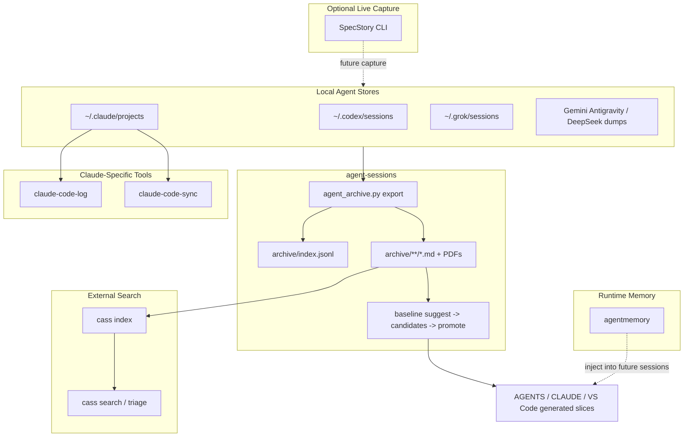

# Compose Stack

> **Status:** `Active (reference)` · **Owner:** `avidullu` · **Last updated:** `2026-07-22`
> Defines what this repo owns vs external tools.

`agent-sessions` should stay narrow: durable multi-agent export, private git
archive, and engineering baseline. Search, Claude-specific browsing, live
capture, and runtime memory should be delegated to tools that already specialize
in those jobs.

## Layer Ownership

| Layer | Owner | Why |
| --- | --- | --- |
| Retrospective multi-agent export to Markdown/PDF | `agent-sessions` | Custom Windows/WSL paths, niche sources, private git archive |
| Engineering baseline extraction and promotion | `agent-sessions` | Differentiated local workflow; no mature equivalent |
| Full-text and semantic search | [cass](https://github.com/Dicklesworthstone/coding_agent_session_search) | Multi-provider local history index and search |
| Claude browsing/export UX | [claude-code-log](https://github.com/daaain/claude-code-log) | Claude JSONL to readable HTML/Markdown, TUI-oriented workflow |
| Raw Claude JSONL sync | [claude-code-sync](https://github.com/perfectra1n/claude-code-sync) | Claude-specific cross-machine raw history sync |
| Live terminal-agent capture | [SpecStory CLI](https://docs.specstory.com/quickstart) | Wrapper-style capture going forward |
| Runtime memory injection | [agentmemory](https://github.com/rohitg00/agentmemory) | MCP/hooks/REST memory layer for future sessions |

## Architecture

## Daily Workflow

1. Pull this repo on each machine.
2. Run the local export script from [AUTOMATION.md](AUTOMATION.md).
3. Let cass index/search local stores or the exported archive separately.
4. Use claude-code-log when the task is specifically Claude browsing/export.
5. Run `baseline suggest` manually or weekly until promotion is mature.

## Scope Boundaries

Build here:

- Pluggable extractors in `agent_sessions/sources/`.
- TOML source definitions and path templates.
- Markdown/PDF archive and `archive/index.jsonl`.
- Daily export automation for this repo.
- Baseline candidate, calibration, promotion, and generated agent views.
- Custom extractors for Grok, Gemini Antigravity, DeepSeek dumps, Codex, Claude,
  and other local stores that are not well-covered elsewhere.

Delegate externally:

- Search/indexing to cass.
- Claude-specific TUI and detailed exports to claude-code-log.
- Raw Claude JSONL sync to claude-code-sync.
- Live capture to SpecStory when wrapping future terminal-agent sessions.
- Runtime memory injection to agentmemory.

Non-goals:

- Do not build a SQLite or semantic search engine inside this repo without a new
  explicit decision.
- Do not compete with Claude-specific UX tools.
- Do not replace runtime memory systems.
- Do not auto-promote baseline policy changes without review.
- Do not commit raw bundles or evidence excerpts unless explicitly forced.

## Install Pointers

- cass: project README at [coding_agent_session_search](https://github.com/Dicklesworthstone/coding_agent_session_search)
- claude-code-log: project README at [claude-code-log](https://github.com/daaain/claude-code-log)
- claude-code-sync: project README at [claude-code-sync](https://github.com/perfectra1n/claude-code-sync)
- SpecStory CLI: [SpecStory quickstart](https://docs.specstory.com/quickstart)
- agentmemory: [agentmemory repo](https://github.com/rohitg00/agentmemory) and [project site](https://agent-memory.dev/)

External tools should be installed beside this repo, not vendored into it.

## Related Work

- [AUTOMATION.md](AUTOMATION.md)
- [ENGINEERING_BASELINE.md](ENGINEERING_BASELINE.md)
- [BASELINE_PLANNING.md](BASELINE_PLANNING.md)
