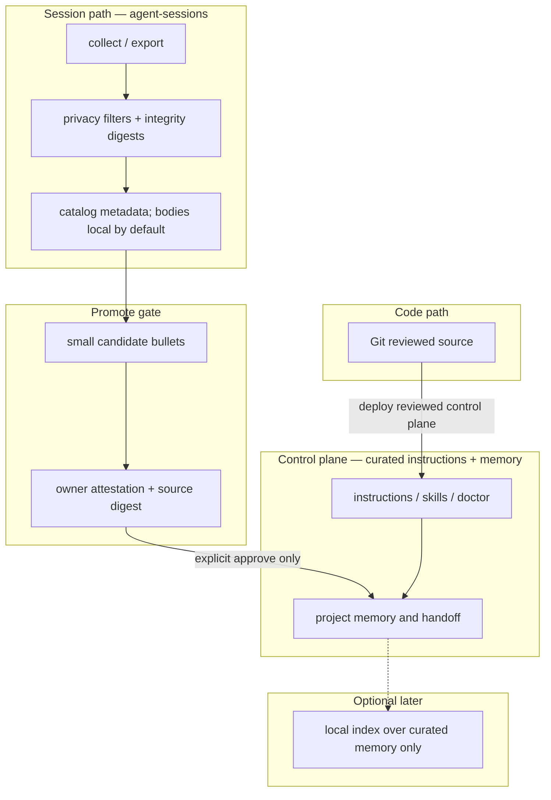

# Product boundary: session archive vs curated control plane

> **Status:** Accepted · **Owner:** avidullu · **Date:** 2026-09-03
> Closes the design half of issues #157 and #153 (parent meta #148).

This repository is a **local-first session archive**. It is not a second
`CLAUDE.md` / `AGENTS.md` / project-memory source of truth.

A privacy-conscious multi-machine setup often also has a **curated instruction
and project-memory control plane** (Avi's is `avis-agents-xdsync`; other owners
may use a renameable equivalent). Those two layers stay separate until an
**owner-attested promote gate** writes a small, reviewed bullet set into curated
memory.

## Layer ownership

| Layer | Owns | Does not own |
| --- | --- | --- |
| **Curated control plane** (xdsync or equivalent) | Instructions, project memory, skills, doctor / link repair | Raw session blobs, SSH collection, semantic RAG as a requirement |
| **agent-sessions** | Session export integrity, multi-machine collect, privacy filters, ship-back approval, propose-only baseline | Becoming a second instruction/memory source of truth |
| **Promote gate** (not shipped) | Owner attestation, digest binding, write into curated memory | Silent learning |

[COMPOSE_STACK.md](COMPOSE_STACK.md) still delegates *search*, live capture, and
optional vendor/runtime memory products. This document adds the missing peer:
curated continuity is a sibling layer, not a feature of the archive.

## End-state diagram

**Caption.** What happened in a session stays in the archive until the owner
attests a small promote. The archive never silently rewrites instruction files.
Optional search, if added, reads curated memory — not raw transcripts.

### Trust boundary

Never leaves owner machines by default:

- transcript bodies and raw session logs
- credentials and session databases
- absolute home paths and operator narrative

May converge across the owner's machines:

- reviewed control-plane files via Git, then the owner's sync fabric
- curated project memory via that same owner-chosen fabric
- catalog metadata when the owner opts a *private* archive into Git

Must not happen:

- silent auto-promotion into `CLAUDE.md` / `AGENTS.md` / project `MEMORY.md`
- shipping raw transcripts to a third-party memory API by default
- treating the control-plane sync folder as a session blob store

## Sequencing for the remaining #148 children

Recorded so later PRs do not invert the order:

1. **This document** — boundaries + shared map (#157, #153).
2. **Closed-loop vertical slice** — end of session → attested bullets → handoff
   update on one host (#149). Fleet SSH collect is orthogonal until that gate
   exists.
3. **Exportable control-plane skeleton** — may be drafted anytime (#150). Do not
   market archive+control-plane coupling until #149 has worked once.
4. **Hygiene while building** — concurrent memory-write policy, handoff rot
   signals, sync-exclude review (#152, #155, #156).
5. **Polish after the loop works** — cross-project index, AGENTS.md / Agent
   Skills portability (#151, #154).

## Related

- Public compose map: [COMPOSE_STACK.md](COMPOSE_STACK.md)
- Collector / session-intel (propose-only, still not a second memory store):
  [designs/SESSION_COLLECTOR_AND_INTEL.md](designs/SESSION_COLLECTOR_AND_INTEL.md)
- Avi-fleet coupling primitives (identity, receipts, transport): private
  `avis-agents-xdsync` `docs/architecture/ADR-002-closed-loop-product-boundary.md`
