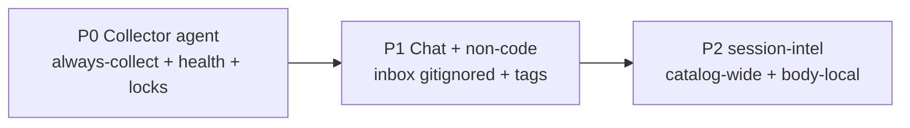
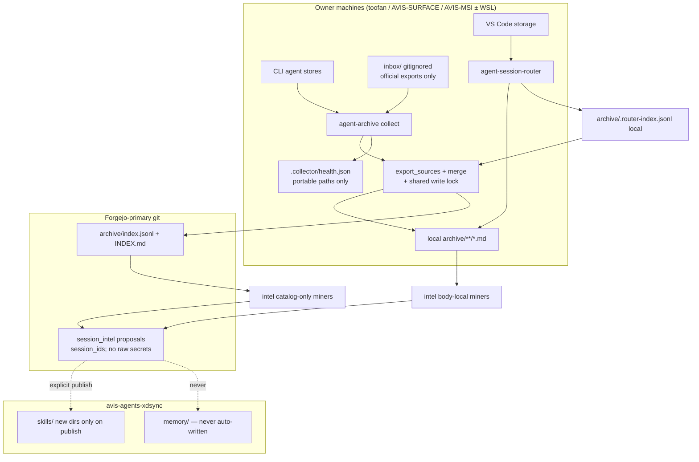
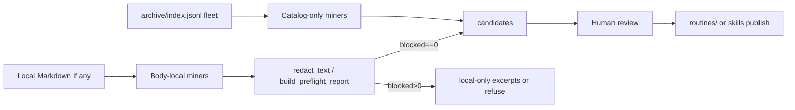
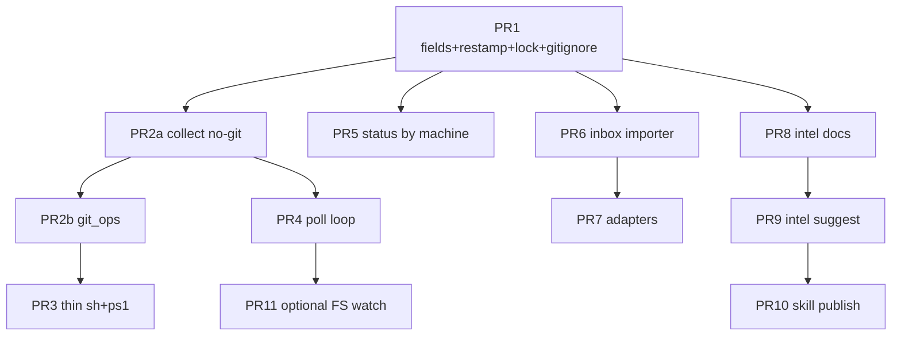

# Design: Session Collector Agent, Non-Code Workload Archive, and Session-Intel Synthesis

| Field | Value |
| --- | --- |
| **Document title** | Lightweight agent-session collector + non-code workload extension + routine/skill synthesis |
| **Author** | TBD (design for avidullu / agent-sessions program) |
| **Date** | 2026-08-01 |
| **Status** | Ready for implementation (rev 2; review consensus; open-question defaults accepted 2026-08-01) |
| **Primary repo** | `avidullu/agent-sessions` (Forgejo-primary: `forge:avidullu/agent-sessions.git`; GitHub is backup only per avis-agents-xdsync) |
| **Companion feeder** | `avidullu/agent-session-router` |
| **Cross-machine semantics** | `avis-agents-xdsync` (CLAUDE.md, memory/, skills/) |
| **Related issues** | hub #32 (backfill/regenerate), hub #86 (publish rules / propose-only), router #24 (inject-context spike) — content assumed from local docs, not re-fetched from forge in this design |

---

## Overview

Today `agent-sessions` is a **local-first coding-session archive hub**: Python extractors (`agent_sessions/sources/*`) and the VS Code **agent-session-router** feeder write Markdown + catalog rows under a shared Output Contract v1. Collection is **batch** (`scripts/daily-export.{sh,ps1}` / cron / Task Scheduler). The engineering **baseline** pipeline turns coding sessions into reviewable guardrails.

Multi-machine catalog merge uses hub identity from `archive.py::index_identity_key` / `merge_index_records` (not a simplified pair alone):

- **Session key:** `("session", metadata.session_id, sha256)` when both `session_id` and `sha256` are non-empty.
- **Path fallback:** `("path", source, portable_path(source_file))` otherwise.
- **Same-path content supersede:** when the same local `(source, source_file)` path gets a new digest, `merge_index_records` drops the previous identity for that path (`path_to_identity` upsert). Same `session_id` with **different** digests stays as **distinct** rows.
- Transcript bodies (`archive/**/*.md` except `INDEX.md`) are **local-only by default**; only `archive/index.jsonl` + `archive/INDEX.md` converge via git.

This design extends that hub—without inventing a third archive format—along three product phases:

1. **P0 — Collector agent:** a lightweight, always-available **collector** (user-service + CLI) that continuously discovers/export/merges with health, backoff, mtime settle, coverage reporting, explicit machine identity, **shared archive write locking**, and **restamp-on-reuse** of additive catalog fields.
2. **P1 — Chat & non-code workloads:** first-class catalog fields and importers so general chat and life/ops/planning sessions are archivable citizens, not inventory-only afterthoughts (inbox is **gitignored**, local-only).
3. **P2 — Session-intel:** a synthesis subsystem (named **`session-intel`**, deliberately distinct from engineering `baseline`) that mines archives for periodic-task automation candidates, routine detection, and **propose-only** skill proposals. **Fleet-wide** mining is catalog-only; **body-dependent** mining is per-machine where local Markdown exists.

---

## Background & Motivation

### Current state (grounded in code)

| Layer | What exists | Key paths |
| --- | --- | --- |
| Hub CLI | `agent-archive` → `agent_sessions.cli:main`; `tools/agent_archive.py` | `agent_sessions/{cli,archive,config,models,render}.py` |
| Extractors | Claude, Codex, Gemini Antigravity, Grok, DeepSeek | `agent_sessions/sources/{claude,codex,gemini,grok,deepseek}.py`, `registry.py` |
| Catalog | `archive/index.jsonl` + `INDEX.md`; feeder sidecar `.router-index.jsonl` | `archive.py::{export_sources,merge_index_records,read_router_index_records,index_identity_key}` |
| Contract | Output Contract **v1** (byte-stable Markdown + catalog schema) | `docs/OUTPUT_CONTRACT.md`, fixtures `tests/fixtures/contract/v1/` |
| Multi-machine | Session+digest or path identity; path-inferred origins; no explicit machine id yet | `docs/MULTI_MACHINE.md`, `portable_paths.py`, `archive_status.classify_source_origin` |
| Automation | Daily pull → export → commit metadata → push | `docs/AUTOMATION.md`, `scripts/daily-export.{sh,ps1}` |
| Automation parity gap | **sh** has branch/clean-tree/lock; **ps1 does not** (pull/export/`git add -- archive/` only) | Verified in `scripts/daily-export.ps1` |
| Locks today | Only shell uses `.daily-export.lock`; **Python `export` has no lock** | `scripts/daily-export.sh` |
| Baseline | Code-centric guardrails: suggest → promote → publish | `baseline/`, `docs/ENGINEERING_BASELINE.md`, `baseline_*.py` |
| Redaction | `redact_text` → `RedactionResult(blocked=…)`, `result_to_report`, `build_preflight_report`; `SCANNER_VERSION = "redaction-v1"` | `baseline_redaction.py` |
| Compose boundary | Search→cass; live capture→SpecStory; memory→agentmemory | `docs/COMPOSE_STACK.md` |
| Router | VS Code discoverer/extractor/watcher; hub-compatible renderer | `agent-session-router/src/{router,watcher,contract,discoverers,extractors}.ts` |
| Publish rules | Propose-only, pull-model, marker blocks, no unmanaged overwrite | `docs/RULES_EXTRACTION_AND_PUBLISH_PLAN.md` D7–D15 / issue #86 |
| Owner remotes | Forgejo-primary, GitHub backup | `avis-agents-xdsync/CLAUDE.md` (hub docs still often say “GitHub”) |

### Pain points

1. **Batch-only collection.** Sessions that finish between daily runs wait up to ~24h. There is no continuous health surface, coverage matrix, or safe mid-write settle loop outside ad-hoc watcher sketches in docs.
2. **Coding-agent scope.** Web/mobile chats and non-engineering workloads are out of scope or inventory-only. Catalog lacks `workload_kind` / domain tags for filtering.
3. **No life/routine synthesis.** Baseline is deliberately engineering-guardrail-shaped. Overloading it would muddy promote/publish semantics.
4. **Machine identity is inferred.** `source_origin` is username-free path class. `AGENT_ARCHIVE_MACHINE_ID` is documented as future in `MULTI_MACHINE.md` and is **not implemented in code today**.
5. **Router is not system-wide.** Auto-watch lives inside VS Code (`watcher.ts`). CLI sources when VS Code is closed are uncovered.
6. **No shared write lock** for `export_sources` / `write_indexes` — concurrent interactive export + scheduled export can interleave catalog writes.
7. **Windows daily-export is under-guarded** relative to the shell script.

### Why not a new archive product?

`COMPOSE_STACK.md` and `OUTPUT_CONTRACT.md` already draw a hard line: one hub format, feeders write identical artifacts, external tools own search/memory/live capture. Prefer **extending the hub** + a **companion collector process** that calls existing `export_sources` / merge paths.

---

## Goals & Non-Goals

### Goals

| ID | Goal |
| --- | --- |
| G1 | Ship a **lightweight collector** that keeps local agent logs flowing into the existing archive with debounce, health, backoff, and multi-source coverage reporting. |
| G2 | Preserve **Output Contract `format_version: 1`** byte compatibility for Markdown; document **additive optional catalog keys** that consumers MUST ignore if unknown (still contract v1 — not a semi-version “v1.1”). |
| G3 | Make **non-code workloads** and general chat **first-class** in schema and filtering so P2 synthesis is not blocked by re-exports. |
| G4 | Design **session-intel** (routines / periodic tasks / skill proposals) so contracts and redaction boundaries are correct before implementation, including **catalog-only vs body-local** miner tiers. |
| G5 | Stay **local-first**: transcripts default local-only; git tracks catalog metadata; multi-machine merge continues via existing identity keys; no body sync (NG5). |
| G6 | Align with **avis-agents-xdsync** topology (four runtimes, skills, memory) and issue **#86 propose-only / no unmanaged overwrite** spirit. |
| G7 | Deliver via **PR-only**, incremental, independently mergeable PRs with green CI. |
| G8 | **Shared archive write lock** so collect, interactive `export`, and `prune` cannot corrupt `index.jsonl` / `INDEX.md`. |

### Non-Goals

| ID | Non-goal |
| --- | --- |
| NG1 | Rebuild cass search, SpecStory live terminal capture, or agentmemory injection. |
| NG2 | Scrape vendor web UIs when no official export/API/local log exists (document gaps honestly). |
| NG3 | Auto-promote engineering baseline or auto-install skills without explicit owner action. |
| NG4 | Replace or absorb `agentforge` (separate owner product / Forgejo console surface in owner topology; not verified in this workspace beyond name/role) or rename/overload engineering `baseline/`. |
| NG5 | Continuous multi-machine real-time sync of transcript bodies (metadata git push remains eventual). |
| NG6 | Solve hub #32 full backfill/regenerate in the collector P0 (may share machine_id helpers only). |
| NG7 | Cloud-hosted collector SaaS or multi-tenant productization. |
| NG8 | Structured three-way merge for concurrent `index.jsonl` rewrites across machines (document risk; use pull-ff + backoff). |

### Non-goals for P0 code (freeze line)

P0 ships **collector + schema stamping only**. Explicitly **not** in P0 code:

- Chat export inbox importers (P1)
- session-intel miners / CLI (P2)
- Optional FS-watch backend (PR11)
- `#32` regenerate
- Body sync

### Interfaces frozen for P1 (stable after P0)

| Surface | Frozen shape |
| --- | --- |
| Catalog optional keys | `machine_id`, `workload_kind`, `domain`, `agent_family` (MAY be present; ignore if unknown) |
| Collect subcommands | `collect run \| watch \| status \| doctor` |
| Lock path | `.collector/collect.lock` (+ dual-check `.daily-export.lock` until shell fully migrated) |
| Git stage allowlist | `archive/index.jsonl`, `archive/INDEX.md` only |
| Export contract Markdown | Unchanged v1 goldens |

---

## Product Phases



### Phase P0 — Lightweight collector agent (shippable now)

**Outcome:** On each owner machine (toofan, AVIS-SURFACE WSL, AVIS-MSI WSL, Windows hosts as needed), a **user-level service** runs the hub export path with settle/debounce, writes health state, and optionally commits/pushes catalog metadata—replacing pure “cron once a day” as the *primary* collection mode while keeping `daily-export` as a thin one-shot.

**In scope:**

- Package `agent_sessions/collector/` inside **agent-sessions** (not a new repo).
- CLI: `agent-archive collect {run|watch|status|doctor}`.
- Explicit `machine_id` on export, including **restamp-on-reuse** of additive fields.
- Shared archive write lock for collect **and** mutating `export` / `prune`.
- Health JSON (paths **must** be portable) + coverage report.
- `CollectorConfig` load path; systemd user unit + Windows Task Scheduler sketches.
- `git_ops` as **canonical** guardrails; **both** sh and ps1 become thin wrappers (closes Windows gap).
- Complementary to router auto-watch.

**Success metrics (per machine):**

| Metric | Target |
| --- | --- |
| Steady-state RSS | ≤ 80 MB typical; ≤ 150 MB with large trees |
| Idle CPU | &lt; 1% when no file activity |
| Export lag after settle | ≤ 120 s after mtime+size stable for `settle_seconds` (poll interval bound) |
| Mid-write safety | Zero partial-hash exports (size/mtime/tail_sha256 reuse path) |
| Catalog corruption | Zero concurrent writers: shared lock + tests (second writer waits/fails with timeout) |
| Field convergence | After one successful collect, all **reused** rows also have `machine_id`/`workload_kind` via restamp |

### Phase P1 — Chat sessions & non-code workloads

**Outcome:** Catalog can filter `workload_kind` and `domain`; inbox importers for official chat exports; honest gap table for web-only products. Entire `inbox/` tree is **local-only / gitignored**.

### Phase P2 — Session-intel (routines, periodic tasks, skill proposals)

**Outcome:** Offline synthesis produces **reviewable proposals** (not auto-installed automation).

**Critical locality rule:**

| Miner tier | Inputs | Fleet-wide? |
| --- | --- | --- |
| **Catalog-only** | `index.jsonl` fields (counts, kinds, `workload_kind`, `domain`, `machine_id`, mtimes, agent_family) | Yes — after metadata merge |
| **Body-dependent** | Local `archive/**/*.md` when present | **No** — per machine (or machines that regenerated bodies from local source logs) |

Skill proposals that include excerpts are **inherently machine-local**; git-tracked proposals use **session_id evidence lists**, not raw quotes, unless redaction preflight allows and owner opts into tracked quotes (default: session_ids only in tracked JSON).

---

## Key Decisions

| # | Decision | Rationale |
| --- | --- | --- |
| **KD1** | **Collector lives inside `agent-sessions`** as `agent_sessions/collector/` + CLI subcommands; **not** a third repo. | One archive format, one merge path, shared tests/contract fixtures. |
| **KD2** | **Collector evolves daily-export; `git_ops` is the canonical guardrail implementation** (branch, clean tree, lock, allowlisted stage paths, commit, push). Both `daily-export.sh` and **`.ps1` become thin** wrappers to `collect run`. PS1 is currently under-guarded; P0 closes that gap. Stage **only** `archive/index.jsonl` + `archive/INDEX.md` (never `git add -- archive/`). | Single implementation of safety; Windows parity; avoid staging `.router-index.jsonl` or other archive noise. |
| **KD3** | **Router auto-watch and collector complement; collector does not subsume the router.** | Router owns VS Code storage parsers; collector owns CLI stores + system-wide schedule; hub merges `.router-index.jsonl` as today. |
| **KD4** | **Synthesis subsystem name: `session-intel`** (`session_intel/`, CLI `agent-archive intel …`). | Avoids `agentforge` and engineering `baseline`. |
| **KD5** | **Output Contract stays `format_version: 1`.** Additive optional catalog keys are documented in §6 as MAY/ignore-unknown. **Do not** introduce a human “catalog v1.1” semi-version or per-record `format_version` field. Bump contract version only if Markdown bytes or **required** keys change. | Matches `OUTPUT_CONTRACT.md` §9 and feeder goldens; optional keys already work with “ignore unknown.” |
| **KD6** | **`machine_id` is explicit, stable, machine-local**, from `AGENT_ARCHIVE_MACHINE_ID` else config else hostname slug; never a username; **never part of merge identity**. | Implements `MULTI_MACHINE.md` future without changing dedupe. |
| **KD7** | **`workload_kind` + `domain` are first-class optional catalog fields from the first schema PR.** **Read path:** missing `domain` → `""` (unknown); missing `workload_kind` → treat as `"code"` only when filtering for backward compatibility with today’s corpus. **Write path:** coding Source defaults stamp `workload_kind=code`, `domain=engineering`; chat/inbox stamps `chat` + empty or vendor domain. | Prevents dual defaults; empty domain is correct for non-code. |
| **KD8** | **Skill/routine proposals are propose-only** (#86 D7 spirit). P2 v1 **creates new skill directories only**; marker-update of existing skills is stretch. Never write `avis-agents-xdsync/memory/**`. | Minimizes clobber risk. |
| **KD9** | **Redaction reuses exact `baseline_redaction` APIs:** `redact_text` → `RedactionResult`; `result_to_report`; `build_preflight_report` / `RedactionPreflight`; `SCANNER_VERSION = "redaction-v1"`. Refuse publish/git of quote-bearing artifacts when any evidence has `blocked=True` or preflight `blocked > 0`. No invented `scan_text` / `status=allowed` schema. | Implementable against real code. |
| **KD10** | **Delivery is PR-only, Forgejo-primary.** Collector `git push` uses the checkout’s default remote; operator must set Forgejo as `origin` / `pushDefault`. Hub docs that still say “GitHub” are historical; COLLECTOR/AUTOMATION updates note the invariant without rewriting all docs in P0. | Owner global rules. |
| **KD11** | **Shared archive write lock** for any process that mutates `archive/index.jsonl` / `INDEX.md` / rendered artifacts via hub writers: `collect run`, `collect watch` export steps, CLI `export`, CLI `prune`. Read-only (`status`, `doctor`, `discover`, `intel suggest` reads) are lock-free (intel may take a **shared/read** advisory lock later if needed; P2 default: best-effort read). | Closes concurrent corruption; success metric “zero catalog corruption” requires this. |
| **KD12** | **session-intel body locality:** fleet-wide miners are **catalog-only**; body-dependent miners run only where local Markdown (or regenerable sources) exist. No body sync in this design (NG5). | Matches OUTPUT_CONTRACT / AUTOMATION local-only policy. |
| **KD13** | **Restamp-on-reuse is in P0 scope:** when `_can_reuse_record` returns true, shallow-copy prior and `setdefault` additive fields (`machine_id`, `workload_kind`, `domain`, `agent_family`) without changing sha256/markdown/imported_at. If any field value changes, the index write is a real metadata change (may dirty git). Optional `--restamp-catalog-fields` / `migrate catalog-fields` remains as an explicit full pass. | Continuous collect converges tags without waiting for session file edits. |

---

## Proposed Design

### Architecture (target)



### Collector placement

**Chosen:** package **inside agent-sessions**, process model = **systemd user service / Task Scheduler + CLI**, evolving daily-export.

| Option | Verdict |
| --- | --- |
| New repo | Reject — contract drift |
| Shell-only forever | Reject — no health/lock in Python export |
| **`agent_sessions/collector` + service units** | **Accept** |
| Subsume router | Reject |

### Collector vs router auto-watch

| Concern | Owner |
| --- | --- |
| Copilot / Cline / Continue / Cody / Aider discovery | **Router** |
| Claude Code / Codex / Grok / Gemini CLI / DeepSeek dumps | **Hub extractors + collector** |
| Debounced watch while VS Code open | **Router** (`watcher.ts`) |
| System-wide schedule when VS Code closed | **Collector** |
| Merge sidecar into catalog | **Hub export** (existing) |
| Commit/push catalog metadata | **`git_ops` via collect** |

Collector never deletes/rewrites `.router-index.jsonl` in P0; only reads via `read_router_index_records`. Prefer **gitignore** of `archive/.router-index.jsonl` (related cleanup) so it cannot be staged; feeder keeps it local.

### Package layout (P0)

```text
agent_sessions/
  machine_id.py              # resolve AGENT_ARCHIVE_MACHINE_ID / hostname
  archive_lock.py            # shared write lock (used by export + collect + prune)
  collector/
    __init__.py
    service.py               # run loop: poll (P0) | watch (later)
    settle.py                # optional activity settle for poll wake
    health.py                # .collector/health.json — portable paths required
    coverage.py
    git_ops.py               # CANONICAL branch/clean/lock/allowlist/commit/push
    config.py                # CollectorConfig + load_collector_config
  …
scripts/
  daily-export.sh            # thin → agent-archive collect run …
  daily-export.ps1           # thin → same (parity with sh)
  systemd/
    agent-archive-collect.service
docs/
  COLLECTOR.md
  OUTPUT_CONTRACT.md         # §6 optional keys language
```

Local-only (gitignored):

```text
.collector/
  health.json
  collect.lock
  last_coverage.json
inbox/                       # entire tree — see Gitignore
```

### Shared archive write lock (KD11)

**Lock file path (canonical):** `{repo_root}/.collector/collect.lock`

**Migration / dual-check (Issue 3):**

1. On acquire, refuse (or wait) if **either** `.collector/collect.lock` **or** legacy `.daily-export.lock` is fresh (mtime age &lt; `lock_timeout_seconds`).
2. Write **both** lock files during transition **or** write only `.collector/collect.lock` but still **check** `.daily-export.lock` until all automation is on thin wrappers (same PR as lock introduction + script thin-out: PR2a/PR3).
3. Prefer **PID liveness** when PID is recorded and `os.kill(pid, 0)` is available; fall back to **mtime stale** semantics matching current shell (300s default) when PID is dead or missing.

**Who acquires (exclusive, write):**

| Command | Lock? |
| --- | --- |
| `collect run` / `collect watch` (during export/git) | Yes exclusive |
| `agent-archive export` | Yes exclusive (new; library `export_sources` acquires when not already held by collect, or CLI always acquires) |
| `agent-archive prune` | Yes exclusive |
| `status`, `doctor`, `discover`, baseline/intel reads | No |

**Semantics:**

- Wait up to `lock_timeout_seconds` with short sleep, then fail with clear error (non-zero).
- Test: second concurrent `export` fails or blocks until timeout then fails; no interleaved `write_indexes`.
- Health file updates use atomic temp+rename and should also run under the same exclusive lock when written from export path (collect holds lock for whole run).

**Success metric wording:** Catalog corruption zero **requires** this lock on index writers—not “document that collect holds lock.”

### CollectorConfig load path (Issue 15)

```python
@dataclass(frozen=True)
class CollectorConfig:
    enabled: bool = True
    mode: str = "poll"  # poll | watch (watch optional later)
    poll_interval_seconds: int = 120
    settle_seconds: int = 15
    settle_checks: int = 2
    max_backoff_seconds: int = 900
    export_pdf: bool = False
    commit_metadata: bool = True
    push: bool = True
    branch: str = "main"
    require_clean_tree: bool = True
    lock_timeout_seconds: int = 300
    health_path: str = ".collector/health.json"
    machine_id: str | None = None  # optional config override

def load_collector_config(repo_root: Path, toml_data: dict) -> CollectorConfig:
    ...
```

**Load order:**

1. `load_config(repo_root)` → `ArchiveConfig` (unchanged export fields).
2. Collect handlers re-read the same TOML used by `load_config` (`sources.toml` if present else `config/default_sources.toml`) and call `load_collector_config`.
3. Env overrides (table):

| Env | Effect |
| --- | --- |
| `AGENT_ARCHIVE_MACHINE_ID` | Wins over config `machine_id` |
| `DAILY_EXPORT_BRANCH` | Overrides `branch` (existing shell convention) |
| `AGENT_ARCHIVE_COLLECT_PUSH=0` | Forces `push=false` |
| `AGENT_ARCHIVE_COLLECT_COMMIT=0` | Forces `commit_metadata=false` |

**Export path stays free of collector deps** except: shared `archive_lock` + optional field stamping helpers live in `archive.py` / `machine_id.py` / `agent_family` map—not under `collector/git_ops`.

Default `[collector]` block lives in `config/default_sources.toml` comments/values; machine overrides in ignored `sources.toml`.

### Collector runtime algorithm

**Config example:**

```toml
[collector]
enabled = true
mode = "poll"
poll_interval_seconds = 120
settle_seconds = 15
settle_checks = 2
max_backoff_seconds = 900
export_pdf = false
commit_metadata = true
push = true
branch = "main"
require_clean_tree = true
lock_timeout_seconds = 300
health_path = ".collector/health.json"
# machine_id = "toofan"
```

**`collect run` (one-shot)** — replaces daily-export **body** (git_ops is Python):

1. Acquire shared archive write lock (dual-check legacy).
2. Resolve `machine_id`.
3. If `commit_metadata`: require branch + clean tree (canonical git_ops); `git pull --ff-only`. On non-ff: write health error, release lock, exit non-zero (**no force**).
4. Call `export_sources(...)` (under same lock; do not double-lock if export detects held lock by same process — use re-entrant or “already held” token).
5. **Restamp:** every record emitted (including reuse path) gets `setdefault` for additive fields (see below).
6. Update health (portable paths only).
7. If metadata changed and `commit_metadata`: stage **only** allowlist paths; commit `archive: collect <date> [<machine_id>]`; push if enabled.
8. Release lock; exit codes as today (0 nothing-to-do / success).

**`collect watch` (P0 = poll loop):**

1. Exclusive lock **per export cycle**, not forever across sleep (so interactive export can run between cycles). Alternative acceptable: hold lock only during export/git steps.
2. **P0 algorithm (Issue 14):** On each interval, run **full** `export_sources` for configured sources (equivalent to `export --all` or configured list)—**no per-file dirty export API**. Optional: if no root mtime advanced since last success, skip export (cheap tree max-mtime check), else full export. Reuse path keeps cost low.
3. On failure: exponential backoff `min(max_backoff, base * 2^n)`.
4. SIGTERM: finish in-flight export, release lock, exit 0.
5. Never run baseline/intel on hot path.

**Settle:** Optional pre-export delay when using activity wake; for interval poll, settle is “wait `settle_seconds` after detecting activity” before full export. Per-path settle before hashing remains the existing size/mtime/tail reuse in `archive.py`.

**`collect status` / `doctor`:** lock-free. Doctor warns if tracked git files appear under `inbox/`; verifies machine_id, roots, lock free, remotes, branch, write access, router-index readable.

### Explicit machine identity

```python
def resolve_machine_id(config_value: str | None = None) -> str:
    env = os.environ.get("AGENT_ARCHIVE_MACHINE_ID", "").strip()
    if env:
        return slugify_machine(env)
    if config_value:
        return slugify_machine(config_value)
    return slugify_machine(socket.gethostname())
```

**Merge reminder:** `machine_id` is **never** part of `index_identity_key` or `merge_index_records` keys.

**P0 acceptance — multi-machine merge regression:**

1. Two records, same `session_id`, different `sha256` → two rows after merge.
2. Path-key older row superseded when same `(source, source_file)` gets new digest.
3. `machine_id` differs across rows without collapsing them.

### Schema extension (still Output Contract v1)

Markdown §2 **unchanged**. Catalog §6 documents **optional** keys (MAY be present; consumers MUST ignore unknown keys). **No** per-record `format_version`. **No** “catalog v1.1” product version name in contract text—use “additive optional catalog fields (contract remains format_version 1).”

| Key | Type | Read default if absent | Write behavior | Notes |
| --- | --- | --- | --- | --- |
| `machine_id` | string | omit / treat as unknown | Always stamp current machine on this machine’s export/restamp | Not in merge key |
| `workload_kind` | string enum | treat as `"code"` for filters | Source default or classifier | Closed enum below |
| `domain` | string | `""` (unknown) | Coding sources: `"engineering"`; chat/inbox: `""` or vendor | **Not** forced to engineering on read |
| `agent_family` | string | `"unknown"` | `agent_family_for_kind(kind)` | Table below |

**`workload_kind` enum:** `code` | `chat` | `ops` | `life` | `research` | `planning` | `mixed` | `unknown`

**Source dataclass (write defaults):**

```python
@dataclass(frozen=True)
class Source:
    name: str
    kind: str
    roots: tuple[Path, ...]
    glob: str = "**/*"
    description: str = ""
    workload_kind: str = "code"
    domain: str = "engineering"  # write default for coding sources; chat sources set ""
```

Inbox / chat sources set `workload_kind="chat"`, `domain=""` (or e.g. `chatgpt`) in TOML.

### `agent_family` mapping (closed)

| `kind` | `agent_family` |
| --- | --- |
| `claude` | `claude` |
| `codex` | `codex` |
| `gemini_antigravity` | `gemini` |
| `grok` | `grok` |
| `deepseek_request_dump` | `deepseek` |
| `copilot_chat` | `copilot` |
| `router_index` | `router` |
| `inventory` | `inventory` |
| `chat_export_inbox` | `import` |
| anything else | `unknown` |

Pure function + unit tests. Inventory rows may omit family or use `inventory`.

### Restamp-on-reuse (KD13)

In `export_sources`, when `_can_reuse_record` is true:

```python
record = dict(prior)  # shallow copy
record.setdefault("machine_id", current_machine_id)
record.setdefault("workload_kind", source.workload_kind or "code")
if source.domain is not None:
    record.setdefault("domain", source.domain)
record.setdefault("agent_family", agent_family_for_kind(source.kind))
# do not change sha256, markdown, imported_at, messages, size, mtime, tail_sha256
records.append(record)
```

For freshly extracted records, set the same keys (assign, not only setdefault).

If restamp changes any field relative to `prior`, `write_indexes` will rewrite index → **git metadata commit is expected** (desired for fleet convergence).

Optional CLI: `agent-archive migrate catalog-fields` or `export --restamp-catalog-fields` for full pass without relying on source file visibility (still only restamps rows this machine’s export touches unless migrate reads whole index and rewrites all missing fields with **current** machine_id only on rows this machine owns—**caution:** migrate must not overwrite foreign `machine_id`. Rule: restamp `machine_id` only when missing **or** when this process exported/reused the row from a local source file; never invent machine_id for not-visible foreign rows).

### P1 inbox importer

```text
inbox/                 # gitignored entire tree
  README.md            # exception: tracked via !inbox/README.md
  chatgpt/
  claude-ai/
  gemini/
  manual/
  processed/           # still under ignored tree
```

- Official exports only; no scraping.
- After export, optional move to `inbox/processed/`.
- Identity still sha256-based.
- Doctor: warn if `git ls-files inbox` non-empty (except README).

**Gitignore (required for privacy):**

```gitignore
.collector/
inbox/**
!inbox/README.md
archive/.router-index.jsonl
session_intel/.cache/
```

(Exact `.gitignore` syntax may use `inbox/*` + un-ignore README; entire content local-only, same class as transcript bodies.)

### P1 source strategy (honest gaps)

| Source | Approach | Phase |
| --- | --- | --- |
| Existing CLI/VS Code | As today | done |
| Claude.ai / ChatGPT / Gemini export | Inbox importer | P1 |
| Grok.com / mobile | Document gap; no scrape | P1 docs |

### P2 session-intel

#### Why not `baseline/`?

Engineering promote/publish vs life/ops routines and skill UX — separate trees and CLIs.

#### Artifact layout

```text
session_intel/
  README.md
  SCHEMA.md
  candidates/          # generated; prefer session_id lists in tracked JSON
  routines/            # human-promoted
  periodic_tasks/
  skills/proposals/
  reports/
```

#### Pipeline



**CLI:** `agent-archive intel suggest|routines|skills propose|skills publish`

**Miners:**

1. **Catalog-only (fleet):** cadence of kinds/domains/machine_ids; volume spikes; multi-machine coverage gaps.
2. **Body-local:** topic tokens, “every Monday” phrasing, cross-agent agreement **on this disk**.
3. Defaults: N=4 occurrences, W=4 weeks (until calibrated).

**Logging:** intel CLI logs paths + counts only—never transcript bodies (same rule as collector).

#### Skill landing (P2 v1)

| Target | Auto-write? |
| --- | --- |
| `session_intel/skills/proposals/*` | Yes (generated; session_ids; no raw quotes by default) |
| `avis-agents-xdsync/skills/<name>/` | **Only** `intel skills publish` — **create new skill directory**; if exists, refuse (write `SKILL.proposed.md` beside or fail) |
| `avis-agents-xdsync/memory/**` | **Never** |
| Existing skill marker upsert | Stretch after v1 |

#### Marker grammar (if stretch marker updates used)

```markdown
<!-- session-intel:begin id="skill.slug" proposal_id="YYYY-MM-DD-slug" -->
…
<!-- session-intel:end id="skill.slug" -->
```

- Begin/end `id` must match; never nest; do not mix baseline markers inside.
- Prefer **new skill directory** for first ship (KD8).

#### Redaction (exact APIs — KD9)

```python
from agent_sessions.baseline_redaction import (
    SCANNER_VERSION,  # "redaction-v1"
    redact_text,
    result_to_report,
    build_preflight_report,
)

result = redact_text(excerpt)
if result.blocked:
    # refuse git-tracked write of this quote; optional local-only redacted file
    ...
preflight = build_preflight_report([(ref, text), ...], generated_at=...)
if preflight.blocked > 0:
    refuse publish
```

Do **not** invent `status=allowed`. Use `RedactionResult.blocked` and preflight aggregate counts. Tracked intel artifacts that embed quote fields **must** pass preflight. Prefer **session_id-only** evidence in git-tracked JSON so PII CI (`tools/check_pii.py`) stays quiet; if session_intel paths grow tracked prose, extend PII check allowlist/deny patterns in the same PR.

#### Redaction boundaries table

| Artifact | Raw transcript? | Redaction | Git? |
| --- | --- | --- | --- |
| `archive/**/*.md` bodies | Yes (local) | N/A | Default **no** |
| `archive/index.jsonl` | No | portable_paths | **Yes** |
| `inbox/**` | Yes | N/A | **No** (gitignored) |
| `session_intel` candidates with session_ids only | No | path scrub | Yes |
| Candidates/quotes | Yes | `redact_text` fail-closed | Only if `blocked==0`; default prefer local-only quotes |
| Health JSON | Paths **must** portable | N/A | **No** |
| xdsync skills on publish | Summaries | Preflight required | Outside hub git |

---

## API / Interface Changes

### CLI

```text
agent-archive collect run [--source NAME ...] [--pdf] [--no-commit] [--no-push] [--dry-run]
agent-archive collect watch [--mode poll]
agent-archive collect status [--json]
agent-archive collect doctor

agent-archive export …          # acquires shared write lock
agent-archive prune …           # acquires shared write lock

# P2
agent-archive intel suggest …
agent-archive intel skills propose|publish …
```

### Library

```python
from agent_sessions.machine_id import resolve_machine_id
from agent_sessions.archive_lock import archive_write_lock
from agent_sessions.collector.service import collect_once, collect_poll_loop
from agent_sessions.collector.config import CollectorConfig, load_collector_config
from agent_sessions.collector.health import read_health, write_health
from agent_sessions.collector.git_ops import commit_archive_metadata  # allowlist only
```

### `export_sources` changes

1. Acquire lock (or accept held token).
2. On reuse: restamp setdefault fields (KD13).
3. On full extract: set `machine_id`, `workload_kind`, `domain`, `agent_family`.
4. Router records merged: stamp current `machine_id` only if missing; do not invent foreign hosts.

### Feeder (router)

- P0: no required TypeScript change (optional keys).
- P1 optional: emit workload fields when known.
- Goldens: existing v1 fixtures still pass; new unit tests for optional keys without claiming contract version bump.

---

## Data Model Changes

### Index record example

```json
{
  "source": "claude-linux",
  "kind": "claude",
  "source_file": "~/.claude/projects/.../session.jsonl",
  "source_origin": "posix-home",
  "machine_id": "toofan",
  "workload_kind": "code",
  "domain": "engineering",
  "agent_family": "claude",
  "sha256": "…",
  "tail_sha256": "…",
  "size": 12345,
  "mtime": 1720000000.0,
  "messages": 42,
  "markdown": "archive/claude-linux/….md",
  "pdf": null,
  "raw": null,
  "metadata": { "session_id": "…", "project": "…" }
}
```

### Migration

1. Read path: ignore unknown keys; domain missing → `""`; workload missing → filter as code for backward compat.
2. Write/restamp: continuous convergence (KD13).
3. Optional migrate command for edge cases; never overwrite foreign machine_id on not-visible rows.
4. No contract version bump.

### Gitignore (authoritative for this design)

```gitignore
.collector/
inbox/**
!inbox/README.md
archive/.router-index.jsonl
session_intel/.cache/
```

(Plus existing archive md/pdf ignores.)

---

## Alternatives Considered

### 1. Collector as a separate repository

Reject — contract drift.

### 2. Subsume router into collector

Reject — VS Code expertise / lifecycle.

### 3. Continuous daemon runs baseline + intel hourly

Reject — COMPOSE_STACK separation; human gates.

### 4. Full Output Contract v2 with required workload fields

Reject — feeder breakage; optional keys sufficient.

### 5. Overload `baseline/` for life routines

Reject — promote/publish semantics diverge; use `session-intel`.

### 6. LLM-first routine detection in P0

Reject — cost/privacy/nondeterminism; deterministic first.

### 7. Document-only lock discipline for interactive export

**Reject** — not a fix for concurrent `write_indexes` (Issue 2). Shared lock required.

### 8. Catalog-only “v1.1” version label + per-record format_version

**Reject** — keep contract v1 + MAY optional keys (Issue 9).

---

## Security & Privacy Considerations

| Threat | Severity | Mitigation |
| --- | --- | --- |
| Transcript bodies committed | High | `track_artifacts=false`; git_ops allowlist only index + INDEX.md |
| **Inbox exports committed** | **High** | **Gitignore entire `inbox/`; doctor warns if tracked; same class as local transcripts** |
| Secrets in intel proposals | High | `redact_text` / preflight; default session_id-only evidence in git |
| Health file absolute user paths | Medium | **Require** `portable_path` on all paths in health.json |
| Concurrent catalog writers | High | Shared write lock on export/collect/prune |
| Dirty/wrong branch push | Medium | git_ops branch + clean tree (both OS wrappers) |
| Skill publish clobber | High | New skill dir only; never memory/ |
| Broad `git add archive/` stages router sidecar | Medium | Allowlist; gitignore `.router-index.jsonl` |
| Web scraping ToS | High | Forbidden |
| Multi-machine index push conflicts | Medium | pull --ff-only; backoff; no force; manual resolve (NG8) |
| PII CI on session_intel growth | Medium | Prefer session_ids; extend `tools/check_pii.py` when needed |
| Daemon full-home read | Medium | User-level service; optional hardening |

**Threat model:** single-user, owner machines on Tailscale; primary risks are **accidental git of sensitive content** (transcripts, **inbox**, excerpts) and **silent instruction mutation**.

---

## Observability

### Health record (local JSON)

```json
{
  "version": 1,
  "machine_id": "toofan",
  "updated_at": "2026-08-01T12:00:00+00:00",
  "last_success_at": "2026-08-01T12:00:00+00:00",
  "last_error": null,
  "last_duration_ms": 1840,
  "exported": 3,
  "mode": "poll",
  "backoff_seconds": 0,
  "sources": {
    "claude-linux": {
      "last_export_at": "…",
      "files_seen": 12,
      "last_error": null,
      "sample_root": "~/.claude/projects"
    }
  },
  "router_index_records": 17
}
```

All path-like fields **must** pass through `portable_path`.

### Metrics / logging

| Name | Notes |
| --- | --- |
| `collect.export.duration_ms` | Per run |
| `collect.export.sessions` | Count |
| `collect.export.errors` | Count |
| `collect.lock.wait_ms` / `collect.lock.busy` | Lock contention |
| `collect.git.push` | success/fail |
| `collect.git.ff_fail` | Concurrent multi-machine push |

Logs: paths (portable) + counts only for collect **and** intel CLIs.

### Multi-machine concurrent push (Issue 22)

1. `git pull --ff-only` before commit.
2. On non-ff or push rejection: record health error, backoff, **no force-push**, no rebase automation.
3. Whole-file `index.jsonl` rewrites can conflict under concurrent machines—**risk accepted** (NG8); short-lived commits reduce window; operator resolves manually if needed.

---

## Rollout Plan

| Stage | Action |
| --- | --- |
| 0 | PR1: optional fields + machine_id + restamp + lock helper on export |
| 1 | PR2a/2b: collect run + health; then git_ops allowlist |
| 2 | PR3: thin sh **and** ps1; dual lock check; COLLECTOR.md Forgejo note |
| 3 | Install poll service on toofan; observe 1 week |
| 4 | Other machines with distinct `AGENT_ARCHIVE_MACHINE_ID` |
| 5 | P1 inbox (gitignore already in place) |
| 6 | P2 catalog-only intel, then body-local |

**Rollback:** stop service; thin wrappers can call `export --all` + manual git if needed; additive fields ignore-safe.

**Risks**

| Risk | Severity | Mitigation |
| --- | --- | --- |
| Lock contention | Med | Wait+timeout; lock only during write cycles |
| Dirty tree skips commit | Low | Local archive still written; next clean commit |
| Reuse without restamp | — | **Fixed by KD13** |
| Inbox leak | — | **Fixed by gitignore** |
| Overstated multi-machine intel | — | **Fixed by KD12** |
| Index merge conflicts | Med | ff-only + backoff; NG8 |

---

## Open Questions

**Owner resolution (2026-08-01):** accept all defaults below for implementation.

| # | Question | Decision |
| --- | --- | --- |
| Q1 | Windows native vs WSL same laptop: one or two machine_ids? | **Two** (`…-win` / `…-wsl`) |
| Q2 | Optional watchdog extra for FS watch? | Optional later; P0 poll only |
| Q3 | Router stamps machine_id? | Optional P1; hub restamps missing on merge for rows it rewrites |
| Q4 | Miner thresholds N/W? | N=4, W=4 |
| Q5 | Joint #32 regenerate + field backfill? | Separate |
| Q6 | Router #24 inject-context coupling? | No — pull-model publish |
| Q7 | macOS launchd in P0? | Docs sketch only |
| Q8 | Owner wants optional opt-in body sync later? | Still NG5 for this design; would need new design if yes |
| Q9 | Re-entrant lock design vs single CLI always acquires? | Prefer context manager with thread/process local “held” flag for collect→export |

---

## References

- `agent-sessions/docs/OUTPUT_CONTRACT.md` (§6 catalog, §9 versioning)
- `agent-sessions/docs/MULTI_MACHINE.md`
- `agent-sessions/docs/AUTOMATION.md` (still mentions GitHub in places; design is Forgejo-primary)
- `agent-sessions/docs/COMPOSE_STACK.md`
- `agent-sessions/docs/ENGINEERING_BASELINE.md`
- `agent-sessions/docs/RULES_EXTRACTION_AND_PUBLISH_PLAN.md` (D7–D15)
- `agent-sessions/agent_sessions/archive.py` (`index_identity_key`, `merge_index_records`, `_can_reuse_record`)
- `agent-sessions/agent_sessions/baseline_redaction.py` (`redact_text`, `build_preflight_report`, `SCANNER_VERSION`)
- `agent-sessions/scripts/daily-export.sh` (branch, clean tree, lock)
- `agent-sessions/scripts/daily-export.ps1` (no branch/clean/lock — gap)
- `agent-session-router/PLAN.md`, `src/watcher.ts`
- `avis-agents-xdsync/CLAUDE.md` (Forgejo-primary)
- `avis-agents-xdsync/skills/tracker-dashboard/SKILL.md` (skill format precedent)

---

## Implementation notes sufficient for P0

### Files to add/change

1. `agent_sessions/machine_id.py`
2. `agent_sessions/archive_lock.py` — dual-check legacy lock; PID+mtime
3. `agent_sessions/agent_family.py` — mapping table + tests
4. `agent_sessions/collector/{config,health,service,git_ops,coverage,settle}.py`
5. `agent_sessions/cli.py` — `collect` subcommands; export/prune take lock
6. `agent_sessions/archive.py` — restamp-on-reuse; stamp on extract; lock integration
7. `agent_sessions/config.py` + `models.py` — Source optional workload/domain
8. `config/default_sources.toml` — `[collector]` + Source defaults
9. `.gitignore` — `.collector/`, `inbox/**`, `!inbox/README.md`, `.router-index.jsonl`
10. `inbox/README.md` — local-only policy
11. `scripts/daily-export.sh` + **`.ps1`** thin wrappers
12. `scripts/systemd/…`
13. Docs: `COLLECTOR.md`, `AUTOMATION.md`, `MULTI_MACHINE.md`, `OUTPUT_CONTRACT.md` §6
14. Tests: lock concurrency, restamp-on-reuse, merge identity cases, git allowlist, agent_family, health portable paths, PS1/sh invoke collect

### P0 acceptance checklist

- [ ] `collect run` exports same sessions as `export --all` on fixtures.
- [ ] Second concurrent export/collect fails or waits then fails; no torn index.
- [ ] Dual-check: fresh `.daily-export.lock` blocks collect.
- [ ] Reuse path restamps missing `machine_id`/`workload_kind`/`domain`/`agent_family`; index may dirty git when fields fill.
- [ ] Merge tests: same session_id different sha256 → two rows; path supersede works; machine_id not in key.
- [ ] git_ops stages only allowlist; test fails if staging `.router-index.jsonl` attempted.
- [ ] ps1 and sh both invoke collect (guardrails in Python).
- [ ] Health paths are portable.
- [ ] Router merge still works.
- [ ] Coverage/ruff/mypy green.
- [ ] Docs: Forgejo push remote expectation; lock; inbox privacy for P1 path already gitignored.

### Service unit sketch (Linux)

```ini
[Unit]
Description=Agent Sessions archive collector
After=network-online.target

[Service]
Type=simple
WorkingDirectory=%h/Projects/agentic-work/agent-sessions
Environment=AGENT_ARCHIVE_MACHINE_ID=toofan
ExecStart=%h/.local/bin/agent-archive collect watch --mode poll
Restart=on-failure
RestartSec=30

[Install]
WantedBy=default.target
```

P0: **poll only**.

---

## PR Plan

Effort: **S** &lt; ~1 day, **M** ~1–3 days, **L** multi-day. Each PR independently reviewable.

### PR1 — Additive catalog fields + machine_id + restamp + shared lock on export (L)

- **Title:** `feat(archive): optional catalog fields, machine_id, restamp-on-reuse, shared write lock`
- **Files:** `machine_id.py`, `archive_lock.py`, `agent_family.py`, `models.py`, `config.py`, `archive.py`, `cli.py` (export/prune lock), `default_sources.toml` (Source defaults for workload/domain), `.gitignore` (`.collector/`, **inbox/**, router-index), `inbox/README.md`, `docs/OUTPUT_CONTRACT.md` §6 optional-key language, `MULTI_MACHINE.md`, tests (merge identity, restamp, lock, agent_family)
- **Dependencies:** none
- **Description:** Contract remains format_version 1. Stamp + restamp fields. Shared lock on mutating export/prune. Inbox gitignore early so P1 cannot leak. Source TOML workload/domain defaults **in this PR** (schema-complete write path).
- **Effort:** L

### PR2a — Collector run without git (M)

- **Title:** `feat(collector): collect run/status/doctor + health (no git commit)`
- **Files:** `collector/{service,health,coverage,config,settle}.py`, `cli.py`, tests, `docs/COLLECTOR.md` (draft)
- **Dependencies:** PR1
- **Description:** One-shot collect calling export_sources under lock; health JSON; doctor checks (incl. inbox tracked warning). No commit/push yet.
- **Effort:** M

### PR2b — git_ops allowlist commit/push (M)

- **Title:** `feat(collector): git_ops allowlist commit/push for collect run`
- **Files:** `collector/git_ops.py`, wire into `collect run`, tests that only index+INDEX staged
- **Dependencies:** PR2a
- **Description:** Canonical guardrails: branch, clean tree, dual lock already held, pull --ff-only, allowlist add, commit, push, no force.
- **Effort:** M

### PR3 — Thin daily-export sh **and** ps1 + systemd sketches (S)

- **Title:** `chore(automation): daily-export shells delegate to collect run; document Forgejo push`
- **Files:** `scripts/daily-export.sh`, `scripts/daily-export.ps1`, `scripts/systemd/*`, `docs/AUTOMATION.md`, `docs/NEW_MACHINE_SETUP.md`, `docs/COLLECTOR.md`
- **Dependencies:** PR2b
- **Description:** Both wrappers thin; PS1 gains parity via Python git_ops. Note: push uses default remote—set Forgejo origin. Dual-check legacy lock until old cron retired.
- **Effort:** S

### PR4 — collect watch poll loop + backoff (M)

- **Title:** `feat(collector): poll loop watch mode`
- **Files:** `collector/service.py`, cli, tests, docs
- **Dependencies:** PR2a (git optional)
- **Description:** Interval full export (or skip if no root activity); lock only during export cycle; backoff. **No** per-file dirty export API.
- **Effort:** M

### PR5 — Status grouping by machine_id (S)

- **Title:** `feat(status): group archive status by machine_id`
- **Files:** `archive_status.py`, tests, docs
- **Dependencies:** PR1
- **Description:** **Only** status reporting polish—Source TOML defaults already in PR1 (no overlap).
- **Effort:** S

### PR6 — Chat export inbox importer (M)

- **Title:** `feat(sources): chat_export_inbox importer`
- **Files:** sources module, registry, sources.example.toml, fixtures, docs gap table
- **Dependencies:** PR1 (gitignore already present)
- **Description:** Official export JSON → sessions; workload_kind=chat; domain empty/vendor.
- **Effort:** M

### PR7 — Additional chat adapters (M, optional split per vendor)

- **Title:** `feat(sources): additional chat export adapters`
- **Dependencies:** PR6
- **Effort:** M

### PR8 — session-intel docs scaffold + naming table (S)

- **Title:** `docs(session-intel): schema, body locality, compose stack row`
- **Files:** `session_intel/README.md`, `SCHEMA.md`, `docs/SESSION_INTEL.md`, `docs/COMPOSE_STACK.md`, `docs/README.md` one-screen baseline vs session-intel vs agentforge table, ROADMAP pointer
- **Dependencies:** none (parallel); reference PR1 fields
- **Description:** Locks KD4/KD12, redaction APIs, propose-only, catalog-only vs body-local. No mining code. CLI verb remains `intel` not `baseline`.
- **Effort:** S

### PR9 — intel suggest catalog-only + optional body-local (L)

- **Title:** `feat(intel): suggest routines/periodic tasks with redaction-safe evidence`
- **Files:** `agent_sessions/session_intel/*`, CLI, candidates writers, tests, PII interaction note
- **Dependencies:** PR1, PR8
- **Description:** Catalog-only fleet miners; body-local when md present; `redact_text`/`build_preflight_report`; tracked JSON uses session_ids by default.
- **Effort:** L

### PR10 — skill proposals + new-dir publish to xdsync (M)

- **Title:** `feat(intel): skill proposals and propose-only xdsync publish (new dirs only)`
- **Files:** proposals layout, publish command, tests refuse overwrite / memory path
- **Dependencies:** PR9
- **Description:** No memory writes; existing skill → refuse or SKILL.proposed.md; marker upsert stretch deferred.
- **Effort:** M

### PR11 — Optional FS watch backend (M, optional)

- **Title:** `feat(collector): optional watchdog backend`
- **Dependencies:** PR4
- **Description:** Only if poll lag insufficient; poll remains default.
- **Effort:** M

### PR sequencing



---

## Appendix A — Naming rationale (`session-intel`)

| Candidate | Why not / why |
| --- | --- |
| `baseline` / `life-baseline` | Overloads engineering pipeline |
| `routines` only | Too narrow |
| `habit-synth` | Informal |
| **`session-intel`** | Clear parallel to archive/baseline; CLI `intel` |

Land comparison table early in PR8 on `docs/README.md` / COMPOSE_STACK to reduce English “baseline” confusion. No CLI alias that routes `baseline life` into intel.

## Appendix B — Compose stack update

| Layer | Owner |
| --- | --- |
| Continuous local export | **collector** in agent-sessions |
| VS Code session feed | agent-session-router |
| Engineering guardrails | baseline/ |
| Routines / skill proposals | **session-intel/** (catalog fleet + body local) |
| Search | cass |
| Live terminal capture | SpecStory |
| Runtime memory | agentmemory |
| Global skills store | avis-agents-xdsync/skills |

## Appendix C — Mapping to owner topology

| Runtime | Collector install | machine_id example |
| --- | --- | --- |
| toofan Linux | systemd user | `toofan` |
| AVIS-SURFACE WSL | systemd user | `avis-surface-wsl` |
| AVIS-SURFACE Windows | Task Scheduler → thin ps1 | `avis-surface-win` |
| AVIS-MSI WSL | systemd user | `avis-msi-wsl` |
| AVIS-MSI Windows | Task Scheduler | `avis-msi-win` |

Each checkout: `origin = forge:avidullu/agent-sessions.git`; land via PR only; collector push uses that remote.
