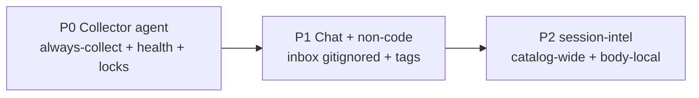
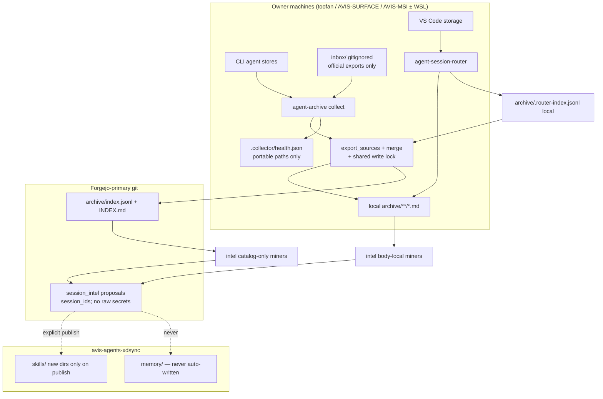
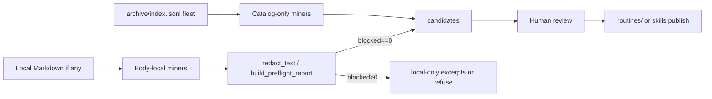
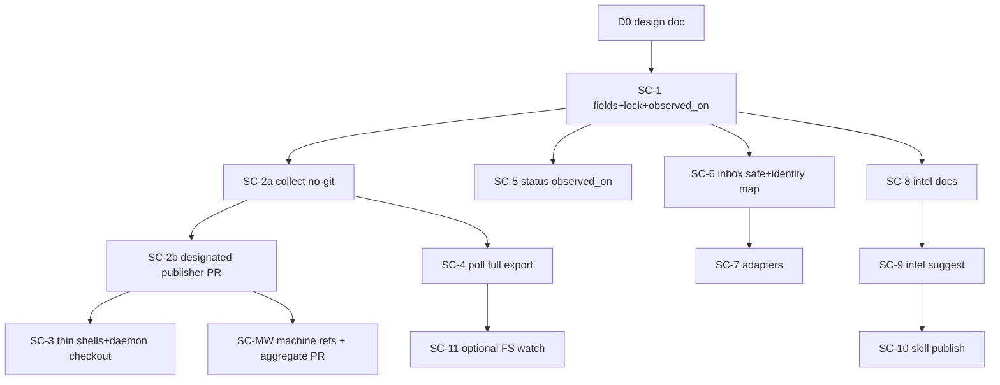

# Session Collector, Non-Code Archive Extension, and Session-Intel

> **Status:** `IN PROGRESS` — design on PR #142 (D0); reviews #351 and #353 incorporated; implementation not started · **Owner:** `avidullu` · **Created:** `2026-08-01` · **Last updated:** `2026-08-01`
> **Lifecycle:** `DRAFT → IN PROGRESS → DONE → ARCHIVED` (archive to `docs/archives/` when DONE)
> **Tracking anchors:** § Progress tracker is the **source of truth**; indexed in `docs/README.md`; pointer in avis-agents-xdsync `memory/agent-sessions/session-handoff.md`.
> **Relation to existing docs:** extends `OUTPUT_CONTRACT.md`, `MULTI_MACHINE.md`, `AUTOMATION.md`, `COMPOSE_STACK.md`, `ENGINEERING_BASELINE.md`; peer of engineering baseline (does not replace it).
> **Honesty note:** claims marked `[verified]` against hub/router code; open product choices marked `[design]`.
> **Primary repo:** `avidullu/agent-sessions` (Forgejo-primary: `forge:avidullu/agent-sessions.git`; GitHub backup only)
> **Companion feeder:** `avidullu/agent-session-router`
> **Related issues:** hub #32 (backfill/regenerate), hub #86 (publish rules / propose-only), router #24 (inject-context spike)

---

## 0. TL;DR

Ship a **lightweight continuous collector** inside the agent-sessions hub (not a third archive), extend the catalog for **chat / non-code** workloads via an official-export inbox, then add **session-intel** to mine routines and propose skills—without overwriting agent memory. Preserve Output Contract Markdown goldens; amend catalog policy **explicitly** for additive optional keys; use an **atomic** shared write lock. Progress is tracked per PR row below.

## Overview

Today `agent-sessions` is a **local-first coding-session archive hub**: Python extractors (`agent_sessions/sources/*`) and the VS Code **agent-session-router** feeder write Markdown + catalog rows under a shared Output Contract v1. Collection is **batch** (`scripts/daily-export.{sh,ps1}` / cron / Task Scheduler). The engineering **baseline** pipeline turns coding sessions into reviewable guardrails.

Multi-machine catalog merge uses hub identity from `archive.py::index_identity_key` / `merge_index_records` (not a simplified pair alone):

- **Session key:** `("session", metadata.session_id, sha256)` when both `session_id` and `sha256` are non-empty.
- **Path fallback:** `("path", source, portable_path(source_file))` otherwise.
- **Same-path content supersede:** when the same local `(source, source_file)` path gets a new digest, `merge_index_records` drops the previous identity for that path (`path_to_identity` upsert). Same `session_id` with **different** digests stays as **distinct** rows.
- Transcript bodies (`archive/**/*.md` except `INDEX.md`) are **local-only by default**; only `archive/index.jsonl` + `archive/INDEX.md` converge via git.

This design extends that hub—without inventing a third archive format—along three product phases:

1. **P0 — Collector agent:** a lightweight, always-available **collector** (user-service + CLI) that continuously discovers/export/merges with health, backoff, mtime settle, coverage reporting, explicit machine identity, **shared archive write locking**, and **restamp-on-reuse** of additive catalog fields.
2. **P1 — Chat & non-code workloads:** first-class catalog fields and importers so general chat and life/ops/planning sessions are archivable citizens, not inventory-only afterthoughts (inbox is **gitignored**, local-only).
3. **P2 — Session-intel:** a synthesis subsystem (named **`session-intel`**, deliberately distinct from engineering `baseline`) that mines archives for periodic-task automation candidates, routine detection, and **propose-only** skill proposals. **Fleet-wide** mining is catalog-only; **body-dependent** mining is per-machine where local Markdown exists.

---

## Background & Motivation

### Current state (grounded in code)

| Layer | What exists | Key paths |
| --- | --- | --- |
| Hub CLI | `agent-archive` → `agent_sessions.cli:main`; `tools/agent_archive.py` | `agent_sessions/{cli,archive,config,models,render}.py` |
| Extractors | Claude, Codex, Gemini Antigravity, Grok, DeepSeek | `agent_sessions/sources/{claude,codex,gemini,grok,deepseek}.py`, `registry.py` |
| Catalog | `archive/index.jsonl` + `INDEX.md`; feeder sidecar `.router-index.jsonl` | `archive.py::{export_sources,merge_index_records,read_router_index_records,index_identity_key}` |
| Contract | Output Contract **v1** (byte-stable Markdown + catalog schema) | `docs/OUTPUT_CONTRACT.md`, fixtures `tests/fixtures/contract/v1/` |
| Multi-machine | Session+digest or path identity; path-inferred origins; no explicit machine id yet | `docs/MULTI_MACHINE.md`, `portable_paths.py`, `archive_status.classify_source_origin` |
| Automation | Daily pull → export → commit metadata → push | `docs/AUTOMATION.md`, `scripts/daily-export.{sh,ps1}` |
| Automation parity gap | **sh** has branch/clean-tree/lock; **ps1 does not** (pull/export/`git add -- archive/` only) | Verified in `scripts/daily-export.ps1` |
| Locks today | Only shell uses `.daily-export.lock`; **Python `export` has no lock** | `scripts/daily-export.sh` |
| Baseline | Code-centric guardrails: suggest → promote → publish | `baseline/`, `docs/ENGINEERING_BASELINE.md`, `baseline_*.py` |
| Redaction | `redact_text` → `RedactionResult(blocked=…)`, `result_to_report`, `build_preflight_report`; `SCANNER_VERSION = "redaction-v1"` | `baseline_redaction.py` |
| Compose boundary | Search→cass; live capture→SpecStory; memory→agentmemory | `docs/COMPOSE_STACK.md` |
| Router | VS Code discoverer/extractor/watcher; hub-compatible renderer | `agent-session-router/src/{router,watcher,contract,discoverers,extractors}.ts` |
| Publish rules | Propose-only, pull-model, marker blocks, no unmanaged overwrite | `docs/RULES_EXTRACTION_AND_PUBLISH_PLAN.md` D7–D15 / issue #86 |
| Owner remotes | Forgejo-primary, GitHub backup | `avis-agents-xdsync/CLAUDE.md` (hub docs still often say “GitHub”) |

### Pain points

1. **Batch-only collection.** Sessions that finish between daily runs wait up to ~24h. There is no continuous health surface, coverage matrix, or safe mid-write settle loop outside ad-hoc watcher sketches in docs.
2. **Coding-agent scope.** Web/mobile chats and non-engineering workloads are out of scope or inventory-only. Catalog lacks `workload_kind` / domain tags for filtering.
3. **No life/routine synthesis.** Baseline is deliberately engineering-guardrail-shaped. Overloading it would muddy promote/publish semantics.
4. **Machine identity is inferred.** `source_origin` is username-free path class. `AGENT_ARCHIVE_MACHINE_ID` is documented as future in `MULTI_MACHINE.md` and is **not implemented in code today**.
5. **Router is not system-wide.** Auto-watch lives inside VS Code (`watcher.ts`). CLI sources when VS Code is closed are uncovered.
6. **No shared write lock** for `export_sources` / `write_indexes` — concurrent interactive export + scheduled export can interleave catalog writes.
7. **Windows daily-export is under-guarded** relative to the shell script.

### Why not a new archive product?

`COMPOSE_STACK.md` and `OUTPUT_CONTRACT.md` already draw a hard line: one hub format, feeders write identical artifacts, external tools own search/memory/live capture. Prefer **extending the hub** + a **companion collector process** that calls existing `export_sources` / merge paths.

---

## Goals & Non-Goals

### Goals

| ID | Goal |
| --- | --- |
| G1 | Ship a **lightweight collector** that keeps local agent logs flowing into the existing archive with debounce, health, backoff, and multi-source coverage reporting. |
| G2 | Preserve **Output Contract Markdown §2 goldens** (`format_version: 1` for bodies). For catalog keys: land an **explicit §6/§9 policy amendment** (additive optional keys + ignore-unknown) **before** producers emit them—do not pretend the active contract already allows silent schema growth. |
| G3 | Make **non-code workloads** and general chat **first-class** in schema and filtering so P2 synthesis is not blocked by re-exports. |
| G4 | Design **session-intel** (routines / periodic tasks / skill proposals) so contracts and redaction boundaries are correct before implementation, including **catalog-only vs body-local** miner tiers. |
| G5 | Stay **local-first**: transcripts default local-only; git tracks catalog metadata; multi-machine merge continues via existing identity keys; no body sync (NG5). |
| G6 | Align with **avis-agents-xdsync** topology (four runtimes, skills, memory) and issue **#86 propose-only / no unmanaged overwrite** spirit. |
| G7 | Deliver via **PR-only**, incremental, independently mergeable PRs with green CI. |
| G8 | **Shared archive write lock** so collect, interactive `export`, and `prune` cannot corrupt `index.jsonl` / `INDEX.md`. |

### Non-Goals

| ID | Non-goal |
| --- | --- |
| NG1 | Rebuild cass search, SpecStory live terminal capture, or agentmemory injection. |
| NG2 | Scrape vendor web UIs when no official export/API/local log exists (document gaps honestly). |
| NG3 | Auto-promote engineering baseline or auto-install skills without explicit owner action. |
| NG4 | Replace or absorb `agentforge` (separate owner product / Forgejo console surface in owner topology; not verified in this workspace beyond name/role) or rename/overload engineering `baseline/`. |
| NG5 | Continuous multi-machine real-time sync of transcript bodies (metadata publication through PRs remains eventual). |
| NG6 | Solve hub #32 full backfill/regenerate in the collector P0 (may share machine_id helpers only). |
| NG7 | Cloud-hosted collector SaaS or multi-tenant productization. |
| NG8 | ~~Accept permanent multi-writer wedge as “manual resolve”~~ — **REJECTED as steady state** (see KD15). Interim designated-publisher branch/PR is allowed only until machine refs land. |

### Non-goals for P0 code (freeze line)

P0 ships **collector + schema stamping only**. Explicitly **not** in P0 code:

- Chat export inbox importers (P1)
- session-intel miners / CLI (P2)
- Optional FS-watch backend (PR11)
- `#32` regenerate
- Body sync

### Interfaces frozen for P1 (stable after P0)

| Surface | Frozen shape |
| --- | --- |
| Catalog optional keys | `machine_id`, `observed_on`, `workload_kind`, `domain`, `agent_family` (MAY; ignore unknown) — only after §6/§9 amendment |
| Collect subcommands | `collect run \| watch \| status \| doctor` |
| Lock path + protocol | Atomic exclusive-create on `.collector/collect.lock` (+ dual legacy protocol until shell migrated) |
| Git stage allowlist | `archive/index.jsonl`, `archive/INDEX.md` only |
| Export contract Markdown | Unchanged v1 goldens |
| Inbox expand interface | Discover → Expand → Materialize → single-session Extract (P1) |

---

## Product Phases



### Phase P0 — Lightweight collector agent (shippable now)

**Outcome:** On each owner machine (toofan, AVIS-SURFACE WSL, AVIS-MSI WSL, Windows hosts as needed), a **user-level service** runs the hub export path with settle/debounce, writes health state, and optionally commits/pushes catalog metadata—replacing pure “cron once a day” as the *primary* collection mode while keeping `daily-export` as a thin one-shot.

**In scope:**

- Package `agent_sessions/collector/` inside **agent-sessions** (not a new repo).
- CLI: `agent-archive collect {run|watch|status|doctor}`.
- Explicit `machine_id` on export, including **restamp-on-reuse** of additive fields.
- Shared archive write lock for collect **and** mutating `export` / `prune`.
- Health JSON (paths **must** be portable) + coverage report.
- `CollectorConfig` load path; systemd user unit + Windows Task Scheduler sketches.
- `git_ops` as **canonical** guardrails; **both** sh and ps1 become thin wrappers (closes Windows gap).
- Complementary to router auto-watch.

**Success metrics (per machine):**

| Metric | Target |
| --- | --- |
| Steady-state RSS | ≤ 80 MB typical; ≤ 150 MB with large trees |
| Idle CPU | &lt; 1% when no file activity |
| Export lag after settle | ≤ 120 s after mtime+size stable for `settle_seconds` (poll interval bound) |
| Mid-write safety | Zero partial-hash exports (size/mtime/tail_sha256 reuse path) |
| Catalog corruption | Zero concurrent writers: shared lock + tests (second writer waits/fails with timeout) |
| Field convergence | After one successful collect, all **reused** rows also have `machine_id`/`workload_kind` via restamp |

### Phase P1 — Chat sessions & non-code workloads

**Outcome:** Catalog can filter `workload_kind` and `domain`; inbox importers for official chat exports; honest gap table for web-only products. Entire `inbox/` tree is **local-only / gitignored**.

### Phase P2 — Session-intel (routines, periodic tasks, skill proposals)

**Outcome:** Offline synthesis produces **reviewable proposals** (not auto-installed automation).

**Critical locality rule:**

| Miner tier | Inputs | Fleet-wide? |
| --- | --- | --- |
| **Catalog-only** | `index.jsonl` fields (counts, kinds, `workload_kind`, `domain`, `machine_id`, mtimes, agent_family) | Yes — after metadata merge |
| **Body-dependent** | Local `archive/**/*.md` when present | **No** — per machine (or machines that regenerated bodies from local source logs) |

Skill proposals that include excerpts are **inherently machine-local**; git-tracked proposals use **session_id evidence lists**, not raw quotes, unless redaction preflight allows and owner opts into tracked quotes (default: session_ids only in tracked JSON).

---

## Key Decisions

| # | Decision | Rationale |
| --- | --- | --- |
| **KD1** | **Collector lives inside `agent-sessions`** as `agent_sessions/collector/` + CLI subcommands; **not** a third repo. | One archive format, one merge path, shared tests/contract fixtures. |
| **KD2** | **Collector evolves daily-export; `git_ops` is the canonical guardrail implementation** (lock, snapshot, ephemeral publish worktree, exact allowlist, commit, non-default ref, PR). Both `daily-export.sh` and **`.ps1` become thin** wrappers to `collect run`. PS1 is currently under-guarded; P0 closes that gap. Never use `git add -- archive/`; never reset a collector checkout; never push the default branch. | Single implementation of safety; Windows parity; preserve local state; comply with PR-only delivery. |
| **KD3** | **Router auto-watch and collector complement; collector does not subsume the router.** | Router owns VS Code storage parsers; collector owns CLI stores + system-wide schedule; hub merges `.router-index.jsonl` as today. |
| **KD4** | **Synthesis subsystem name: `session-intel`** (`session_intel/`, CLI `agent-archive intel …`). | Avoids `agentforge` and engineering `baseline`. |
| **KD5** | **Contract policy amendment, still labeled `format_version: 1` for Markdown.** Active `OUTPUT_CONTRACT.md` §9 today says any change that alters the §6 schema is a **version bump** `[verified]`. That conflicts with “just emit optional keys.” **PR1 / SC-1 must first amend §6 and §9** as follows: (1) §6 lists optional keys `machine_id`, `observed_on`, `workload_kind`, `domain`, `agent_family` as **MAY** be present; (2) §9 gains an explicit rule: *additive optional keys whose absence is equivalent to the documented read-default, and which consumers MUST ignore if unknown, do **not** require a format_version bump*; required-key changes, Markdown §2 byte changes, or feeder naming breaks **do** bump and get `v2/` goldens. **No** per-record `format_version`. **No** human “catalog v1.1” product label. **Downstream consumer audit + cross-repo conformance (blocking for SC-1 merge):** see § Schema extension + contract policy checklist (hub + router). Alternative rejected: full `format_version: 2` with required nullables — forces feeder golden churn without benefit. | Honest vs active §9; preserves feeder Markdown goldens. |
| **KD6** | **`machine_id` is explicit, stable, machine-local**, from `AGENT_ARCHIVE_MACHINE_ID` else config else hostname slug; never a username; **never part of merge identity key**. Provenance is **`observed_on`** (sorted unique machine ids) under merge algebra (KD16)—scalar `machine_id` alone is lossy. | Implements multi-machine reporting without false single-writer provenance. |
| **KD7** | **`workload_kind` + `domain` are first-class optional catalog fields from the first schema PR.** **Read path:** missing `domain` → `""` (unknown); missing `workload_kind` → treat as `"code"` only when filtering for backward compatibility with today’s corpus. **Write path:** coding Source defaults stamp `workload_kind=code`, `domain=engineering`; chat/inbox stamps `chat` + empty or vendor domain. | Prevents dual defaults; empty domain is correct for non-code. |
| **KD8** | **Skill/routine proposals are propose-only** (#86 D7 spirit). P2 v1 **creates new skill directories only**; marker-update of existing skills is stretch. Never write `avis-agents-xdsync/memory/**`. | Minimizes clobber risk. |
| **KD9** | **Redaction reuses exact `baseline_redaction` APIs:** `redact_text` → `RedactionResult`; `result_to_report`; `build_preflight_report` / `RedactionPreflight`; `SCANNER_VERSION = "redaction-v1"`. Refuse publish/git of quote-bearing artifacts when any evidence has `blocked=True` or preflight `blocked > 0`. No invented `scan_text` / `status=allowed` schema. | Implementable against real code. |
| **KD10** | **Delivery is PR-only, Forgejo-primary.** Collector publication uses Forgejo non-default per-machine refs and a ready aggregate PR; no collector path pushes `main`. The operator must set Forgejo as `origin` / `pushDefault`. Hub docs that still say “GitHub” are historical; COLLECTOR/AUTOMATION updates note the invariant without rewriting all docs in P0. | Owner global rules; CI and review remain the landing gate. |
| **KD11** | **Atomic shared archive write lock** with **owner_token** and **explicit-only stale recovery** for P0 (see lock section). Exclusive create (`O_EXCL`); keep the acquisition fd for diagnostic heartbeat; release only if the pathname still carries the caller token. Normal collect/export/prune never auto-reclaims by PID, age, or lease. | Closes TOCTOU and heartbeat/reclaim races; favors fail-closed safety over unattended recovery. |
| **KD14** | **Crash-atomic catalog publication:** temp + fsync + `os.replace` per file; **`index.jsonl` is source of truth**; `INDEX.md` is derived. **Fail-closed on corrupt jsonl** (KD18)—no silent git restore. | Always-on collect increases write frequency. |
| **KD12** | **session-intel body locality:** fleet-wide miners are **catalog-only**; body-dependent miners run only where local Markdown (or regenerable sources) exist. No body sync in this design (NG5). | Matches OUTPUT_CONTRACT / AUTOMATION local-only policy. |
| **KD13** | **Restamp-on-reuse is in P0 scope:** when `_can_reuse_record` returns true, shallow-copy prior and `setdefault`/union additive fields without changing sha256/markdown/imported_at. Union current machine into **`observed_on`**. | Continuous collect converges tags. |
| **KD15** | **Multi-writer convergence (required before fleet publication):** each machine writes a full shard (including its router sidecar rows), pushes only its own non-default ref, and a designated aggregator opens a deterministic catalog PR from an ephemeral worktree. `merge_shards` consumes **committed shard bytes only**; no local sidecar, environment, existing derived file, or wall clock. No collector resets a checkout or pushes `main`. | Prevents non-ff wedges, local-state loss, executor drift, and PR-policy bypass. |
| **KD16** | **Merge algebra for same identity:** content supersede rules + **`observed_on` = sorted unique union**. In **derived** `index.jsonl` / `INDEX.md`, scalar `machine_id` is **deprecated for merge output** or set **only** to `min(observed_on)` (lexicographic)—**never** the executor’s current machine. Local **shard** rows may still stamp their owning machine. Byte-identical merge under shuffled shards + two current machine ids. | Stops oscillating `index.jsonl` under multi-writer. |
| **KD17** | **Daemon runs only from a dedicated collector checkout** (separate clone/worktree per runtime), not a human dev tree. Versioned entrypoint or restart-on-update; isolated config/state; doctor enforces. | Avoids WIP halt and code changing under a long-lived process. |
| **KD18** | **Corrupt `index.jsonl` → fail closed.** Preserve final + temp bytes; hard health error; stop. Git restore only via explicit `doctor --repair-index --from-git` (dry-run/diff/confirm). Auto path may only rebuild **INDEX.md** from a **valid** jsonl. | Dirty catalog may be valid uncommitted work—must not clobber. |
| **KD19** | **Export ZIPs are untrusted.** Streaming validation; reject path escape/links; size/count/ratio caps; clean temp always. SC-6 fixtures for traversal/link/bomb. | “Unzip to temp” is not a security boundary. |
| **KD20** | **Stable import identity map** for inbox: persistent `.collector/inbox-identity-map.json` + versioned canonicalization. Candidate buckets use vendor + creation anchor; mutable message count, attachment names, title, `update_time`, and body digest are evidence only. Ambiguous/no-anchor cases quarantine for explicit mapping rather than silently merge or allocate a duplicate. | Preserves identity across ordinary edits and fails closed when no stable match exists. |
| **KD21** | **P0 poll always runs full reuse-aware export**—no root-directory mtime shortcut. Nested session edits do not advance ancestor mtimes. Optional future: per-file fingerprints (separate design + tests). | Root watermark skip is incorrect and can skip forever. |

---

## Proposed Design

### Architecture (target)



### Collector placement

**Chosen:** package **inside agent-sessions**, process model = **systemd user service / Task Scheduler + CLI**, evolving daily-export.

| Option | Verdict |
| --- | --- |
| New repo | Reject — contract drift |
| Shell-only forever | Reject — no health/lock in Python export |
| **`agent_sessions/collector` + service units** | **Accept** |
| Subsume router | Reject |

### Collector vs router auto-watch

| Concern | Owner |
| --- | --- |
| Copilot / Cline / Continue / Cody / Aider discovery | **Router** |
| Claude Code / Codex / Grok / Gemini CLI / DeepSeek dumps | **Hub extractors + collector** |
| Debounced watch while VS Code open | **Router** (`watcher.ts`) |
| System-wide schedule when VS Code closed | **Collector** |
| Merge sidecar into catalog | **Hub export** (existing) |
| Commit/push catalog metadata | **`git_ops` via collect** |

Collector never deletes/rewrites `.router-index.jsonl` in P0; only reads via `read_router_index_records`. Prefer **gitignore** of `archive/.router-index.jsonl` (related cleanup) so it cannot be staged; feeder keeps it local.

### Package layout (P0)

```text
agent_sessions/
  machine_id.py              # resolve AGENT_ARCHIVE_MACHINE_ID / hostname
  archive_lock.py            # shared write lock (used by export + collect + prune)
  collector/
    __init__.py
    service.py               # run loop: poll (P0) | watch (later)
    settle.py                # optional activity settle for poll wake
    health.py                # .collector/health.json — portable paths required
    coverage.py
    git_ops.py               # CANONICAL branch/clean/lock/allowlist/commit/push
    config.py                # CollectorConfig + load_collector_config
  …
scripts/
  daily-export.sh            # thin → agent-archive collect run …
  daily-export.ps1           # thin → same (parity with sh)
  systemd/
    agent-archive-collect.service
docs/
  COLLECTOR.md
  OUTPUT_CONTRACT.md         # §6 optional keys language
```

Local-only (gitignored):

```text
.collector/
  health.json
  collect.lock
  last_coverage.json
inbox/                       # entire tree — see Gitignore
```

### Shared archive write lock (KD11)

**Lock file path (canonical):** `{repo_root}/.collector/collect.lock`
**Legacy path (transition):** `{repo_root}/.daily-export.lock`

#### Atomic acquisition (required — not check-then-write)

Check-then-write is a TOCTOU race: two processes can both observe “no fresh lock” and both proceed, re-creating interleaved `write_indexes`. **Acquisition MUST be atomic** on every supported platform (Linux, Windows, WSL).

**Primitive (stdlib-first, cross-platform):**

1. Ensure `.collector/` exists (`mkdir -p`, ignore EEXIST).
2. Attempt **exclusive create** of the lock file:
   - `fd = os.open(path, os.O_CREAT | os.O_EXCL | os.O_RDWR)`; write + fsync the payload and **keep this acquisition fd open until release**.
   - On Windows this is supported by Python’s `os.open` with `O_EXCL`.
3. If `FileExistsError`:
   - Read payload only for diagnostics. **Never unlink or replace it from normal `collect` / `export` / `prune`, regardless of PID, age, or heartbeat.**
   - Sleep briefly and retry until `lock_timeout_seconds`, then fail non-zero with owner diagnostics (**fail closed**).
4. Payload (UTF-8 JSON object):

```json
{
  "owner_token": "<uuid4>",
  "runtime_id": "linux|windows|wsl",
  "hostname": "<slug>",
  "pid": 12345,
  "process_start": "<boot_id or process create time token>",
  "started_at": "2026-08-01T12:00:00+00:00",
  "heartbeat_at": "2026-08-01T12:01:00+00:00",
  "owner": "collect|export|prune"
}
```

**Owner token and diagnostic heartbeat (KD11 / #3940 / #3974 / #3994):**

- On acquire, generate a fresh random `owner_token` and remember it in process memory (contextvar).
- **Heartbeat:** update `heartbeat_at` only through the acquisition fd: seek to 0, truncate, write the same token payload, fsync. **Never** renew with `os.replace(path)` or by reopening/truncating the pathname. If an operator explicitly removes the lock, a late heartbeat can touch only the old/unlinked inode and cannot overwrite a successor lock.
- **Release:** close the acquisition fd, re-read the pathname, and **unlink only if** `owner_token` still matches the caller. If the file is missing, unreadable, or carries another token, do not unlink.
- `pid`, `process_start`, `runtime_id`, mtime, and `heartbeat_at` are diagnostics—not automatic ownership proofs across Windows/WSL namespaces.

**P0 stale-owner policy — explicit-only break:**

Normal commands **never auto-reclaim**. This deliberately chooses safety over unattended recovery: a filesystem lease implemented as “read token, then unlink/replace” has no cross-platform conditional-CAS primitive. A heartbeat and a reclaimer can otherwise cross at expiry and both enter.

`agent-archive collect doctor --break-lock` is a separate, explicit operator action:

1. Require `--expect-owner-token <token>` and `--i-have-stopped-all-writers`.
2. Re-read immediately before unlink; refuse if the token changed, payload is unreadable, or either dual-lock file has a different token.
3. Write an audit record (time, runtime, hostname slug, prior token, reason) under `.collector/`; never log secrets or usernames.
4. Unlink both canonical and legacy names only after the operator has stopped collector/export/prune on **every runtime sharing the checkout**. Reacquisition still goes through `O_EXCL`.
5. If Windows/open-handle semantics refuse deletion, fail with instructions to stop the owning process; never fall back to path replacement.

Automatic stale recovery may be reconsidered only with a separately reviewed fencing/CAS design that protects the catalog writes themselves—not merely the lock-file payload.

**Dual-lock transition protocol (one acquire, both names):**

Until all automation uses thin wrappers (through PR3), acquire as **one protocol**:

1. Atomically exclusive-create **canonical** `.collector/collect.lock` with full payload.
2. Atomically exclusive-create **legacy** `.daily-export.lock` with the **same** `owner_token` payload.
3. If step 2 finds any pre-existing legacy lock, release canonical **only if token still matches**, then wait/retry; normal acquisition never classifies or reclaims the legacy file.
4. Hold **both** until release; heartbeat each through its own acquisition fd and token-check each release independently.
5. Explicit break validates that both names still carry the expected token before unlinking either; a mismatch fails closed for operator inspection.

**Who acquires (exclusive, write):**

| Command | Lock? |
| --- | --- |
| `collect run` / `collect watch` (during export/git) | Yes exclusive |
| `agent-archive export` | Yes exclusive (CLI always acquires; library path used only under already-held owner token — Q9) |
| `agent-archive prune` | Yes exclusive |
| `status`, `doctor`, `discover`, baseline/intel reads | No |

**Semantics:**

- Wait up to `lock_timeout_seconds` with short sleep, then fail with clear error (non-zero).
- Health file updates use atomic temp+rename under the same exclusive lock when written from export/collect.
- **Re-entrancy (Q9):** process-local contextvar holds `owner_token`; nested acquire by same token is a no-op.

**Acceptance tests:**

1. **Simultaneous contenders** (≥2 processes): exactly one critical-section winner.
2. Sequential second writer alone is **not** sufficient.
3. Dead PID, old mtime, expired-looking heartbeat, foreign runtime, and unreadable payload each remain **non-reclaimable by normal commands**.
4. A long-running foreign owner that heartbeats past `lock_timeout_seconds` retains exclusion; a contender times out non-zero.
5. Adversarial barrier: pause owner heartbeat before its fd write, run explicit break + successor acquire, resume heartbeat/release; neither operation overwrites or unlinks the successor pathname.
6. Explicit break rejects token changes and missing acknowledgement; after a verified dead owner it removes both names and a fresh `O_EXCL` acquisition succeeds.
7. Dual-lock: holding only legacy blocks canonical acquire.

**Success metric wording:** Catalog corruption zero **requires** this atomic, token-checked lock plus explicit-only P0 stale recovery on index writers.

#### Crash-atomic catalog writes (mutual exclusion is not enough)

`[verified]` Today `write_indexes` builds full text then calls `write_text_if_changed`, which opens the **final path** and writes in place when content differs (`archive.py::write_indexes` / `write_text_if_changed`). That is fine under a lock for **concurrency**, but a SIGKILL, power loss, or I/O error mid-write can **truncate** `archive/index.jsonl` or leave `index.jsonl` and `INDEX.md` as an inconsistent pair. Always-on collect raises write frequency, so SC-1 must harden this.

**Required write protocol for each catalog file** (`index.jsonl`, then `INDEX.md`):

1. Write full content to a sibling temp file in the same directory (e.g. `index.jsonl.tmp.{pid}` or `index.jsonl.{nonce}.tmp`).
2. `flush` + `os.fsync(fd)` (or platform equivalent) before close.
3. **Atomic replace** onto the final name: `os.replace(tmp, final)` (POSIX rename; on Windows `os.replace` overwrites destinaton atomically when on the same volume).
4. Best-effort fsync of the parent directory after replace where the OS allows (document Linux yes / Windows best-effort).

**Pair ordering and recovery (KD14 + KD18 fail-closed):**

| Rule | Spec |
| --- | --- |
| Source of truth | **`archive/index.jsonl` is authoritative.** `INDEX.md` is a derived human view. |
| Order | Always publish `index.jsonl` via temp+replace **first**, then rebuild and temp+replace `INDEX.md`. |
| Interrupted after jsonl, before INDEX | Next `export`/`collect`/`doctor --repair-index` **regenerates INDEX.md only** from a **valid** `index.jsonl` (no source re-extraction). |
| Truncated / invalid jsonl | **Fail closed (KD18).** Detect empty file, majority non-JSONL, or parse failure. **Preserve** final path bytes and any `*.tmp*` siblings (copy to `.collector/quarantine/` with timestamp). Emit **hard health error** and **stop** collect/export. **Never** auto-restore from git during collect start—a dirty catalog may be valid uncommitted work from another session/machine. |
| Explicit git restore | Only `doctor --repair-index --from-git` with **dry-run**, **diff against HEAD**, and **confirmation** (or `--yes` for automation). Not on the collect hot path. |
| Partial temp only | Final untouched → next run succeeds; leave or clean temps under policy. |
| Unchanged content | Compare first; when writing, still temp+replace (never truncate-in-place). |

**Tests (SC-1):**

1. Fault-injection: crash **between** jsonl replace and INDEX replace → next run rebuilds INDEX from valid jsonl.
2. Fault-injection: interrupt **during** temp write → final unchanged.
3. Corrupt final jsonl on collect start → hard error, files preserved, **no** git checkout of index.
4. `doctor --repair-index --from-git --dry-run` shows diff; apply only with confirm.
5. Writer helper never opens final path for truncate-in-place.

This pairs with the exclusive lock: lock = one writer; temp+replace = crash safety; fail-closed = no silent data loss.

### CollectorConfig load path (Issue 15)

```python
@dataclass(frozen=True)
class CollectorConfig:
    enabled: bool = True
    mode: str = "poll"  # poll | watch (watch optional later)
    poll_interval_seconds: int = 120
    settle_seconds: int = 15
    settle_checks: int = 2
    max_backoff_seconds: int = 900
    export_pdf: bool = False
    commit_metadata: bool = True
    publish: bool = True
    publication_mode: str = "pr"  # only supported mode
    machine_ref_prefix: str = "collector/machines"
    aggregate_ref_prefix: str = "collector/catalog"
    aggregate: bool = False  # enabled on exactly one designated runtime
    lock_timeout_seconds: int = 300
    health_path: str = ".collector/health.json"
    machine_id: str | None = None  # optional config override

def load_collector_config(repo_root: Path, toml_data: dict) -> CollectorConfig:
    ...
```

**Load order:**

1. `load_config(repo_root)` → `ArchiveConfig` (unchanged export fields).
2. Collect handlers re-read the same TOML used by `load_config` (`sources.toml` if present else `config/default_sources.toml`) and call `load_collector_config`.
3. Env overrides (table):

| Env | Effect |
| --- | --- |
| `AGENT_ARCHIVE_MACHINE_ID` | Wins over config `machine_id` |
| `AGENT_ARCHIVE_COLLECT_PUBLISH=0` | Forces `publish=false` |
| `AGENT_ARCHIVE_COLLECT_PUSH=0` | Deprecated compatibility kill switch; also forces `publish=false`. Any other value is ignored and cannot enable publication. |
| `AGENT_ARCHIVE_AGGREGATOR=1` | Enables aggregate-PR publication only on the designated runtime; doctor rejects more than one registered aggregator. |

`DAILY_EXPORT_BRANCH` is intentionally not consumed by the collector. Publication refs are derived from the validated machine id or shard digest, and no configuration or environment value may select the default branch.
| `AGENT_ARCHIVE_COLLECT_COMMIT=0` | Forces `commit_metadata=false` |

**Export path stays free of collector deps** except: shared `archive_lock` + optional field stamping helpers live in `archive.py` / `machine_id.py` / `agent_family` map—not under `collector/git_ops`.

Default `[collector]` block lives in `config/default_sources.toml` comments/values; machine overrides in ignored `sources.toml`.

### Collector runtime algorithm

**Config example:**

```toml
[collector]
enabled = true
mode = "poll"
poll_interval_seconds = 120
settle_seconds = 15
settle_checks = 2
max_backoff_seconds = 900
export_pdf = false
commit_metadata = true
publish = true
publication_mode = "pr"
machine_ref_prefix = "collector/machines"
aggregate_ref_prefix = "collector/catalog"
aggregate = false  # true on exactly one designated runtime after SC-MW
lock_timeout_seconds = 300
health_path = ".collector/health.json"
# machine_id = "toofan"
```

**`collect run` (one-shot)** — replaces daily-export **body** (git_ops is Python):

1. Acquire shared archive write lock (dual-check legacy); normal acquisition never reclaims stale files.
2. Resolve `machine_id`; call `export_sources(...)` under the same token (re-entrant library path).
3. **Restamp:** every record emitted (including reuse path) gets additive defaults/unions below. Atomically write catalog/shard + portable health state.
4. Snapshot the exact publish payload to memory/temp outside a publish worktree; release both archive locks before any network/git/CI work.
5. If metadata changed and publication is enabled, invoke canonical git_ops: build an ephemeral worktree, stage the exact allowlist, run gates, and publish a non-default branch/ref + ready PR according to SC-2b/SC-MW.
6. Never pull/reset/rebase/clean the collector checkout, never force-push, and never push/merge `main`. Publication failure updates health and exits non-zero without altering local archive bytes.
7. Exit codes as today (0 nothing-to-do / success; non-zero on lock/export/publication failure).

**`collect watch` (P0 = poll loop):**

1. Exclusive lock **per export cycle**, not forever across sleep (so interactive export can run between cycles).
2. **P0 algorithm (KD21 / #3945):** On **every** poll interval, run **full** reuse-aware `export_sources` for configured sources (equivalent to `export --all` or configured list).
   - **No** root-directory mtime shortcut. Nested session file edits do **not** advance ancestor directory mtimes; a root watermark can stay stale and skip exports forever.
   - **No** “walk every descendant for max mtime” pseudo-optimization (still wrong under timestamp granularity / clock skew, and not cheap).
   - Cost control is the existing per-file `_can_reuse_record` path (size/mtime/tail_sha256), not tree watermarks.
   - Future optional design (not P0): **persisted per-file fingerprints** with tests for nested in-place edits, same-timestamp rewrites, and clock skew—tracked as a separate row if needed.
3. On failure: exponential backoff `min(max_backoff, base * 2^n)`.
4. SIGTERM: finish in-flight export, token-checked release, exit 0.
5. Never run baseline/intel on hot path.

**Settle:** Optional pre-export delay only for FS-watch backends (PR11). Interval poll does not gate on root mtime. Per-path settle remains size/mtime/tail reuse inside `export_sources`.

**`collect status` / `doctor`:** lock-free. Doctor checks: inbox not tracked; machine_id; roots; lock free; remotes; branch; write access; router-index; **dedicated collector checkout invariant (KD17)**; shard/merge health when multi-writer enabled.

### Explicit machine identity + observation merge algebra (KD6 / KD16)

```python
def resolve_machine_id(config_value: str | None = None) -> str:
    env = os.environ.get("AGENT_ARCHIVE_MACHINE_ID", "").strip()
    if env:
        return slugify_machine(env)
    if config_value:
        return slugify_machine(config_value)
    return slugify_machine(socket.gethostname())
```

**Merge key reminder:** `machine_id` / `observed_on` are **never** part of `index_identity_key`.

**Problem `[verified]`:** `merge_index_records` collapses identical `("session", session_id, sha256)` to one row and the later dict **replaces** the earlier wholesale. Two machines exporting the same session therefore retain only the last writer’s scalar `machine_id`—coverage oscillates and SC-5 lies.

**Catalog fields (optional, additive under KD5):**

| Key | Type | Rule |
| --- | --- | --- |
| `machine_id` | string | **Shard rows:** owning machine. **Derived index (`merge_shards` output):** `min(observed_on)` only—**never** the merge executor’s id (#3973). |
| `observed_on` | array of string | **Sorted unique** machine ids. **Provenance SoT** for fleet coverage. |

**Merge algebra when identity keys equal:**

1. Content fields (markdown path, messages, sha256, …): existing supersede / path rules (must themselves be executor-independent when merging shards—prefer higher mtime, then lexicographic `source_file`, documented).
2. `observed_on` := `sorted(set(left.observed_on ∪ right.observed_on ∪ {left.machine_id?} ∪ {right.machine_id?}))` (ignore empty).
3. **Derived catalog:** `machine_id := observed_on[0]` if non-empty else `""`. **Forbidden:** stamping `current_machine_id` of the process running `merge_shards`.
4. **Local shard write / restamp on this machine’s export:** set shard row `machine_id = current`; **union** current into `observed_on`.

**Determinism test (#3973 / #3996):** same committed shard bytes, shuffled discovery order, run the **production** `merge_shards` + render path under `AGENT_ARCHIVE_MACHINE_ID=alice` and `=bob` → byte-identical `index.jsonl` and `INDEX.md` without clock injection or output normalization. SC-MW replaces the wall-clock `Generated:` line in derived `INDEX.md` with a deterministic `Shard set: sha256:<digest>` computed from sorted `(<shard_path>, <raw_bytes>)` inputs. The local `.router-index.jsonl` is folded into its owning machine shard before publication and is never a direct merge input.

**P0 acceptance — multi-machine merge regression:**

1. Two records, same `session_id`, different `sha256` → two rows after merge.
2. Path-key older row superseded when same `(source, source_file)` gets new digest.
3. **Same identity, two machines → one row with `observed_on` containing both**; derived `machine_id = min(observed_on)`.

### Schema extension + contract policy (KD5)

Markdown §2 **unchanged** (existing `tests/fixtures/contract/v1/` Markdown goldens stay valid).

**Active contract conflict `[verified]`:** `OUTPUT_CONTRACT.md` §9 currently states that a change which alters the §6 schema is a version bump. §6 today has **no** MAY/ignore-unknown extension point. Emitting new keys under the *unamended* contract would be a silent policy violation.

**Required SC-1 ordering (blocking — not implicit):**

1. Amend `docs/OUTPUT_CONTRACT.md` §6: document the optional keys table below; state consumers **MUST ignore unknown keys**.
2. Amend §9: carve out **additive optional keys** (absence ≡ read-default) as **not** requiring `format_version` bump; keep bump rule for Markdown bytes, required keys, §4/§5 naming breaks.
3. Complete the **downstream consumer audit + cross-repo conformance checklist** (below) and paste evidence into the SC-1 PR body.
4. **Then** hub producers may stamp optional keys. Router continues to **omit** them (no TypeScript change required for SC-1).

**Downstream consumer audit + cross-repo conformance checklist (SC-1):**

| # | Consumer / repo | Check | Pass criterion |
| --- | --- | --- | --- |
| C1 | Hub `merge_index_records` / `read_jsonl_dicts` | Extra JSON keys round-trip | Unknown keys preserved or ignored without crash; merge identity unchanged |
| C2 | Hub `archive_status` / status CLI | Reads catalog | No KeyError on missing optional keys; group fleet coverage by `observed_on`, falling back to scalar `machine_id` only for legacy rows; absent values are unknown |
| C3 | Hub baseline / rules ledger / redaction paths | Index iteration | Only required keys assumed; optional keys ignored if unused |
| C4 | Hub `tests/test_output_contract.py` + `tests/fixtures/contract/v1/` | Markdown §2 goldens | **Byte-identical** after §6/§9 doc change (Markdown unchanged) |
| C5 | Hub unit tests for optional keys | Stamp/restamp | Present when written; absent rows still valid |
| C6 | **Router** `avidullu/agent-session-router` | Vendored contract goldens / `npm test` contract suite | Still green **without** emitting optional keys; Markdown renderer unchanged |
| C7 | Router → hub merge | Fixture `.router-index.jsonl` without optional keys | Hub export merges as today |
| C8 | Docs | `OUTPUT_CONTRACT.md` §8 kind registry | Optional note that optional catalog keys are hub-stamped; feeders MAY omit |

SC-1 is **not mergeable** until C1–C8 are checked (or explicitly waived with owner note). This is the “cross-repo conformance coverage” required by review #3865.

**No** per-record `format_version`. **No** “catalog v1.1” product label.

| Key | Type | Read default if absent | Write behavior | Notes |
| --- | --- | --- | --- | --- |
| `machine_id` | string | omit / treat as unknown | Local shard: current machine; derived index: `min(observed_on)` or `""` | Not in merge key; legacy compatibility only, not provenance SoT |
| `observed_on` | string[] | `[]` / treat missing as `{machine_id}` if scalar present | Sorted unique union on merge/restamp | **Provenance SoT** (KD16) |
| `workload_kind` | string enum | treat as `"code"` for filters | Source default or classifier | Closed enum below |
| `domain` | string | `""` (unknown) | Coding sources: `"engineering"`; chat/inbox: `""` or vendor | **Not** forced to engineering on read |
| `agent_family` | string | `"unknown"` | `agent_family_for_kind(kind)` | Table below |

**`workload_kind` enum:** `code` | `chat` | `ops` | `life` | `research` | `planning` | `mixed` | `unknown`

**Source dataclass (write defaults):**

```python
@dataclass(frozen=True)
class Source:
    name: str
    kind: str
    roots: tuple[Path, ...]
    glob: str = "**/*"
    description: str = ""
    workload_kind: str = "code"
    domain: str = "engineering"  # write default for coding sources; chat sources set ""
```

Inbox / chat sources set `workload_kind="chat"`, `domain=""` (or e.g. `chatgpt`) in TOML.

### `agent_family` mapping (closed)

Kinds below are **first-class producers today** `[verified]` against hub `agent_sessions/sources/*` and router `src/extractors/*` (`registerExtractor(...)` kind strings). Unsupported / future kinds fall through to `unknown` deliberately—not the established router sources.

| `kind` | `agent_family` | Origin |
| --- | --- | --- |
| `claude` | `claude` | hub CLI |
| `codex` | `codex` | hub CLI |
| `gemini_antigravity` | `gemini` | hub + router |
| `grok` | `grok` | hub CLI |
| `deepseek_request_dump` | `deepseek` | hub + router |
| `copilot_chat` | `copilot` | router |
| `cline` | `cline` | router |
| `continue_dev` | `continue` | router |
| `cody` | `cody` | router |
| `aider` | `aider` | router |
| `tabby` | `tabby` | router (generic globalStorage) |
| `codeium` | `codeium` | router (generic globalStorage) |
| `amazon_q` | `amazon_q` | router (generic globalStorage) |
| `router_index` | `router` | hub merge of feeder sidecar |
| `inventory` | `inventory` | hub inventory-only sources |
| `chat_export_inbox` | `import` | hub P1 inbox (bundle expander) |
| `chat_export_materialized` | `import` | hub P1 per-conversation materializations |
| anything else | `unknown` | intentional fallback |

Pure function `agent_family_for_kind(kind: str) -> str` + unit tests covering **every row above** (including router kinds) and the `unknown` default. Inventory rows may omit family or use `inventory`.

### Restamp-on-reuse (KD13)

In `export_sources`, when `_can_reuse_record` is true:

```python
record = dict(prior)  # shallow copy
obs = set(record.get("observed_on") or [])
if prior.get("machine_id"):
    obs.add(prior["machine_id"])
obs.add(current_machine_id)
record["observed_on"] = sorted(obs)
# Local/shard row: owning machine. Derived index rewrite uses min(observed_on) only (KD16).
record["machine_id"] = current_machine_id
record.setdefault("workload_kind", source.workload_kind or "code")
if source.domain is not None:
    record.setdefault("domain", source.domain)
record.setdefault("agent_family", agent_family_for_kind(source.kind))
# do not change sha256, markdown, imported_at, messages, size, mtime, tail_sha256
records.append(record)
```

For freshly extracted records: set `machine_id`, `observed_on=[current]`, plus workload/domain/family.

If restamp changes any field relative to `prior`, `write_indexes` will rewrite index → **git metadata commit is expected** (desired for fleet convergence).

Optional CLI: `agent-archive migrate catalog-fields` or `export --restamp-catalog-fields` for full pass without relying on source file visibility (still only restamps rows this machine’s export touches unless migrate reads whole index and rewrites all missing fields with **current** machine_id only on rows this machine owns—**caution:** migrate must not overwrite foreign `machine_id`. Rule: restamp `machine_id` only when missing **or** when this process exported/reused the row from a local source file; never invent machine_id for not-visible foreign rows).

### P1 inbox importer + multi-session splitting

```text
inbox/                 # gitignored entire tree
  README.md            # exception: tracked via !inbox/README.md
  chatgpt/
  claude-ai/
  gemini/
  manual/
  processed/           # still under ignored tree
.collector/
  inbox-materialized/  # gitignored; one file per conversation after expand
```

- Official exports only; no scraping.
- Doctor: warn if `git ls-files inbox` non-empty (except README).

**Gitignore (required for privacy):**

```gitignore
.collector/
inbox/**
!inbox/README.md
archive/.router-index.jsonl
session_intel/.cache/
```

#### Registry contract gap `[verified]`

Hub registry is `Extractor = Callable[[Path], ExtractedSession]` — **one session per source file** (`agent_sessions/sources/registry.py`). Official ChatGPT export commonly ships a **`conversations.json` bundle** (or a small set of numbered JSON files for large accounts; see OpenAI export help) containing **many conversations**. Treating the whole file as one `ExtractedSession` would either collapse the bundle into a single catalog row or force an unplanned one-shot redesign mid-PR6.

#### Required splitter / iterator boundary (before calling P1 “implementation-ready”)

Introduce an explicit **bundle expander** stage (not a silent overload of single-file extractors):

| Stage | Responsibility |
| --- | --- |
| **Discover** | Locate official export artifacts under `inbox/{vendor}/` (zip or json). |
| **Expand** | Vendor adapter yields **N conversation units** from the bundle. |
| **Materialize** | Write each unit to `.collector/inbox-materialized/{vendor}/{stable_id}.json` (local-only) so the existing `Callable[[Path], ExtractedSession]` path continues to work **without** changing every extractor. |
| **Extract** | Register kind `chat_export_materialized` (or per-vendor kinds) that extract **one** conversation from a materialized path. |
| **Catalog** | One index row **per conversation**. |
| **Processed** | After **all** conversations from a bundle export successfully (or are skipped as unchanged), move the original bundle to `inbox/processed/` (optional, config-gated). Partial failure leaves the bundle in place for retry. |

**Alternative considered and deferred:** changing the global registry to `Callable[[Path], Iterable[ExtractedSession]]` and teaching `export_sources` to fan out. That is a wider archive refactor; materialize-then-single-session is the **P1 default** so PR6 stays reviewable. If materialize cost becomes painful, a later PR may add multi-session extractors behind the same expand interface.

#### Stable identity (per conversation, not per bundle) — KD20

| Field | Rule |
| --- | --- |
| `metadata.session_id` | Stable for the logical conversation across re-exports (see resolution + **identity map**). **Never** the bulk bundle filename alone. |
| `source_file` | Materialized per-conversation path (portable `~` form). Prefer path keyed by **map session_id**, not by mutable title. |
| `sha256` | Digest of **canonical conversation payload** (versioned algorithm below)—content change detection only. Whole-bundle hash is never the catalog digest. |
| Merge key | `("session", session_id, sha256)` when both set. |

**Problem with naïve fallbacks (#3944):** Using mutable `update_time`/title or full-body hash as `session_id` means an edit changes both id and materialize filename → path upsert cannot retire the old row → **two rows for one conversation**, violating “exactly one row updates.”

**Vendor-ID resolution + persistent identity map:**

1. **If vendor id present** (`conversation_id` / `id` / `uuid` first non-empty): `session_id = "{vendor}:{vendor_id}"` (stable). Record in map.
2. **Else** compute a stable **candidate bucket**, not a full evolving fingerprint (KD20 / #3976 / #3995):
   - `creation_anchor = create_time` else first-message timestamp. Normalize it under canonicalization v1.
   - `bucket_key = canon_v1({vendor, creation_anchor})`.
   - `first_user_prefix_sha` is a **disambiguator inside the bucket**, not part of the bucket key. `message_count`, attachment names, title, `update_time`, and full-body digest are mutable evidence only and never participate in candidate lookup.
3. **Resolve a bucket:**
   - One candidate with the same prefix → reuse its `session_id`, even when message count, attachments, title, or body changed.
   - Multiple candidates with exactly one matching prefix → reuse that candidate.
   - Prefix mismatch, multiple matches, or any otherwise non-unique result → write a `needs_identity` quarantine record and materialize nothing. Do **not** silently merge and do **not** allocate another UUID.
4. **First sighting:** when the bucket is empty and a creation anchor exists, allocate `session_id = "import-{vendor}-{uuid4}"` once and append a candidate containing the stable prefix plus diagnostic first-seen evidence. A later same-timestamp/different-prefix conversation is quarantined until the operator explicitly adds a second candidate/alias, after which replays resolve deterministically.
5. **No creation anchor:** quarantine for explicit mapping; do not invent a supposedly stable id from mutable body content. The operator may assign a durable alias in the map, with an audit reason.
6. **Cross-machine policy (#3976):** SC-6 v1 has exactly one designated inbox-importer machine. Other machines refuse inbox materialization and report the designation. Multi-importer deterministic synthetic ids require a separate SC-6.1 design; local UUID maps are not claimed to converge.

**Map file (local-only, gitignored under `.collector/`):**

```json
{
  "version": 1,
  "vendor_ids": {
    "chatgpt:abc-123": {
      "session_id": "chatgpt:abc-123",
      "vendor": "chatgpt"
    }
  },
  "buckets": {
    "chatgpt:create:1690000000": [
      {
        "session_id": "import-chatgpt-…",
        "first_user_prefix_sha": "…",
        "first_seen_evidence": {"msg_count": 12, "attachment_names": []}
      }
    ]
  },
  "manual_aliases": {
    "<operator-chosen-stable-key>": {
      "session_id": "import-chatgpt-…",
      "reason": "resolved needs_identity quarantine"
    }
  }
}
```

**Required identity fixtures:** adding messages or attachments keeps the same `session_id`; title/`update_time`/body edits keep the same id when stable anchors match; two conversations sharing a timestamp never auto-merge; prefix ambiguity and missing creation anchors quarantine without a catalog row; a manual alias makes replay deterministic; a non-designated machine refuses import.

**Canonicalization v1** (for digests and fingerprint hashes—must be cross-platform byte-identical):

- UTF-8, LF newlines, no BOM.
- JSON: `json.dumps(obj, ensure_ascii=False, sort_keys=True, separators=(",", ":"))` after recursively sorting object keys; arrays keep order.
- Floats: reject non-finite; emit shortest round-trip or integer when whole.
- Document version in map + materialize sidecar `canonicalization: "v1"`. Bumping version requires a migration note; digests may change only with a bulk re-import flag.

**Content digest (`sha256`):** hash of canonicalization v1 of the **conversation object** used for transcript extraction (not the map key). Edit → new sha256, **same session_id** via map → one row updates (session-key change or path supersede on stable materialize path `{session_id}.json`).

**Bundle discovery shapes (Expand input):**

| Pattern | Handling |
| --- | --- |
| Single `conversations.json` | Expand all conversations |
| Numbered parts (`conversations-001.json`, …) | Expand each; de-dupe by session_id |
| Vendor zip | **Safe extract (KD19)** then same rules |
| One conversation per file | Normalize/materialize; one row |

#### Untrusted ZIP extraction (KD19 / #3943)

Official exports arrive as zip. Treat as **untrusted input** even from the owner’s browser download (supply chain / confused deputy).

| Control | Spec |
| --- | --- |
| API | Prefer `zipfile` with explicit member iteration—not `extractall` to arbitrary paths |
| Path | Reject absolute paths, `..` segments, Windows drive prefixes, and any member whose resolved path escapes the temp root |
| Links | Reject symlink/reparse/`ZipInfo` with external_attr indicating links |
| Caps | Max entries (e.g. 10_000); max **compressed** total bytes; max **uncompressed** total bytes; max **per-member** compressed/uncompressed; max conversations after parse |
| **Bomb ratio (#3975)** | A zip bomb has **large** `uncompressed / compressed`. Check **per member and cumulative:** `uncompressed_bytes / max(1, compressed_bytes) <= max_ratio` (e.g. `max_ratio = 100`). **Not** `compressed:uncompressed` (that fraction is tiny for bombs and would pass a max check incorrectly). |
| Parse | Cap JSON depth/size when loading conversations |
| Lifecycle | Temp dir under `.collector/inbox-extract/{nonce}/`; **delete on success, failure, and signal** |
| Tests | Fixtures: `../` traversal, absolute path member, symlink member, **high uncompressed/compressed ratio** member that **must be rejected**, huge entry count |

#### Idempotent `processed/` replay

1. Safe-expand → identity-map resolve → materialize under **stable session_id**.
2. Skip if `(session_id, sha256)` already in index.
3. Same session_id, new sha256 → re-export one row (path supersede on materialize path).
4. All units done → move bundle to `processed/` + receipt; partial failure leaves bundle in place.

**SC-6 acceptance fixtures (required):**

- Multi-conversation bundle → N rows.
- Identical re-import → 0 new rows.
- **Vendor-id conversation edited** → exactly one row updates (same session_id).
- **No-vendor-id conversation: title and update_time change** → same session_id via map; one row updates.
- **No-vendor-id body edit** → same session_id; new sha256; one row.
- Collision handling does not clobber map.
- Canonicalization v1 identical on Linux/Windows for fixture bytes.
- Numbered multi-file de-dupe.
- ZIP traversal / symlink / bomb fixtures **rejected**.

### P1 source strategy (honest gaps)

| Source | Approach | Phase |
| --- | --- | --- |
| Existing CLI/VS Code | As today | done |
| Claude.ai / ChatGPT / Gemini export | Inbox expander + per-conversation materialize | P1 |
| Grok.com / mobile | Document gap; no scrape | P1 docs |

### P2 session-intel

#### Why not `baseline/`?

Engineering promote/publish vs life/ops routines and skill UX — separate trees and CLIs.

#### Artifact layout

```text
session_intel/
  README.md
  SCHEMA.md
  candidates/          # generated; prefer session_id lists in tracked JSON
  routines/            # human-promoted
  periodic_tasks/
  skills/proposals/
  reports/
```

#### Pipeline



**CLI:** `agent-archive intel suggest|routines|skills propose|skills publish`

**Miners:**

1. **Catalog-only (fleet):** cadence of kinds/domains/machine_ids; volume spikes; multi-machine coverage gaps.
2. **Body-local:** topic tokens, “every Monday” phrasing, cross-agent agreement **on this disk**.
3. Defaults: N=4 occurrences, W=4 weeks (until calibrated).

**Logging:** intel CLI logs paths + counts only—never transcript bodies (same rule as collector).

#### Skill landing (P2 v1)

| Target | Auto-write? |
| --- | --- |
| `session_intel/skills/proposals/*` | Yes (generated; session_ids; no raw quotes by default) |
| `avis-agents-xdsync/skills/<name>/` | **Only** `intel skills publish` — **create new skill directory**; if exists, refuse (write `SKILL.proposed.md` beside or fail) |
| `avis-agents-xdsync/memory/**` | **Never** |
| Existing skill marker upsert | Stretch after v1 |

#### Marker grammar (if stretch marker updates used)

```markdown
<!-- session-intel:begin id="skill.slug" proposal_id="YYYY-MM-DD-slug" -->
…
<!-- session-intel:end id="skill.slug" -->
```

- Begin/end `id` must match; never nest; do not mix baseline markers inside.
- Prefer **new skill directory** for first ship (KD8).

#### Redaction (exact APIs — KD9)

```python
from agent_sessions.baseline_redaction import (
    SCANNER_VERSION,  # "redaction-v1"
    redact_text,
    result_to_report,
    build_preflight_report,
)

result = redact_text(excerpt)
if result.blocked:
    # refuse git-tracked write of this quote; optional local-only redacted file
    ...
preflight = build_preflight_report([(ref, text), ...], generated_at=...)
if preflight.blocked > 0:
    refuse publish
```

Do **not** invent `status=allowed`. Use `RedactionResult.blocked` and preflight aggregate counts. Tracked intel artifacts that embed quote fields **must** pass preflight. Prefer **session_id-only** evidence in git-tracked JSON so PII CI (`tools/check_pii.py`) stays quiet; if session_intel paths grow tracked prose, extend PII check allowlist/deny patterns in the same PR.

#### Redaction boundaries table

| Artifact | Raw transcript? | Redaction | Git? |
| --- | --- | --- | --- |
| `archive/**/*.md` bodies | Yes (local) | N/A | Default **no** |
| `archive/index.jsonl` | No | portable_paths | **Yes** |
| `inbox/**` | Yes | N/A | **No** (gitignored) |
| `session_intel` candidates with session_ids only | No | path scrub | Yes |
| Candidates/quotes | Yes | `redact_text` fail-closed | Only if `blocked==0`; default prefer local-only quotes |
| Health JSON | Paths **must** portable | N/A | **No** |
| xdsync skills on publish | Summaries | Preflight required | Outside hub git |

---

## API / Interface Changes

### CLI

```text
agent-archive collect run [--source NAME ...] [--pdf] [--no-commit] [--no-push] [--dry-run]
agent-archive collect watch [--mode poll]
agent-archive collect status [--json]
agent-archive collect doctor

agent-archive export …          # acquires shared write lock
agent-archive prune …           # acquires shared write lock

# P2
agent-archive intel suggest …
agent-archive intel skills propose|publish …
```

### Library

```python
from agent_sessions.machine_id import resolve_machine_id
from agent_sessions.archive_lock import archive_write_lock
from agent_sessions.collector.service import collect_once, collect_poll_loop
from agent_sessions.collector.config import CollectorConfig, load_collector_config
from agent_sessions.collector.health import read_health, write_health
from agent_sessions.collector.git_ops import commit_archive_metadata  # allowlist only
```

### `export_sources` changes

1. Acquire lock (or accept held token).
2. On reuse: restamp setdefault fields (KD13).
3. On full extract: set `machine_id`, `workload_kind`, `domain`, `agent_family`.
4. Router records merged: stamp current `machine_id` only if missing; do not invent foreign hosts.

### Feeder (router)

- P0: no required TypeScript change (optional keys).
- P1 optional: emit workload fields when known.
- Goldens: existing v1 fixtures still pass; new unit tests for optional keys without claiming contract version bump.

---

## Data Model Changes

### Index record example

```json
{
  "source": "claude-linux",
  "kind": "claude",
  "source_file": "~/.claude/projects/.../session.jsonl",
  "source_origin": "posix-home",
  "machine_id": "toofan",
  "workload_kind": "code",
  "domain": "engineering",
  "agent_family": "claude",
  "sha256": "…",
  "tail_sha256": "…",
  "size": 12345,
  "mtime": 1720000000.0,
  "messages": 42,
  "markdown": "archive/claude-linux/….md",
  "pdf": null,
  "raw": null,
  "metadata": { "session_id": "…", "project": "…" }
}
```

### Migration

1. Read path: ignore unknown keys; domain missing → `""`; workload missing → filter as code for backward compat.
2. Write/restamp: continuous convergence (KD13).
3. Optional migrate command for edge cases; never overwrite foreign machine_id on not-visible rows.
4. No contract version bump.

### Gitignore (authoritative for this design)

```gitignore
.collector/
inbox/**
!inbox/README.md
archive/.router-index.jsonl
session_intel/.cache/
```

(Plus existing archive md/pdf ignores.)

---

## Alternatives Considered

### 1. Collector as a separate repository

Reject — contract drift.

### 2. Subsume router into collector

Reject — VS Code expertise / lifecycle.

### 3. Continuous daemon runs baseline + intel hourly

Reject — COMPOSE_STACK separation; human gates.

### 4. Full Output Contract v2 with required workload fields

Reject — feeder breakage; optional keys sufficient.

### 5. Overload `baseline/` for life routines

Reject — promote/publish semantics diverge; use `session-intel`.

### 6. LLM-first routine detection in P0

Reject — cost/privacy/nondeterminism; deterministic first.

### 7. Document-only lock discipline for interactive export

**Reject** — not a fix for concurrent `write_indexes` (Issue 2). Shared **atomic** lock required.

### 8. Catalog-only “v1.1” version label + per-record format_version

**Reject** — three competing version names. Prefer stay-at-label-v1 after **explicit** §6/§9 amendment (KD5).

### 9. Full `format_version: 2` for optional catalog keys

**Reject as default** — Markdown unchanged; feeder golden churn without benefit. **Chosen:** §9 carve-out for additive optional keys + consumer audit. If carve-out is refused, fall back to true v2 as a separate decision—not a silent path under unamended §9.

### 10. Check-then-write lock files

**Reject** — TOCTOU lets two writers both pass. **Chosen:** `O_CREAT|O_EXCL` exclusive create, token-checked release, explicit-only P0 stale break, simultaneous/adversarial multi-process tests.

### 11. Global multi-session `Extractor` signature in PR6

Change registry to `Callable[[Path], Iterable[ExtractedSession]]` for all sources. **Defer** (wide blast radius). **Chosen for P1:** expand → materialize → existing single-session extractors.

### 12. Rely on lock alone without crash-atomic file replace

**Reject** — lock prevents concurrent writers only; in-place `write_text_if_changed` can still truncate on crash (`write_indexes` today). **Chosen:** temp + fsync + `os.replace` per catalog file + INDEX rebuild (KD14).

### 13. Accept multi-writer wedge (NG8) as steady state

**Reject.** Backoff cannot unwedge non-ff local divergence. **Chosen:** KD15 per-machine refs + deterministic aggregate PR topology and two-clone acceptance before fleet publication.

### 14. Root-mtime export skip

**Reject** (#3945). Nested edits do not bump roots. **Chosen:** full reuse-aware export every poll (KD21).

### 15. Auto-restore corrupt index from git on collect start

**Reject** (#3941). Loses valid dirty catalogs. **Chosen:** fail closed + explicit doctor git repair (KD18).

---

### Multi-writer convergent topology (KD15 / #3938 / #3972 / #3996 / #3997 / #3999)

**Problem:** Two machines at base A that both commit to `main` create tips B and C. Git decides the **branch ref**, not “files touched,” so even disjoint shard paths leave the loser non-fast-forward and `pull --ff-only` cannot recover. Resetting a long-lived checkout to recover can also destroy local tracked or untracked state.

**Chosen topology — committed machine refs + deterministic aggregate PR:**

```text
archive/
  shards/
    {machine_id}.jsonl   # full machine snapshot, including that machine's router rows
  index.jsonl            # pure merge_shards output
  INDEX.md               # pure derived view with deterministic shard-set fingerprint

Forgejo refs:
  refs/heads/collector/machines/{machine_id}   # exactly one owning runtime
  refs/heads/collector/catalog/{shard_digest}  # immutable aggregate PR branch
```

| Rule | Spec |
| --- | --- |
| Machine shard input | Under the archive lock, merge this machine's hub extractor records **and local `.router-index.jsonl` rows** into one complete `shards/{M}.jsonl` snapshot. The sidecar remains local/gitignored and is never read by fleet merge. |
| `merge_shards` | Pure function of sorted committed `(shard_path, raw_bytes)` only. Apply KD16. No environment, hostname, live sidecar, existing `index.jsonl`/`INDEX.md`, config, filesystem discovery order, or wall clock. |
| Derived view | `machine_id = min(observed_on)`; `INDEX.md` carries `Shard set: sha256:<digest>`, not a wall-clock `Generated:` value. |
| Checkout safety | Publication uses a fresh ephemeral worktree outside the collector checkout. No `reset --hard`, rebase, clean, or checkout operation runs against the daemon/human tree. |
| Landing | Machines push non-default refs; aggregator opens a ready Forgejo PR. Only green-CI, reviewed PR merge changes `main`. |

#### Per-machine ref publication

After export on machine M:

1. Snapshot the crash-atomic `shards/{M}.jsonl` bytes to process memory or a temp file **outside any publish worktree**.
2. Fetch `refs/heads/collector/machines/{M}`. If absent, use `origin/main` as the first parent; otherwise use the fetched machine-ref tip.
3. Create a fresh detached ephemeral worktree from that tip; verify it starts clean.
4. Write only `archive/shards/{M}.jsonl` from the snapshot. Stage that exact path; assert the staged/unstaged/untracked set contains no other path.
5. If bytes are unchanged, remove the worktree and succeed without a commit. Otherwise commit `archive: collect <date> [<M>]` and push `HEAD:refs/heads/collector/machines/{M}`.
6. If a duplicate publisher for the same M wins first, discard the ephemeral worktree, refetch, recreate, and reapply the latest snapshot with bounded retries/backoff. Never force-push.
7. Remove the ephemeral worktree on success/failure. The dedicated collector checkout and its local Markdown/config/inbox remain untouched.

`machine_id` ownership is exclusive: doctor fails if two configured runtimes claim the same machine ref.

#### Aggregate PR publication

A single designated aggregator runs on a bounded cadence:

1. Fetch `origin/main` and all `refs/heads/collector/machines/*`; validate machine-id/path ownership and parse every shard fail-closed.
2. Read each shard blob from its ref tip into memory; compute `shard_digest = sha256(sorted(path + NUL + raw_bytes))`.
3. If `origin/main` already contains that digest, or an open aggregate PR for it exists, exit idempotently.
4. Create a fresh ephemeral worktree from `origin/main`; materialize the exact shard set; run production `merge_shards` to generate `index.jsonl` + `INDEX.md`.
5. Stage only `archive/shards/*.jsonl`, `archive/index.jsonl`, and `archive/INDEX.md`; hard-fail on any other dirty/staged/untracked path. Run the repository gate before publication.
6. Commit `archive: aggregate <shard_digest>`; push the new immutable branch `collector/catalog/<shard_digest>`; open a **ready** Forgejo PR targeting `main` with shard refs/digest and gate evidence.
7. CI + review + merge follow the normal PR gate. The aggregator never calls a merge API and never pushes the default branch. If `main` moves first, close/supersede the stale aggregate PR and regenerate a new immutable branch from the new base; do not rewrite it.

| Rollout | Spec |
| --- | --- |
| Gate | Fleet machine-ref publication is forbidden until SC-MW + adversarial tests are green. |
| P0 interim | SC-2b may have one designated publisher, but it still publishes a non-default branch + ready PR; all other machines remain `push=false`. |

**Acceptance (SC-MW):**

1. Two clones at A export different sessions and push different machine refs; both refs retain their shards without a default-branch push.
2. Two simulated publishers race on the **same** machine ref; loser receives non-ff, retries from the new tip, and succeeds without reset/force.
3. Seed arbitrary dirty tracked and untracked files in the collector checkout; publication leaves their bytes and branch/HEAD unchanged.
4. Aggregator reads both committed refs, creates one aggregate PR branch from current `origin/main`, and its tree contains both shards.
5. Same shard blobs on two machines under different environment ids and clocks produce byte-identical `index.jsonl` + `INDEX.md`; router-only records are present because they were folded into the owning shard.
6. Shared session identity yields one row with both machines in `observed_on`; scalar `machine_id = min(observed_on)`.
7. Test transport rejects any attempted `HEAD:main` push and asserts the aggregator cannot call merge; only the normal reviewed PR path lands the catalog.

### Dedicated collector checkout (KD17 / #3942)

**Problem:** A daemon `WorkingDirectory` on a human dev tree couples service code and local state to feature-branch switches, dirty WIP, and pulls that can change code under a long-lived process. Publication safety no longer depends on that tree being clean, but service reproducibility still requires a dedicated checkout.

**Spec:**

| Item | Requirement |
| --- | --- |
| Path | Per runtime, e.g. `~/collector/agent-sessions` (or `%USERPROFILE%\collector\agent-sessions`) — **not** `Projects/...` workspaces |
| Git | Tracks `main` only; no human feature branches. Collection never commits, resets, cleans, or publishes from this checkout; updates are explicit and followed by a service restart. |
| Install | `pip install -e .` or pinned console script from that tree; **restart service on update** (systemd `ExecStart` + `systemctl restart` after pull, or version file watch) |
| State | `.collector/`, `inbox/`, local `sources.toml` live here (or XDG paths pointed here) |
| Dev | Humans develop in a separate clone; never run long-lived `collect watch` from WIP trees |
| Doctor | Fails if: not on `main`, dirty unexpected paths, path looks like a multi-project workspace without `collector` marker file `.collector/DAEMON_CHECKOUT` |

Service unit `WorkingDirectory=` **must** point at the dedicated checkout.

---

## Security & Privacy Considerations

| Threat | Severity | Mitigation |
| --- | --- | --- |
| Transcript bodies committed | High | `track_artifacts=false`; git_ops allowlist only index + INDEX.md |
| **Inbox exports committed** | **High** | **Gitignore entire `inbox/`; doctor warns if tracked; same class as local transcripts** |
| Secrets in intel proposals | High | `redact_text` / preflight; default session_id-only evidence in git |
| Health file absolute user paths | Medium | **Require** `portable_path` on all paths in health.json |
| Concurrent catalog writers (process) | High | Atomic O_EXCL lock + **owner_token** release; dual legacy protocol |
| Concurrent catalog writers (git multi-machine) | High | **KD15 machine refs** + committed-only deterministic merge + aggregate PR; fleet publication gated on adversarial tests |
| Crash mid-catalog write / torn pair | High | Temp+fsync+`os.replace`; fail-closed corrupt jsonl (KD18) |
| Silent git restore of dirty catalog | High | **Forbidden** on collect; explicit doctor only |
| Win/WSL lock false-stale / late unlink | High | No normal reclaim; acquisition-fd heartbeat; token-checked release; explicit break + barrier tests |
| Dirty/wrong branch publication | High | Snapshot + fresh ephemeral worktree + exact allowlist; collector checkout never reset; non-default ref + PR only |
| Export ZIP path traversal / bombs | High | KD19 safe extract + caps + fixtures |
| Unstable import session_id on edit | High | KD20 identity map; no mutable title/update_time as id |
| Skill publish clobber | High | New skill dir only; never memory/ |
| Broad `git add archive/` stages router sidecar | Medium | Allowlist; gitignore `.router-index.jsonl` |
| Web scraping ToS | High | Forbidden |
| PII CI on session_intel growth | Medium | Prefer session_ids; extend `tools/check_pii.py` when needed |
| Daemon full-home read | Medium | User-level service; optional hardening |
| Daemon on mutable dev tree | High | KD17 dedicated checkout + doctor |

**Threat model:** single-user, owner machines on Tailscale; primary risks are **accidental git of sensitive content** (transcripts, **inbox**, excerpts) and **silent instruction mutation**.

---

## Observability

### Health record (local JSON)

```json
{
  "version": 1,
  "machine_id": "toofan",
  "updated_at": "2026-08-01T12:00:00+00:00",
  "last_success_at": "2026-08-01T12:00:00+00:00",
  "last_error": null,
  "last_duration_ms": 1840,
  "exported": 3,
  "mode": "poll",
  "backoff_seconds": 0,
  "sources": {
    "claude-linux": {
      "last_export_at": "…",
      "files_seen": 12,
      "last_error": null,
      "sample_root": "~/.claude/projects"
    }
  },
  "router_index_records": 17
}
```

All path-like fields **must** pass through `portable_path`.

### Metrics / logging

| Name | Notes |
| --- | --- |
| `collect.export.duration_ms` | Per run |
| `collect.export.sessions` | Count |
| `collect.export.errors` | Count |
| `collect.lock.wait_ms` / `collect.lock.busy` | Lock contention |
| `collect.git.machine_ref_push` | success/fail/unchanged |
| `collect.git.ff_retry` | Same-machine ref publication race |
| `collect.git.aggregate_pr` | opened/already-open/merged/failed |

Logs: paths (portable) + counts only for collect **and** intel CLIs.

### Multi-machine publication

1. Machines publish only `collector/machines/{machine_id}` through ephemeral worktrees; never pull/reset the collector checkout and never push `main`.
2. Same-machine ref non-ff → discard ephemeral worktree, refetch, reapply the latest snapshot, bounded retry; no force-push.
3. **Before SC-MW:** one designated publisher may open a normal non-default-branch catalog PR; all other machines are `push=false`.
4. **After SC-MW (KD15):** distinct machine refs carry shards; the aggregator rebuilds deterministic derived files and opens a ready aggregate PR. Permanent wedge and direct-default landing are both rejected.

---

## Rollout Plan

| Stage | Action |
| --- | --- |
| 0 | SC-1: fields + observed_on + token lock + explicit break + crash-safe + fail-closed |
| 1 | SC-2a/2b: collect + designated publisher branch/PR git_ops |
| 2 | SC-3: thin shells; **dedicated checkout** systemd on toofan |
| 3 | Observe single-machine poll 1 week |
| 4 | **SC-MW** machine refs + aggregate PR + adversarial tests **before** fleet publication |
| 5 | Other machines with distinct `AGENT_ARCHIVE_MACHINE_ID` + machine-ref publication |
| 6 | SC-6 inbox (safe ZIP + identity map) |
| 7 | P2 session-intel |

**Rollback:** stop service; thin wrappers can call `export --all` + manual git if needed; additive fields ignore-safe.

**Risks**

| Risk | Severity | Mitigation |
| --- | --- | --- |
| Lock contention | Med | Wait+timeout; token release; lock only during write cycles |
| Dirty tree skips commit | Low | Dedicated checkout; local archive still written |
| Multi-writer wedge | High | **KD15 shards**; fleet push gated |
| Lossy machine provenance | High | **KD16 observed_on** |
| Reuse without restamp | — | **Fixed by KD13** |
| Inbox leak / zip attacks | High | gitignore + **KD19** |
| Unstable import ids | High | **KD20** identity map |
| Overstated multi-machine intel | — | **Fixed by KD12** |

---

## Open Questions

**Owner resolution (2026-08-01):** accept all defaults below for implementation.

| # | Question | Decision |
| --- | --- | --- |
| Q1 | Windows native vs WSL same laptop: one or two machine_ids? | **Two** (`…-win` / `…-wsl`) |
| Q2 | Optional watchdog extra for FS watch? | Optional later; P0 poll only |
| Q3 | Router stamps machine_id? | Optional P1; hub restamps missing on merge for rows it rewrites |
| Q4 | Miner thresholds N/W? | N=4, W=4 |
| Q5 | Joint #32 regenerate + field backfill? | Separate |
| Q6 | Router #24 inject-context coupling? | No — pull-model publish |
| Q7 | macOS launchd in P0? | Docs sketch only |
| Q8 | Owner wants optional opt-in body sync later? | Still NG5 for this design; would need new design if yes |
| Q9 | Re-entrant lock design vs single CLI always acquires? | Prefer context manager with thread/process local “held” flag for collect→export |

---

## References

- `agent-sessions/docs/OUTPUT_CONTRACT.md` (§6 catalog, §9 versioning)
- `agent-sessions/docs/MULTI_MACHINE.md`
- `agent-sessions/docs/AUTOMATION.md` (still mentions GitHub in places; design is Forgejo-primary)
- `agent-sessions/docs/COMPOSE_STACK.md`
- `agent-sessions/docs/ENGINEERING_BASELINE.md`
- `agent-sessions/docs/RULES_EXTRACTION_AND_PUBLISH_PLAN.md` (D7–D15)
- `agent-sessions/agent_sessions/archive.py` (`index_identity_key`, `merge_index_records`, `_can_reuse_record`)
- `agent-sessions/agent_sessions/baseline_redaction.py` (`redact_text`, `build_preflight_report`, `SCANNER_VERSION`)
- `agent-sessions/scripts/daily-export.sh` (branch, clean tree, lock)
- `agent-sessions/scripts/daily-export.ps1` (no branch/clean/lock — gap)
- `agent-session-router/PLAN.md`, `src/watcher.ts`
- `avis-agents-xdsync/CLAUDE.md` (Forgejo-primary)
- `avis-agents-xdsync/skills/tracker-dashboard/SKILL.md` (skill format precedent)

---

## Implementation notes sufficient for P0

Synced with **KD5–KD21** (#3977). This checklist is the **only** P0/SC-1 acceptance source—do not invent a parallel obsolete list.

### Files to add/change (SC-1 / early P0)

1. `agent_sessions/machine_id.py` — resolve machine id
2. `agent_sessions/archive_lock.py` — O_EXCL, **owner_token**, acquisition-fd diagnostic heartbeat, explicit-only stale break, dual legacy
3. `agent_sessions/agent_family.py` — hub + all router kinds + tests
4. `agent_sessions/archive.py` — restamp + **`observed_on` union**; crash-atomic `write_indexes`; **fail-closed** corrupt jsonl (no auto git restore); merge algebra for derived fields
5. `agent_sessions/cli.py` — export/prune take lock; collect stubs later
6. `config` / `models` — Source workload/domain; optional catalog keys in contract docs
7. `.gitignore` — `.collector/`, `inbox/**`, `!inbox/README.md`, `.router-index.jsonl`
8. `inbox/README.md`, `OUTPUT_CONTRACT.md` §6/§9, `MULTI_MACHINE.md` notes
9. Tests listed below

(SC-2+: collector package, git_ops, dedicated checkout, SC-MW reconciliation, SC-6 inbox—not all required to call SC-1 done.)

### P0 / SC-1 acceptance checklist

- [ ] `collect run` / `export --all` parity on fixtures (when collect exists; else export path).
- [ ] **Lock:** simultaneous multi-process contenders → one winner.
- [ ] **Lock:** owner_token release; late acquisition-fd heartbeat/release after explicit break does not overwrite or unlink successor (#3994).
- [ ] **Lock:** normal commands never auto-reclaim by PID/age/heartbeat; long foreign-runtime owner past timeout retains exclusion; explicit break requires expected token + stopped-writers acknowledgement.
- [ ] **Lock:** dual-check legacy `.daily-export.lock`.
- [ ] **Crash-atomic** write_indexes: temp+fsync+replace; between-file fault rebuilds INDEX only.
- [ ] **Fail-closed:** corrupt jsonl → hard error, bytes preserved; **no** git checkout of index on collect start (#3941).
- [ ] **Restamp:** reuse unions `observed_on`; sets workload/domain/family; does not drop foreign observations.
- [ ] **Merge:** same session_id+sha256 from two machines → one row, `observed_on` has both; derived `machine_id = min(observed_on)` (#3939/#3973).
- [ ] **Merge:** session_id same, sha256 differs → two rows; path supersede still works; machine fields not in identity key.
- [ ] Contract §6/§9 amendment; **C1–C8** evidenced (C2: status groups by **`observed_on`**, not scalar-only).
- [ ] git stage allowlist: `archive/index.jsonl`, `archive/INDEX.md` (and later `archive/shards/*` for SC-MW)—never `.router-index.jsonl`.
- [ ] Health paths portable.
- [ ] Router merge still works.
- [ ] Coverage/ruff/mypy green; PII clean (no `*.ts.net` in tracked docs).

### SC-2+ checklist pointers (not SC-1)

- Dedicated checkout doctor (KD17); full export every poll no root-mtime (KD21); designated publisher uses a normal branch/PR until SC-MW.
- SC-MW: ephemeral machine-ref publication + deterministic aggregate PR; forced same-ref rejection recovery; dirty collector checkout preserved; no `main` push (#3972/#3996/#3997/#3999).
- SC-6: stable candidate buckets, ambiguity quarantine, designated importer (#3976/#3995); ZIP ratio `uncompressed/compressed` (#3975).

### Service unit sketch (Linux)

```ini
[Unit]
Description=Agent Sessions archive collector
After=network-online.target

[Service]
Type=simple
WorkingDirectory=%h/collector/agent-sessions
Environment=AGENT_ARCHIVE_MACHINE_ID=toofan
# Install the console script from this checkout (venv or pip --user from WD).
ExecStart=%h/collector/agent-sessions/.venv/bin/agent-archive collect watch --mode poll
Restart=on-failure
RestartSec=30

[Install]
WantedBy=default.target
```

P0: **poll only**; full export every interval (no root-mtime skip). Checkout is **dedicated** (KD17).

---

## Progress tracker (source of truth)

Legend: ☐ Todo · ◐ In progress · ☑ Done · ⛔ Blocked/gated · **Deferred** (parked with issue; not Complete).

| ID | Deliverable | Depends on | Gated? | Status | PR |
|----|-------------|-----------|--------|--------|----|
| D0 | Design + tracked project doc (this file) | — | No | ☑ | #142 (Forgejo PR on this repo) |
| SC-1 | Contract §6/§9 + optional fields (`observed_on`) + restamp + **tokenized atomic lock** + **crash-atomic** writes + **fail-closed** corrupt recovery + inbox gitignore + agent_family map + observation merge algebra | D0 | No | ☐ | — |
| SC-2a | Collector `run`/`status`/`doctor` + health (no git); doctor dedicated-checkout checks | SC-1 | No | ☐ | — |
| SC-2b | git_ops allowlist; designated publisher uses ephemeral worktree + non-default branch/ready PR; others `push=false` | SC-2a | No | ☐ | — |
| SC-MW | **Machine shard refs** + committed-only deterministic merge + immutable aggregate PR + adversarial tests (KD15) | SC-2b | Gate: before fleet publication | ☐ | — |
| SC-3 | Thin daily-export sh/ps1 + systemd on **dedicated checkout** + Forgejo push note | SC-2b | No | ☐ | — |
| SC-4 | `collect watch` poll: **full export every interval** (no root-mtime); backoff | SC-2a | No | ☐ | — |
| SC-5 | Status grouping by `observed_on` / machine coverage | SC-1 | No | ☐ | — |
| SC-6 | Inbox expander + **safe ZIP** + **identity map** + materialize + fixtures (incl. edit stability, zip attacks) | SC-1 | No | ☐ | — |
| SC-7 | Additional chat vendor adapters | SC-6 | No | ☐ | — |
| SC-8 | session-intel docs scaffold + naming table | — (// SC-1) | No | ☐ | — |
| SC-9 | intel suggest (catalog-only + optional body-local) | SC-1, SC-8 | No | ☐ | — |
| SC-10 | Skill proposals + propose-only xdsync publish (new dirs only) | SC-9 | No | ☐ | — |
| SC-11 | Optional FS watch backend | SC-4 | No | ☐ | — |

Every implementation PR updates **its own row** (status + PR link) and the Changelog. A PR is not complete if the tracker update is missing.

---

## Definition of done (project)

- [ ] All non-Deferred rows above are ☑ or explicitly **Deferred** with linked issues (not labeled Complete).
- [ ] P0 acceptance checklist satisfied on at least one Linux host; Windows ps1 path exercised or gap filed.
- [ ] Atomic lock + owner_token + explicit-break + heartbeat/release race tests green; normal commands never reclaim.
- [ ] Crash-atomic writes + fail-closed corrupt jsonl (no auto git restore) tested.
- [ ] Observation merge: same identity two machines → `observed_on` has both.
- [ ] Multi-writer: machine refs + aggregate PR converge without resetting collector checkouts or pushing `main` (SC-MW).
- [ ] Dedicated checkout doctor checks documented and implemented.
- [ ] OUTPUT_CONTRACT §6/§9 amendment merged; Markdown v1 goldens still pass hub + router.
- [ ] Inbox: identity map edit fixtures + ZIP attack fixtures green.
- [ ] Poll path has **no** root-mtime skip.
- [ ] session-intel proposals are propose-only; never write `avis-agents-xdsync/memory/**`.
- [ ] Docs index / COMPOSE_STACK / ROADMAP consistent with shipped surface.
- [ ] Completion note + archive move to `docs/archives/` when DONE.

---

## PR Plan

Effort: **S** &lt; ~1 day, **M** ~1–3 days, **L** multi-day. Each PR independently reviewable. IDs match the progress tracker.

### SC-1 / PR1 — Contract + fields + lock + crash-safe + observation merge (L)

- **Title:** `feat(archive): optional catalog fields, observed_on merge, token lock, crash-safe indexes`
- **Files:** `OUTPUT_CONTRACT.md`, `machine_id.py`, `archive_lock.py` (O_EXCL + owner_token + explicit-only stale break), `agent_family.py`, `models.py`, `config.py`, `archive.py` (write_indexes temp+replace; merge algebra; fail-closed), `cli.py`, `default_sources.toml`, `.gitignore`, `inbox/README.md`, tests
- **Dependencies:** D0
- **Description:** KD5/11/14/16/18. C1–C8 evidence in PR body. Cross-runtime lock tests. Observation union tests.
- **Effort:** L

### SC-2a / PR2a — Collector run without git (M)

- **Title:** `feat(collector): collect run/status/doctor + health (no git commit)`
- **Files:** `collector/*`, doctor dedicated-checkout checks (KD17), tests, `docs/COLLECTOR.md`
- **Dependencies:** SC-1
- **Effort:** M

### SC-2b / PR2b — git_ops designated-publisher PR path (M)

- **Title:** `feat(collector): publish catalog through allowlisted branch and PR`
- **Files:** `collector/git_ops.py`, Forgejo PR client, ephemeral-worktree tests, docs: fleet publication gated on SC-MW
- **Dependencies:** SC-2a
- **Description:** One designated publisher snapshots outputs, builds a non-default branch in an ephemeral worktree, runs gates, and opens a ready PR. No reset/force/default-branch push; others default `push=false`.
- **Effort:** M

### SC-MW / PR — Machine refs + deterministic aggregate PR (L)

- **Title:** `feat(archive): machine shard refs and deterministic aggregate PR`
- **Files:** router-to-shard fold, pure shard merge/render, machine-ref publisher, aggregate PR builder, ephemeral worktrees, allowlists, same-ref rejection + dirty-checkout + no-main-push integration tests, MULTI_MACHINE.md
- **Dependencies:** SC-2b
- **Description:** KD15 + #3972/#3973/#3996/#3997/#3999. Each runtime owns one non-default ref; aggregate output is committed-shard-only and byte-identical; normal PR gate is the sole path to `main`.
- **Effort:** L

### SC-3 / PR3 — Thin shells + dedicated-checkout systemd (S)

- **Title:** `chore(automation): daily-export → collect; daemon checkout layout`
- **Files:** scripts, systemd unit with `~/collector/agent-sessions`, docs
- **Dependencies:** SC-2b
- **Effort:** S

### SC-4 / PR4 — collect watch poll (full export every interval) (M)

- **Title:** `feat(collector): poll loop watch mode (no root-mtime skip)`
- **Files:** `collector/service.py`, tests asserting no root watermark skip
- **Dependencies:** SC-2a
- **Description:** KD21. Full reuse-aware export each interval; lock per cycle; backoff.
- **Effort:** M

### SC-5 / PR5 — Status by observed_on (S)

- **Title:** `feat(status): fleet coverage via observed_on`
- **Files:** `archive_status.py`, tests
- **Dependencies:** SC-1
- **Effort:** S

### SC-6 / PR6 — Inbox expander + safe ZIP + identity map (L)

- **Title:** `feat(sources): chat export inbox with safe extract and stable identity map`
- **Files:** expander, safe zip, identity map, materialize, fixtures (edits, zip attacks, numbered parts)
- **Dependencies:** SC-1
- **Description:** KD19/KD20. No mutable title/update_time as session_id.
- **Effort:** L

### SC-7 / PR7 — Additional chat adapters (M, optional split per vendor)

- **Title:** `feat(sources): additional chat export adapters`
- **Dependencies:** SC-6
- **Effort:** M

### SC-8 / PR8 — session-intel docs scaffold + naming table (S)

- **Title:** `docs(session-intel): schema, body locality, compose stack row`
- **Files:** `session_intel/README.md`, `SCHEMA.md`, `docs/SESSION_INTEL.md`, `docs/COMPOSE_STACK.md`, `docs/README.md` one-screen baseline vs session-intel vs agentforge table, ROADMAP pointer
- **Dependencies:** none (parallel); reference SC-1 fields
- **Description:** Locks KD4/KD12, redaction APIs, propose-only, catalog-only vs body-local. No mining code. CLI verb remains `intel` not `baseline`.
- **Effort:** S

### SC-9 / PR9 — intel suggest catalog-only + optional body-local (L)

- **Title:** `feat(intel): suggest routines/periodic tasks with redaction-safe evidence`
- **Files:** `agent_sessions/session_intel/*`, CLI, candidates writers, tests, PII interaction note
- **Dependencies:** SC-1, SC-8
- **Description:** Catalog-only fleet miners; body-local when md present; `redact_text`/`build_preflight_report`; tracked JSON uses session_ids by default.
- **Effort:** L

### SC-10 / PR10 — skill proposals + new-dir publish to xdsync (M)

- **Title:** `feat(intel): skill proposals and propose-only xdsync publish (new dirs only)`
- **Files:** proposals layout, publish command, tests refuse overwrite / memory path
- **Dependencies:** SC-9
- **Description:** No memory writes; existing skill → refuse or SKILL.proposed.md; marker upsert stretch deferred.
- **Effort:** M

### SC-11 / PR11 — Optional FS watch backend (M, optional)

- **Title:** `feat(collector): optional watchdog backend`
- **Dependencies:** SC-4
- **Description:** Only if poll lag insufficient; poll remains default.
- **Effort:** M

### PR sequencing



---

### Changelog

- `2026-08-01` — Initial design (rev 1–2); design-review consensus; open-question defaults accepted.
- `2026-08-01` — Address PR #142 review: atomic O_EXCL lock + dual protocol; explicit OUTPUT_CONTRACT §6/§9 policy amendment; tracked-project lifecycle + progress table + DoD; inbox multi-conversation expand/materialize identity; full router `agent_family` map (cline, continue_dev, cody, aider, tabby, codeium, amazon_q).
- `2026-08-01` — Address review #345: crash-atomic catalog writes (temp+fsync+`os.replace`), `index.jsonl` source of truth, INDEX rebuild after interrupted pair, fault-injection tests (KD14).
- `2026-08-01` — Tighten residual review gaps: SC-1 cross-repo conformance checklist C1–C8 (hub + router goldens); vendor-ID fallback chain + numbered multi-file export handling; Review findings disposition matrix.
- `2026-08-01` — PII: remove tailnet hostname from progress tracker link.
- `2026-08-01` — Review #349 (8 P1s): multi-writer shards (KD15); `observed_on` merge algebra (KD16); owner_token locks (KD11); fail-closed recovery (KD18); dedicated checkout (KD17); safe ZIP (KD19); stable identity map (KD20); no root-mtime skip (KD21).
- `2026-08-01` — Review #351 final pass: git reconciliation state machine (#3972); deterministic merge_shards independent of executor (#3973); long-owner lock safety (#3974); zip bomb ratio formula (#3975); identity-map ambiguity + importer policy (#3976); P0 checklist resynced to KD15–KD21 (#3977).
- `2026-08-01` — Review #353 takeover hardening: explicit-only P0 stale-lock break and acquisition-fd heartbeat (#3994); stable identity buckets + quarantine (#3995); router rows folded into committed shards and clock-free deterministic render (#3996); ephemeral publish worktrees (#3997); `observed_on` contract/C2 alignment (#3998); per-machine refs + aggregate PR with no default-branch push (#3999).

---

## Appendix R — Review findings disposition (PR #142)

Maps each Forgejo review finding to the design text that incorporates it. Inline replies on the PR are pointers; **this matrix is authoritative**.

### Pass 1 (reviews #344 / #345)

| Finding ID | Severity | Ask | Incorporated in | Status |
| --- | --- | --- | --- | --- |
| **#3864** | P1 | Atomic lock acquisition | KD11 atomic section | **In design** |
| **#3865** | P1 | §9 vs optional keys + cross-repo | KD5; C1–C8 | **In design** |
| **#3866** | P1 | Tracked project structure | Progress tracker; DoD; changelog | **In design** |
| **#3867** | P2 | Router agent_family kinds | agent_family table | **In design** |
| **#3868** | P1 | Bulk export split / identity | P1 inbox sections | **In design** (strengthened by #3944) |
| **#3887** | P1 | Crash-atomic catalog pair | KD14 | **In design** (fail-closed via #3941) |
| **PR body** | meta | Stripped description | Fixed on PR | **Fixed** |

### Pass 2 (review #349 @ `9dea578`)

| Finding ID | Severity | Ask | Incorporated in | Status |
| --- | --- | --- | --- | --- |
| **#3938** | P1 | Convergent multi-writer topology; not NG8 wedge | **KD15**; § Multi-writer convergent topology; SC-MW | **In design** |
| **#3939** | P1 | Lossy scalar machine_id under merge | **KD16**; `observed_on` algebra; restamp union; acceptance #3 | **In design** |
| **#3940** | P1 | Runtime-aware lock + owner_token | **KD11** rewrite; token release; cross-runtime tests | **In design** |
| **#3941** | P1 | Fail-closed recovery; no auto git restore | **KD18**; crash-atomic recovery table | **In design** |
| **#3942** | P1 | Dedicated daemon checkout | **KD17**; service unit; doctor; SC-3 | **In design** |
| **#3943** | P1 | Untrusted ZIP extract | **KD19**; SC-6 fixtures | **In design** |
| **#3944** | P1 | Stable fallback identity across edits | **KD20**; identity map; canonicalization v1 | **In design** |
| **#3945** | P1 | Remove root-mtime shortcut | **KD21**; collect watch algorithm | **In design** |

### Pass 3 (review #351 @ `089ff39` — final)

| Finding ID | Severity | Ask | Incorporated in | Status |
| --- | --- | --- | --- | --- |
| **#3972** | P1 | Shards ≠ ff; need reconciliation state machine | KD15 machine refs + aggregate PR; same-ref non-ff retry and default-push rejection acceptance | **In design** |
| **#3973** | P1 | merge_shards must not stamp executor machine_id | KD16; derived `machine_id=min(observed_on)`; byte-identical test | **In design** |
| **#3974** | P1 | Fixed timeout must not steal a long owner | KD11 explicit-only P0 stale recovery; heartbeat is diagnostic only | **In design** (strengthened by #3994) |
| **#3975** | P1 | Zip bomb ratio direction | KD19 formula `uncompressed/max(1,compressed) <= max_ratio` | **In design** |
| **#3976** | P2 | Identity map ambiguity / multi-importer | Composite fingerprint + anchors; designated importer v1 | **In design** |
| **#3977** | P2 | P0 checklist drift vs KD15–21 | Implementation notes + checklist rewritten | **In design** |

### Pass 4 (review #353 @ `e477df9` — takeover hardening)

| Finding ID | Severity | Ask | Incorporated in | Status |
| --- | --- | --- | --- | --- |
| **#3994** | P1 | Heartbeat/reclaim needs fencing; path replace/held-fd races | KD11 + lock protocol: normal commands never reclaim; heartbeat uses acquisition fd; explicit break only + barrier tests | **In design** |
| **#3995** | P1 | Mutable count/attachments cannot key identity | KD20 + inbox resolution: stable creation buckets; mutable evidence only; ambiguity/no-anchor quarantine | **In design** |
| **#3996** | P1 | Merge inputs must be committed/executor-independent | KD15: router rows folded into owner shard; pure committed-shard merge; deterministic shard digest in INDEX | **In design** |
| **#3997** | P1 | `reset --hard` can destroy dirty local state | KD2/KD15: all publication in fresh ephemeral worktrees; dirty collector checkout preservation test | **In design** |
| **#3998** | P1 | Scalar provenance text contradicts `observed_on` | C2 + schema table: group by `observed_on`; derived scalar is `min(observed_on)` only | **In design** |
| **#3999** | P1 | Direct `HEAD:main` violates PR-only policy | KD10/KD15: per-machine non-default refs + immutable aggregate ready PR; no default push/auto-merge | **In design** |

Implementation remains out of scope for #142 (docs-only). D0 is complete on merge; SC-* implement the reviewed design.

---

## Appendix A — Naming rationale (`session-intel`)

| Candidate | Why not / why |
| --- | --- |
| `baseline` / `life-baseline` | Overloads engineering pipeline |
| `routines` only | Too narrow |
| `habit-synth` | Informal |
| **`session-intel`** | Clear parallel to archive/baseline; CLI `intel` |

Land comparison table early in PR8 on `docs/README.md` / COMPOSE_STACK to reduce English “baseline” confusion. No CLI alias that routes `baseline life` into intel.

## Appendix B — Compose stack update

| Layer | Owner |
| --- | --- |
| Continuous local export | **collector** in agent-sessions |
| VS Code session feed | agent-session-router |
| Engineering guardrails | baseline/ |
| Routines / skill proposals | **session-intel/** (catalog fleet + body local) |
| Search | cass |
| Live terminal capture | SpecStory |
| Runtime memory | agentmemory |
| Global skills store | avis-agents-xdsync/skills |

## Appendix C — Mapping to owner topology

| Runtime | Collector install | machine_id example |
| --- | --- | --- |
| toofan Linux | systemd user | `toofan` |
| AVIS-SURFACE WSL | systemd user | `avis-surface-wsl` |
| AVIS-SURFACE Windows | Task Scheduler → thin ps1 | `avis-surface-win` |
| AVIS-MSI WSL | systemd user | `avis-msi-wsl` |
| AVIS-MSI Windows | Task Scheduler | `avis-msi-win` |

Each checkout: `origin = forge:avidullu/agent-sessions.git`; land via PR only; collector push uses that remote.
