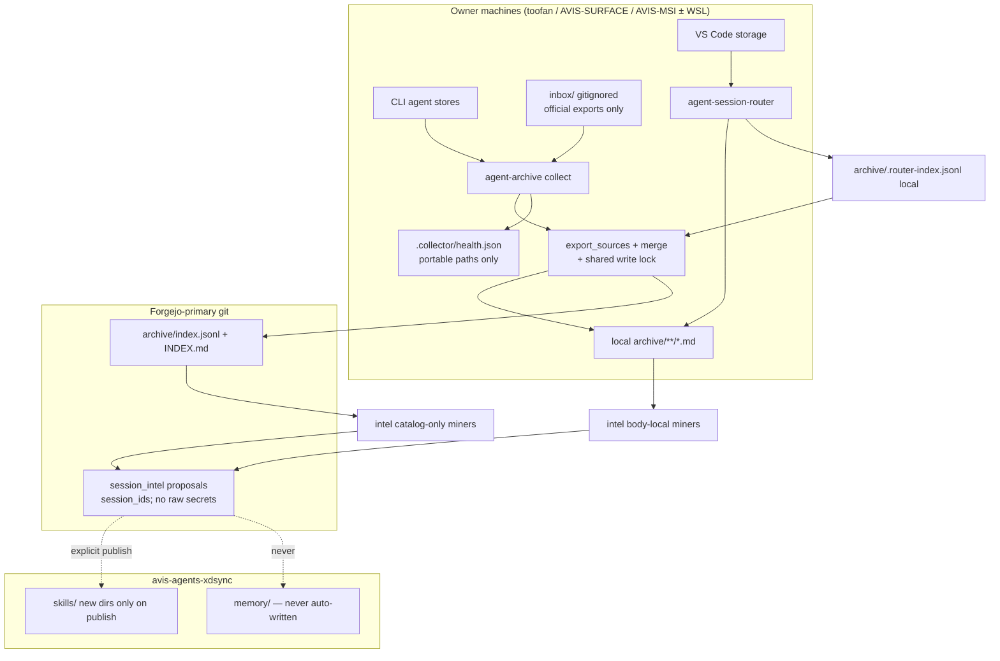
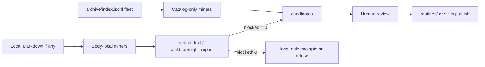
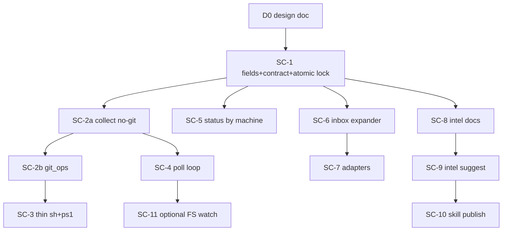

# Session Collector, Non-Code Archive Extension, and Session-Intel

> **Status:** `IN PROGRESS` — design on PR #142; all review findings incorporated in doc; implementation not started · **Owner:** `avidullu` · **Created:** `2026-08-01` · **Last updated:** `2026-08-01`
> **Lifecycle:** `DRAFT → IN PROGRESS → DONE → ARCHIVED` (archive to `docs/archives/` when DONE)
> **Tracking anchors:** § Progress tracker is the **source of truth**; indexed in `docs/README.md`; pointer in avis-agents-xdsync `memory/agent-sessions/session-handoff.md`.
> **Relation to existing docs:** extends `OUTPUT_CONTRACT.md`, `MULTI_MACHINE.md`, `AUTOMATION.md`, `COMPOSE_STACK.md`, `ENGINEERING_BASELINE.md`; peer of engineering baseline (does not replace it).
> **Honesty note:** claims marked `[verified]` against hub/router code; open product choices marked `[design]`.
> **Primary repo:** `avidullu/agent-sessions` (Forgejo-primary: `forge:avidullu/agent-sessions.git`; GitHub backup only)
> **Companion feeder:** `avidullu/agent-session-router`
> **Related issues:** hub #32 (backfill/regenerate), hub #86 (publish rules / propose-only), router #24 (inject-context spike)

---

## 0. TL;DR

Ship a **lightweight continuous collector** inside the agent-sessions hub (not a third archive), extend the catalog for **chat / non-code** workloads via an official-export inbox, then add **session-intel** to mine routines and propose skills—without overwriting agent memory. Preserve Output Contract Markdown goldens; amend catalog policy **explicitly** for additive optional keys; use an **atomic** shared write lock. Progress is tracked per PR row below.

## Overview

Today `agent-sessions` is a **local-first coding-session archive hub**: Python extractors (`agent_sessions/sources/*`) and the VS Code **agent-session-router** feeder write Markdown + catalog rows under a shared Output Contract v1. Collection is **batch** (`scripts/daily-export.{sh,ps1}` / cron / Task Scheduler). The engineering **baseline** pipeline turns coding sessions into reviewable guardrails.

Multi-machine catalog merge uses hub identity from `archive.py::index_identity_key` / `merge_index_records` (not a simplified pair alone):

- **Session key:** `("session", metadata.session_id, sha256)` when both `session_id` and `sha256` are non-empty.
- **Path fallback:** `("path", source, portable_path(source_file))` otherwise.
- **Same-path content supersede:** when the same local `(source, source_file)` path gets a new digest, `merge_index_records` drops the previous identity for that path (`path_to_identity` upsert). Same `session_id` with **different** digests stays as **distinct** rows.
- Transcript bodies (`archive/**/*.md` except `INDEX.md`) are **local-only by default**; only `archive/index.jsonl` + `archive/INDEX.md` converge via git.

This design extends that hub—without inventing a third archive format—along three product phases:

1. **P0 — Collector agent:** a lightweight, always-available **collector** (user-service + CLI) that continuously discovers/export/merges with health, backoff, mtime settle, coverage reporting, explicit machine identity, **shared archive write locking**, and **restamp-on-reuse** of additive catalog fields.
2. **P1 — Chat & non-code workloads:** first-class catalog fields and importers so general chat and life/ops/planning sessions are archivable citizens, not inventory-only afterthoughts (inbox is **gitignored**, local-only).
3. **P2 — Session-intel:** a synthesis subsystem (named **`session-intel`**, deliberately distinct from engineering `baseline`) that mines archives for periodic-task automation candidates, routine detection, and **propose-only** skill proposals. **Fleet-wide** mining is catalog-only; **body-dependent** mining is per-machine where local Markdown exists.

---

## Background & Motivation

### Current state (grounded in code)

| Layer | What exists | Key paths |
| --- | --- | --- |
| Hub CLI | `agent-archive` → `agent_sessions.cli:main`; `tools/agent_archive.py` | `agent_sessions/{cli,archive,config,models,render}.py` |
| Extractors | Claude, Codex, Gemini Antigravity, Grok, DeepSeek | `agent_sessions/sources/{claude,codex,gemini,grok,deepseek}.py`, `registry.py` |
| Catalog | `archive/index.jsonl` + `INDEX.md`; feeder sidecar `.router-index.jsonl` | `archive.py::{export_sources,merge_index_records,read_router_index_records,index_identity_key}` |
| Contract | Output Contract **v1** (byte-stable Markdown + catalog schema) | `docs/OUTPUT_CONTRACT.md`, fixtures `tests/fixtures/contract/v1/` |
| Multi-machine | Session+digest or path identity; path-inferred origins; no explicit machine id yet | `docs/MULTI_MACHINE.md`, `portable_paths.py`, `archive_status.classify_source_origin` |
| Automation | Daily pull → export → commit metadata → push | `docs/AUTOMATION.md`, `scripts/daily-export.{sh,ps1}` |
| Automation parity gap | **sh** has branch/clean-tree/lock; **ps1 does not** (pull/export/`git add -- archive/` only) | Verified in `scripts/daily-export.ps1` |
| Locks today | Only shell uses `.daily-export.lock`; **Python `export` has no lock** | `scripts/daily-export.sh` |
| Baseline | Code-centric guardrails: suggest → promote → publish | `baseline/`, `docs/ENGINEERING_BASELINE.md`, `baseline_*.py` |
| Redaction | `redact_text` → `RedactionResult(blocked=…)`, `result_to_report`, `build_preflight_report`; `SCANNER_VERSION = "redaction-v1"` | `baseline_redaction.py` |
| Compose boundary | Search→cass; live capture→SpecStory; memory→agentmemory | `docs/COMPOSE_STACK.md` |
| Router | VS Code discoverer/extractor/watcher; hub-compatible renderer | `agent-session-router/src/{router,watcher,contract,discoverers,extractors}.ts` |
| Publish rules | Propose-only, pull-model, marker blocks, no unmanaged overwrite | `docs/RULES_EXTRACTION_AND_PUBLISH_PLAN.md` D7–D15 / issue #86 |
| Owner remotes | Forgejo-primary, GitHub backup | `avis-agents-xdsync/CLAUDE.md` (hub docs still often say “GitHub”) |

### Pain points

1. **Batch-only collection.** Sessions that finish between daily runs wait up to ~24h. There is no continuous health surface, coverage matrix, or safe mid-write settle loop outside ad-hoc watcher sketches in docs.
2. **Coding-agent scope.** Web/mobile chats and non-engineering workloads are out of scope or inventory-only. Catalog lacks `workload_kind` / domain tags for filtering.
3. **No life/routine synthesis.** Baseline is deliberately engineering-guardrail-shaped. Overloading it would muddy promote/publish semantics.
4. **Machine identity is inferred.** `source_origin` is username-free path class. `AGENT_ARCHIVE_MACHINE_ID` is documented as future in `MULTI_MACHINE.md` and is **not implemented in code today**.
5. **Router is not system-wide.** Auto-watch lives inside VS Code (`watcher.ts`). CLI sources when VS Code is closed are uncovered.
6. **No shared write lock** for `export_sources` / `write_indexes` — concurrent interactive export + scheduled export can interleave catalog writes.
7. **Windows daily-export is under-guarded** relative to the shell script.

### Why not a new archive product?

`COMPOSE_STACK.md` and `OUTPUT_CONTRACT.md` already draw a hard line: one hub format, feeders write identical artifacts, external tools own search/memory/live capture. Prefer **extending the hub** + a **companion collector process** that calls existing `export_sources` / merge paths.

---

## Goals & Non-Goals

### Goals

| ID | Goal |
| --- | --- |
| G1 | Ship a **lightweight collector** that keeps local agent logs flowing into the existing archive with debounce, health, backoff, and multi-source coverage reporting. |
| G2 | Preserve **Output Contract Markdown §2 goldens** (`format_version: 1` for bodies). For catalog keys: land an **explicit §6/§9 policy amendment** (additive optional keys + ignore-unknown) **before** producers emit them—do not pretend the active contract already allows silent schema growth. |
| G3 | Make **non-code workloads** and general chat **first-class** in schema and filtering so P2 synthesis is not blocked by re-exports. |
| G4 | Design **session-intel** (routines / periodic tasks / skill proposals) so contracts and redaction boundaries are correct before implementation, including **catalog-only vs body-local** miner tiers. |
| G5 | Stay **local-first**: transcripts default local-only; git tracks catalog metadata; multi-machine merge continues via existing identity keys; no body sync (NG5). |
| G6 | Align with **avis-agents-xdsync** topology (four runtimes, skills, memory) and issue **#86 propose-only / no unmanaged overwrite** spirit. |
| G7 | Deliver via **PR-only**, incremental, independently mergeable PRs with green CI. |
| G8 | **Shared archive write lock** so collect, interactive `export`, and `prune` cannot corrupt `index.jsonl` / `INDEX.md`. |

### Non-Goals

| ID | Non-goal |
| --- | --- |
| NG1 | Rebuild cass search, SpecStory live terminal capture, or agentmemory injection. |
| NG2 | Scrape vendor web UIs when no official export/API/local log exists (document gaps honestly). |
| NG3 | Auto-promote engineering baseline or auto-install skills without explicit owner action. |
| NG4 | Replace or absorb `agentforge` (separate owner product / Forgejo console surface in owner topology; not verified in this workspace beyond name/role) or rename/overload engineering `baseline/`. |
| NG5 | Continuous multi-machine real-time sync of transcript bodies (metadata git push remains eventual). |
| NG6 | Solve hub #32 full backfill/regenerate in the collector P0 (may share machine_id helpers only). |
| NG7 | Cloud-hosted collector SaaS or multi-tenant productization. |
| NG8 | Structured three-way merge for concurrent `index.jsonl` rewrites across machines (document risk; use pull-ff + backoff). |

### Non-goals for P0 code (freeze line)

P0 ships **collector + schema stamping only**. Explicitly **not** in P0 code:

- Chat export inbox importers (P1)
- session-intel miners / CLI (P2)
- Optional FS-watch backend (PR11)
- `#32` regenerate
- Body sync

### Interfaces frozen for P1 (stable after P0)

| Surface | Frozen shape |
| --- | --- |
| Catalog optional keys | `machine_id`, `workload_kind`, `domain`, `agent_family` (MAY be present; ignore if unknown) — only after §6/§9 amendment |
| Collect subcommands | `collect run \| watch \| status \| doctor` |
| Lock path + protocol | Atomic exclusive-create on `.collector/collect.lock` (+ dual legacy protocol until shell migrated) |
| Git stage allowlist | `archive/index.jsonl`, `archive/INDEX.md` only |
| Export contract Markdown | Unchanged v1 goldens |
| Inbox expand interface | Discover → Expand → Materialize → single-session Extract (P1) |

---

## Product Phases


### Phase P0 — Lightweight collector agent (shippable now)

**Outcome:** On each owner machine (toofan, AVIS-SURFACE WSL, AVIS-MSI WSL, Windows hosts as needed), a **user-level service** runs the hub export path with settle/debounce, writes health state, and optionally commits/pushes catalog metadata—replacing pure “cron once a day” as the *primary* collection mode while keeping `daily-export` as a thin one-shot.

**In scope:**

- Package `agent_sessions/collector/` inside **agent-sessions** (not a new repo).
- CLI: `agent-archive collect {run|watch|status|doctor}`.
- Explicit `machine_id` on export, including **restamp-on-reuse** of additive fields.
- Shared archive write lock for collect **and** mutating `export` / `prune`.
- Health JSON (paths **must** be portable) + coverage report.
- `CollectorConfig` load path; systemd user unit + Windows Task Scheduler sketches.
- `git_ops` as **canonical** guardrails; **both** sh and ps1 become thin wrappers (closes Windows gap).
- Complementary to router auto-watch.

**Success metrics (per machine):**

| Metric | Target |
| --- | --- |
| Steady-state RSS | ≤ 80 MB typical; ≤ 150 MB with large trees |
| Idle CPU | &lt; 1% when no file activity |
| Export lag after settle | ≤ 120 s after mtime+size stable for `settle_seconds` (poll interval bound) |
| Mid-write safety | Zero partial-hash exports (size/mtime/tail_sha256 reuse path) |
| Catalog corruption | Zero concurrent writers: shared lock + tests (second writer waits/fails with timeout) |
| Field convergence | After one successful collect, all **reused** rows also have `machine_id`/`workload_kind` via restamp |

### Phase P1 — Chat sessions & non-code workloads

**Outcome:** Catalog can filter `workload_kind` and `domain`; inbox importers for official chat exports; honest gap table for web-only products. Entire `inbox/` tree is **local-only / gitignored**.

### Phase P2 — Session-intel (routines, periodic tasks, skill proposals)

**Outcome:** Offline synthesis produces **reviewable proposals** (not auto-installed automation).

**Critical locality rule:**

| Miner tier | Inputs | Fleet-wide? |
| --- | --- | --- |
| **Catalog-only** | `index.jsonl` fields (counts, kinds, `workload_kind`, `domain`, `machine_id`, mtimes, agent_family) | Yes — after metadata merge |
| **Body-dependent** | Local `archive/**/*.md` when present | **No** — per machine (or machines that regenerated bodies from local source logs) |

Skill proposals that include excerpts are **inherently machine-local**; git-tracked proposals use **session_id evidence lists**, not raw quotes, unless redaction preflight allows and owner opts into tracked quotes (default: session_ids only in tracked JSON).

---

## Key Decisions

| # | Decision | Rationale |
| --- | --- | --- |
| **KD1** | **Collector lives inside `agent-sessions`** as `agent_sessions/collector/` + CLI subcommands; **not** a third repo. | One archive format, one merge path, shared tests/contract fixtures. |
| **KD2** | **Collector evolves daily-export; `git_ops` is the canonical guardrail implementation** (branch, clean tree, lock, allowlisted stage paths, commit, push). Both `daily-export.sh` and **`.ps1` become thin** wrappers to `collect run`. PS1 is currently under-guarded; P0 closes that gap. Stage **only** `archive/index.jsonl` + `archive/INDEX.md` (never `git add -- archive/`). | Single implementation of safety; Windows parity; avoid staging `.router-index.jsonl` or other archive noise. |
| **KD3** | **Router auto-watch and collector complement; collector does not subsume the router.** | Router owns VS Code storage parsers; collector owns CLI stores + system-wide schedule; hub merges `.router-index.jsonl` as today. |
| **KD4** | **Synthesis subsystem name: `session-intel`** (`session_intel/`, CLI `agent-archive intel …`). | Avoids `agentforge` and engineering `baseline`. |
| **KD5** | **Contract policy amendment, still labeled `format_version: 1` for Markdown.** Active `OUTPUT_CONTRACT.md` §9 today says any change that alters the §6 schema is a **version bump** `[verified]`. That conflicts with “just emit optional keys.” **PR1 / SC-1 must first amend §6 and §9** as follows: (1) §6 lists optional keys `machine_id`, `workload_kind`, `domain`, `agent_family` as **MAY** be present; (2) §9 gains an explicit rule: *additive optional keys whose absence is equivalent to the documented read-default, and which consumers MUST ignore if unknown, do **not** require a format_version bump*; required-key changes, Markdown §2 byte changes, or feeder naming breaks **do** bump and get `v2/` goldens. **No** per-record `format_version`. **No** human “catalog v1.1” product label. **Downstream consumer audit + cross-repo conformance (blocking for SC-1 merge):** see § Schema extension + contract policy checklist (hub + router). Alternative rejected: full `format_version: 2` with required nullables — forces feeder golden churn without benefit. | Honest vs active §9; preserves feeder Markdown goldens. |
| **KD6** | **`machine_id` is explicit, stable, machine-local**, from `AGENT_ARCHIVE_MACHINE_ID` else config else hostname slug; never a username; **never part of merge identity**. | Implements `MULTI_MACHINE.md` future without changing dedupe. |
| **KD7** | **`workload_kind` + `domain` are first-class optional catalog fields from the first schema PR.** **Read path:** missing `domain` → `""` (unknown); missing `workload_kind` → treat as `"code"` only when filtering for backward compatibility with today’s corpus. **Write path:** coding Source defaults stamp `workload_kind=code`, `domain=engineering`; chat/inbox stamps `chat` + empty or vendor domain. | Prevents dual defaults; empty domain is correct for non-code. |
| **KD8** | **Skill/routine proposals are propose-only** (#86 D7 spirit). P2 v1 **creates new skill directories only**; marker-update of existing skills is stretch. Never write `avis-agents-xdsync/memory/**`. | Minimizes clobber risk. |
| **KD9** | **Redaction reuses exact `baseline_redaction` APIs:** `redact_text` → `RedactionResult`; `result_to_report`; `build_preflight_report` / `RedactionPreflight`; `SCANNER_VERSION = "redaction-v1"`. Refuse publish/git of quote-bearing artifacts when any evidence has `blocked=True` or preflight `blocked > 0`. No invented `scan_text` / `status=allowed` schema. | Implementable against real code. |
| **KD10** | **Delivery is PR-only, Forgejo-primary.** Collector `git push` uses the checkout’s default remote; operator must set Forgejo as `origin` / `pushDefault`. Hub docs that still say “GitHub” are historical; COLLECTOR/AUTOMATION updates note the invariant without rewriting all docs in P0. | Owner global rules. |
| **KD11** | **Atomic shared archive write lock** (`O_CREAT\|O_EXCL` exclusive create + dual-legacy protocol + stale PID recovery) for any process that mutates `archive/index.jsonl` / `INDEX.md` / rendered artifacts via hub writers: `collect run`, `collect watch` export steps, CLI `export`, CLI `prune`. Read-only commands are lock-free. Acceptance requires **simultaneous multi-process** contender tests, not sequential-only. | Closes TOCTOU and concurrent corruption. |
| **KD14** | **Crash-atomic catalog publication:** `write_indexes` (and any collector path that rewrites the pair) uses temp + fsync + `os.replace` per file; **`index.jsonl` is source of truth**; `INDEX.md` is rebuilt if the pair is interrupted. Fault-injection tests required in SC-1. Mutual exclusion alone is insufficient. | Always-on collect increases write frequency; in-place write can truncate. |
| **KD12** | **session-intel body locality:** fleet-wide miners are **catalog-only**; body-dependent miners run only where local Markdown (or regenerable sources) exist. No body sync in this design (NG5). | Matches OUTPUT_CONTRACT / AUTOMATION local-only policy. |
| **KD13** | **Restamp-on-reuse is in P0 scope:** when `_can_reuse_record` returns true, shallow-copy prior and `setdefault` additive fields (`machine_id`, `workload_kind`, `domain`, `agent_family`) without changing sha256/markdown/imported_at. If any field value changes, the index write is a real metadata change (may dirty git). Optional `--restamp-catalog-fields` / `migrate catalog-fields` remains as an explicit full pass. | Continuous collect converges tags without waiting for session file edits. |

---

## Proposed Design

### Architecture (target)



### Collector placement

**Chosen:** package **inside agent-sessions**, process model = **systemd user service / Task Scheduler + CLI**, evolving daily-export.

| Option | Verdict |
| --- | --- |
| New repo | Reject — contract drift |
| Shell-only forever | Reject — no health/lock in Python export |
| **`agent_sessions/collector` + service units** | **Accept** |
| Subsume router | Reject |

### Collector vs router auto-watch

| Concern | Owner |
| --- | --- |
| Copilot / Cline / Continue / Cody / Aider discovery | **Router** |
| Claude Code / Codex / Grok / Gemini CLI / DeepSeek dumps | **Hub extractors + collector** |
| Debounced watch while VS Code open | **Router** (`watcher.ts`) |
| System-wide schedule when VS Code closed | **Collector** |
| Merge sidecar into catalog | **Hub export** (existing) |
| Commit/push catalog metadata | **`git_ops` via collect** |

Collector never deletes/rewrites `.router-index.jsonl` in P0; only reads via `read_router_index_records`. Prefer **gitignore** of `archive/.router-index.jsonl` (related cleanup) so it cannot be staged; feeder keeps it local.

### Package layout (P0)

```text
agent_sessions/
  machine_id.py              # resolve AGENT_ARCHIVE_MACHINE_ID / hostname
  archive_lock.py            # shared write lock (used by export + collect + prune)
  collector/
    __init__.py
    service.py               # run loop: poll (P0) | watch (later)
    settle.py                # optional activity settle for poll wake
    health.py                # .collector/health.json — portable paths required
    coverage.py
    git_ops.py               # CANONICAL branch/clean/lock/allowlist/commit/push
    config.py                # CollectorConfig + load_collector_config
  …
scripts/
  daily-export.sh            # thin → agent-archive collect run …
  daily-export.ps1           # thin → same (parity with sh)
  systemd/
    agent-archive-collect.service
docs/
  COLLECTOR.md
  OUTPUT_CONTRACT.md         # §6 optional keys language
```

Local-only (gitignored):

```text
.collector/
  health.json
  collect.lock
  last_coverage.json
inbox/                       # entire tree — see Gitignore
```

### Shared archive write lock (KD11)

**Lock file path (canonical):** `{repo_root}/.collector/collect.lock`  
**Legacy path (transition):** `{repo_root}/.daily-export.lock`

#### Atomic acquisition (required — not check-then-write)

Check-then-write is a TOCTOU race: two processes can both observe “no fresh lock” and both proceed, re-creating interleaved `write_indexes`. **Acquisition MUST be atomic** on every supported platform (Linux, Windows, WSL).

**Primitive (stdlib-first, cross-platform):**

1. Ensure `.collector/` exists (`mkdir -p`, ignore EEXIST).
2. Attempt **exclusive create** of the lock file:
   - `fd = os.open(path, os.O_CREAT | os.O_EXCL | os.O_WRONLY)` then write payload and `os.close(fd)` (or keep fd open until release if preferred).
   - On Windows this is supported by Python’s `os.open` with `O_EXCL`.
3. If `FileExistsError`:
   - Read payload (best-effort). If **stale** (see below), `os.unlink` the path and **retry exclusive create** (bounded retries).
   - If **live**, sleep briefly and retry until `lock_timeout_seconds`, then fail non-zero.
4. Payload (UTF-8 text, one JSON object or simple lines): `pid`, `hostname`, `started_at` (UTC ISO), `owner` (`export` \| `collect` \| `prune`).

**Stale-owner recovery:**

- Prefer **PID liveness**: if payload has `pid` and `os.kill(pid, 0)` raises `ProcessLookupError` / `ESRCH` (or Windows equivalent “no such process”), treat as stale and unlink.
- Else if payload missing/unreadable and mtime age ≥ `lock_timeout_seconds`, treat as stale.
- **Never** unlink a lock whose PID is alive.

**Dual-lock transition protocol (one acquire, both names):**

Until all automation uses thin wrappers (through PR3), acquire as **one protocol**:

1. Atomically exclusive-create **canonical** `.collector/collect.lock`.
2. Atomically exclusive-create **legacy** `.daily-export.lock` (same payload, `owner` field notes dual).
3. If step 2 fails because legacy is held by a **live** non-us process: release canonical (unlink) and retry from step 1 / wait.
4. If step 2 fails because legacy is **stale**: unlink legacy, retry step 2.
5. Hold **both** until release; release unlinks both (best-effort, ignore missing).

After PR3 deprecates shell-only locking, drop writing the legacy file but keep **checking** exclusive-create against legacy for one release if old cron remains (or document “remove dual-write after N days”).

**Who acquires (exclusive, write):**

| Command | Lock? |
| --- | --- |
| `collect run` / `collect watch` (during export/git) | Yes exclusive |
| `agent-archive export` | Yes exclusive (CLI always acquires; library path used only under an already-held owner via re-entrant token — see Q9) |
| `agent-archive prune` | Yes exclusive |
| `status`, `doctor`, `discover`, baseline/intel reads | No |

**Semantics:**

- Wait up to `lock_timeout_seconds` with short sleep, then fail with clear error (non-zero).
- Health file updates use atomic temp+rename under the same exclusive lock when written from export/collect.
- **Re-entrancy (Q9):** process-local contextvar / thread-local “held” flag so `collect` → `export_sources` does not double-open; nested acquire by the same owner is a no-op.

**Acceptance tests (must prove mutual exclusion):**

1. **Simultaneous contenders:** spawn ≥2 processes (e.g. `multiprocessing` / subprocess) that call acquire at the same time; **exactly one** succeeds within the first attempt window; losers wait or fail; only one may enter a critical section that appends to a shared test file / mock `write_indexes`.
2. Sequential second writer (optional extra) is **not** sufficient alone.
3. Stale lock with dead PID is reclaimable; live PID is not.
4. Dual-lock: holding only legacy blocks canonical acquire; holding only canonical blocks a synthetic legacy-only contender.

**Success metric wording:** Catalog corruption zero **requires** this atomic lock on index writers—not “document that collect holds lock.”

#### Crash-atomic catalog writes (mutual exclusion is not enough)

`[verified]` Today `write_indexes` builds full text then calls `write_text_if_changed`, which opens the **final path** and writes in place when content differs (`archive.py::write_indexes` / `write_text_if_changed`). That is fine under a lock for **concurrency**, but a SIGKILL, power loss, or I/O error mid-write can **truncate** `archive/index.jsonl` or leave `index.jsonl` and `INDEX.md` as an inconsistent pair. Always-on collect raises write frequency, so SC-1 must harden this.

**Required write protocol for each catalog file** (`index.jsonl`, then `INDEX.md`):

1. Write full content to a sibling temp file in the same directory (e.g. `index.jsonl.tmp.{pid}` or `index.jsonl.{nonce}.tmp`).
2. `flush` + `os.fsync(fd)` (or platform equivalent) before close.
3. **Atomic replace** onto the final name: `os.replace(tmp, final)` (POSIX rename; on Windows `os.replace` overwrites destinaton atomically when on the same volume).
4. Best-effort fsync of the parent directory after replace where the OS allows (document Linux yes / Windows best-effort).

**Pair ordering and recovery:**

| Rule | Spec |
| --- | --- |
| Source of truth | **`archive/index.jsonl` is authoritative.** `INDEX.md` is a derived human view. |
| Order | Always publish `index.jsonl` via temp+replace **first**, then rebuild and temp+replace `INDEX.md`. |
| Interrupted after jsonl, before INDEX | Next `export`/`collect`/`doctor --repair-index` regenerates `INDEX.md` from `index.jsonl` without requiring source re-extraction. |
| Truncated / invalid jsonl | `doctor` / collect start: detect empty file, non-JSONL lines majority, or failed parse; refuse silent partial merge; restore from last good git blob if the file is tracked and dirty, else surface hard error + keep `.tmp` / backup if present. Prefer: if `index.jsonl.tmp.*` exists from crashed writer and final is empty/corrupt, offer recovery path in doctor. |
| Unchanged content | Keep “skip write if identical” optimization **only after** hashing/comparing; when writing, still use temp+replace (never truncate-in-place). |

**Tests (SC-1):**

1. Fault-injection: kill/simulate crash **between** jsonl replace and INDEX replace → next run rebuilds INDEX from jsonl; catalog rows preserved.
2. Fault-injection: interrupt **during** temp write (leave partial `.tmp`, final untouched) → final catalog unchanged; next run succeeds.
3. Optional: monkeypatch open/write to raise mid-write on final path must **not** be used once protocol is temp-only (assert no direct truncate of final paths in unit tests of the writer helper).

This pairs with the exclusive lock: lock = one writer; temp+replace = crash safety.

### CollectorConfig load path (Issue 15)

```python
@dataclass(frozen=True)
class CollectorConfig:
    enabled: bool = True
    mode: str = "poll"  # poll | watch (watch optional later)
    poll_interval_seconds: int = 120
    settle_seconds: int = 15
    settle_checks: int = 2
    max_backoff_seconds: int = 900
    export_pdf: bool = False
    commit_metadata: bool = True
    push: bool = True
    branch: str = "main"
    require_clean_tree: bool = True
    lock_timeout_seconds: int = 300
    health_path: str = ".collector/health.json"
    machine_id: str | None = None  # optional config override

def load_collector_config(repo_root: Path, toml_data: dict) -> CollectorConfig:
    ...
```

**Load order:**

1. `load_config(repo_root)` → `ArchiveConfig` (unchanged export fields).
2. Collect handlers re-read the same TOML used by `load_config` (`sources.toml` if present else `config/default_sources.toml`) and call `load_collector_config`.
3. Env overrides (table):

| Env | Effect |
| --- | --- |
| `AGENT_ARCHIVE_MACHINE_ID` | Wins over config `machine_id` |
| `DAILY_EXPORT_BRANCH` | Overrides `branch` (existing shell convention) |
| `AGENT_ARCHIVE_COLLECT_PUSH=0` | Forces `push=false` |
| `AGENT_ARCHIVE_COLLECT_COMMIT=0` | Forces `commit_metadata=false` |

**Export path stays free of collector deps** except: shared `archive_lock` + optional field stamping helpers live in `archive.py` / `machine_id.py` / `agent_family` map—not under `collector/git_ops`.

Default `[collector]` block lives in `config/default_sources.toml` comments/values; machine overrides in ignored `sources.toml`.

### Collector runtime algorithm

**Config example:**

```toml
[collector]
enabled = true
mode = "poll"
poll_interval_seconds = 120
settle_seconds = 15
settle_checks = 2
max_backoff_seconds = 900
export_pdf = false
commit_metadata = true
push = true
branch = "main"
require_clean_tree = true
lock_timeout_seconds = 300
health_path = ".collector/health.json"
# machine_id = "toofan"
```

**`collect run` (one-shot)** — replaces daily-export **body** (git_ops is Python):

1. Acquire shared archive write lock (dual-check legacy).
2. Resolve `machine_id`.
3. If `commit_metadata`: require branch + clean tree (canonical git_ops); `git pull --ff-only`. On non-ff: write health error, release lock, exit non-zero (**no force**).
4. Call `export_sources(...)` (under same lock; do not double-lock if export detects held lock by same process — use re-entrant or “already held” token).
5. **Restamp:** every record emitted (including reuse path) gets `setdefault` for additive fields (see below).
6. Update health (portable paths only).
7. If metadata changed and `commit_metadata`: stage **only** allowlist paths; commit `archive: collect <date> [<machine_id>]`; push if enabled.
8. Release lock; exit codes as today (0 nothing-to-do / success).

**`collect watch` (P0 = poll loop):**

1. Exclusive lock **per export cycle**, not forever across sleep (so interactive export can run between cycles). Alternative acceptable: hold lock only during export/git steps.
2. **P0 algorithm (Issue 14):** On each interval, run **full** `export_sources` for configured sources (equivalent to `export --all` or configured list)—**no per-file dirty export API**. Optional: if no root mtime advanced since last success, skip export (cheap tree max-mtime check), else full export. Reuse path keeps cost low.
3. On failure: exponential backoff `min(max_backoff, base * 2^n)`.
4. SIGTERM: finish in-flight export, release lock, exit 0.
5. Never run baseline/intel on hot path.

**Settle:** Optional pre-export delay when using activity wake; for interval poll, settle is “wait `settle_seconds` after detecting activity” before full export. Per-path settle before hashing remains the existing size/mtime/tail reuse in `archive.py`.

**`collect status` / `doctor`:** lock-free. Doctor warns if tracked git files appear under `inbox/`; verifies machine_id, roots, lock free, remotes, branch, write access, router-index readable.

### Explicit machine identity

```python
def resolve_machine_id(config_value: str | None = None) -> str:
    env = os.environ.get("AGENT_ARCHIVE_MACHINE_ID", "").strip()
    if env:
        return slugify_machine(env)
    if config_value:
        return slugify_machine(config_value)
    return slugify_machine(socket.gethostname())
```

**Merge reminder:** `machine_id` is **never** part of `index_identity_key` or `merge_index_records` keys.

**P0 acceptance — multi-machine merge regression:**

1. Two records, same `session_id`, different `sha256` → two rows after merge.
2. Path-key older row superseded when same `(source, source_file)` gets new digest.
3. `machine_id` differs across rows without collapsing them.

### Schema extension + contract policy (KD5)

Markdown §2 **unchanged** (existing `tests/fixtures/contract/v1/` Markdown goldens stay valid).

**Active contract conflict `[verified]`:** `OUTPUT_CONTRACT.md` §9 currently states that a change which alters the §6 schema is a version bump. §6 today has **no** MAY/ignore-unknown extension point. Emitting new keys under the *unamended* contract would be a silent policy violation.

**Required SC-1 ordering (blocking — not implicit):**

1. Amend `docs/OUTPUT_CONTRACT.md` §6: document the optional keys table below; state consumers **MUST ignore unknown keys**.
2. Amend §9: carve out **additive optional keys** (absence ≡ read-default) as **not** requiring `format_version` bump; keep bump rule for Markdown bytes, required keys, §4/§5 naming breaks.
3. Complete the **downstream consumer audit + cross-repo conformance checklist** (below) and paste evidence into the SC-1 PR body.
4. **Then** hub producers may stamp optional keys. Router continues to **omit** them (no TypeScript change required for SC-1).

**Downstream consumer audit + cross-repo conformance checklist (SC-1):**

| # | Consumer / repo | Check | Pass criterion |
| --- | --- | --- | --- |
| C1 | Hub `merge_index_records` / `read_jsonl_dicts` | Extra JSON keys round-trip | Unknown keys preserved or ignored without crash; merge identity unchanged |
| C2 | Hub `archive_status` / status CLI | Reads catalog | No KeyError on missing optional keys; grouping by `machine_id` treats absent as unknown |
| C3 | Hub baseline / rules ledger / redaction paths | Index iteration | Only required keys assumed; optional keys ignored if unused |
| C4 | Hub `tests/test_output_contract.py` + `tests/fixtures/contract/v1/` | Markdown §2 goldens | **Byte-identical** after §6/§9 doc change (Markdown unchanged) |
| C5 | Hub unit tests for optional keys | Stamp/restamp | Present when written; absent rows still valid |
| C6 | **Router** `avidullu/agent-session-router` | Vendored contract goldens / `npm test` contract suite | Still green **without** emitting optional keys; Markdown renderer unchanged |
| C7 | Router → hub merge | Fixture `.router-index.jsonl` without optional keys | Hub export merges as today |
| C8 | Docs | `OUTPUT_CONTRACT.md` §8 kind registry | Optional note that optional catalog keys are hub-stamped; feeders MAY omit |

SC-1 is **not mergeable** until C1–C8 are checked (or explicitly waived with owner note). This is the “cross-repo conformance coverage” required by review #3865.

**No** per-record `format_version`. **No** “catalog v1.1” product label.

| Key | Type | Read default if absent | Write behavior | Notes |
| --- | --- | --- | --- | --- |
| `machine_id` | string | omit / treat as unknown | Always stamp current machine on this machine’s export/restamp | Not in merge key |
| `workload_kind` | string enum | treat as `"code"` for filters | Source default or classifier | Closed enum below |
| `domain` | string | `""` (unknown) | Coding sources: `"engineering"`; chat/inbox: `""` or vendor | **Not** forced to engineering on read |
| `agent_family` | string | `"unknown"` | `agent_family_for_kind(kind)` | Table below |

**`workload_kind` enum:** `code` | `chat` | `ops` | `life` | `research` | `planning` | `mixed` | `unknown`

**Source dataclass (write defaults):**

```python
@dataclass(frozen=True)
class Source:
    name: str
    kind: str
    roots: tuple[Path, ...]
    glob: str = "**/*"
    description: str = ""
    workload_kind: str = "code"
    domain: str = "engineering"  # write default for coding sources; chat sources set ""
```

Inbox / chat sources set `workload_kind="chat"`, `domain=""` (or e.g. `chatgpt`) in TOML.

### `agent_family` mapping (closed)

Kinds below are **first-class producers today** `[verified]` against hub `agent_sessions/sources/*` and router `src/extractors/*` (`registerExtractor(...)` kind strings). Unsupported / future kinds fall through to `unknown` deliberately—not the established router sources.

| `kind` | `agent_family` | Origin |
| --- | --- | --- |
| `claude` | `claude` | hub CLI |
| `codex` | `codex` | hub CLI |
| `gemini_antigravity` | `gemini` | hub + router |
| `grok` | `grok` | hub CLI |
| `deepseek_request_dump` | `deepseek` | hub + router |
| `copilot_chat` | `copilot` | router |
| `cline` | `cline` | router |
| `continue_dev` | `continue` | router |
| `cody` | `cody` | router |
| `aider` | `aider` | router |
| `tabby` | `tabby` | router (generic globalStorage) |
| `codeium` | `codeium` | router (generic globalStorage) |
| `amazon_q` | `amazon_q` | router (generic globalStorage) |
| `router_index` | `router` | hub merge of feeder sidecar |
| `inventory` | `inventory` | hub inventory-only sources |
| `chat_export_inbox` | `import` | hub P1 inbox (bundle expander) |
| `chat_export_materialized` | `import` | hub P1 per-conversation materializations |
| anything else | `unknown` | intentional fallback |

Pure function `agent_family_for_kind(kind: str) -> str` + unit tests covering **every row above** (including router kinds) and the `unknown` default. Inventory rows may omit family or use `inventory`.

### Restamp-on-reuse (KD13)

In `export_sources`, when `_can_reuse_record` is true:

```python
record = dict(prior)  # shallow copy
record.setdefault("machine_id", current_machine_id)
record.setdefault("workload_kind", source.workload_kind or "code")
if source.domain is not None:
    record.setdefault("domain", source.domain)
record.setdefault("agent_family", agent_family_for_kind(source.kind))
# do not change sha256, markdown, imported_at, messages, size, mtime, tail_sha256
records.append(record)
```

For freshly extracted records, set the same keys (assign, not only setdefault).

If restamp changes any field relative to `prior`, `write_indexes` will rewrite index → **git metadata commit is expected** (desired for fleet convergence).

Optional CLI: `agent-archive migrate catalog-fields` or `export --restamp-catalog-fields` for full pass without relying on source file visibility (still only restamps rows this machine’s export touches unless migrate reads whole index and rewrites all missing fields with **current** machine_id only on rows this machine owns—**caution:** migrate must not overwrite foreign `machine_id`. Rule: restamp `machine_id` only when missing **or** when this process exported/reused the row from a local source file; never invent machine_id for not-visible foreign rows).

### P1 inbox importer + multi-session splitting

```text
inbox/                 # gitignored entire tree
  README.md            # exception: tracked via !inbox/README.md
  chatgpt/
  claude-ai/
  gemini/
  manual/
  processed/           # still under ignored tree
.collector/
  inbox-materialized/  # gitignored; one file per conversation after expand
```

- Official exports only; no scraping.
- Doctor: warn if `git ls-files inbox` non-empty (except README).

**Gitignore (required for privacy):**

```gitignore
.collector/
inbox/**
!inbox/README.md
archive/.router-index.jsonl
session_intel/.cache/
```

#### Registry contract gap `[verified]`

Hub registry is `Extractor = Callable[[Path], ExtractedSession]` — **one session per source file** (`agent_sessions/sources/registry.py`). Official ChatGPT export commonly ships a **`conversations.json` bundle** (or a small set of numbered JSON files for large accounts; see OpenAI export help) containing **many conversations**. Treating the whole file as one `ExtractedSession` would either collapse the bundle into a single catalog row or force an unplanned one-shot redesign mid-PR6.

#### Required splitter / iterator boundary (before calling P1 “implementation-ready”)

Introduce an explicit **bundle expander** stage (not a silent overload of single-file extractors):

| Stage | Responsibility |
| --- | --- |
| **Discover** | Locate official export artifacts under `inbox/{vendor}/` (zip or json). |
| **Expand** | Vendor adapter yields **N conversation units** from the bundle. |
| **Materialize** | Write each unit to `.collector/inbox-materialized/{vendor}/{stable_id}.json` (local-only) so the existing `Callable[[Path], ExtractedSession]` path continues to work **without** changing every extractor. |
| **Extract** | Register kind `chat_export_materialized` (or per-vendor kinds) that extract **one** conversation from a materialized path. |
| **Catalog** | One index row **per conversation**. |
| **Processed** | After **all** conversations from a bundle export successfully (or are skipped as unchanged), move the original bundle to `inbox/processed/` (optional, config-gated). Partial failure leaves the bundle in place for retry. |

**Alternative considered and deferred:** changing the global registry to `Callable[[Path], Iterable[ExtractedSession]]` and teaching `export_sources` to fan out. That is a wider archive refactor; materialize-then-single-session is the **P1 default** so PR6 stays reviewable. If materialize cost becomes painful, a later PR may add multi-session extractors behind the same expand interface.

#### Stable identity (per conversation, not per bundle)

| Field | Rule |
| --- | --- |
| `metadata.session_id` | See **vendor-ID resolution** below. **Never** the bulk bundle filename alone. |
| `source_file` | Path to the **materialized** per-conversation file (portable `~` form in catalog), **not** only the bulk `conversations.json`. |
| `sha256` | Digest of the **materialized conversation payload bytes** (canonical JSON serialization of that conversation only). Re-import of an unchanged conversation → same digest → reuse/skip. Changing one chat in a re-export updates **only that** row. Whole-bundle hash is **never** used as the catalog digest. |
| Merge key | Existing `index_identity_key`: `("session", session_id, sha256)` when both set. |

**Vendor-ID resolution (stable fallback chain)** — applied per conversation object during Expand:

1. Prefer first non-empty among vendor fields (adapter-specific, ordered): e.g. ChatGPT `conversation_id`, `id`, `uuid`.
2. Else if the conversation has a stable vendor `create_time`/`update_time` **and** a non-empty title/slug field:  
   `session_id = "import-{vendor}-" + sha256(f"{create_time}|{title}")[:16]` (deterministic).
3. Else: `session_id = "import-{vendor}-" + sha256(canonical_conversation_json)[:16]`  
   (content-addressed; may change if vendor rewrites history without id — acceptable last resort; log at warn).
4. Materialized filename uses the resolved `session_id` (filesystem-safe slug), so re-expand of the same export lands on the same path → path-key upsert still works if session_id were ever empty (should not happen after step 3).

**Bundle discovery shapes (Expand input):**

| Pattern | Handling |
| --- | --- |
| Single `conversations.json` | Expand all elements of the conversations array/object map |
| Numbered parts (`conversations-001.json`, …) for large accounts | Expand each file; de-dupe by resolved `session_id` across parts |
| Vendor zip of the above | Unzip to temp under `.collector/`, then same rules |
| One conversation per file already | Materialize is copy/normalize; still one catalog row per file |

**Idempotent `processed/` replay:**

1. Expand bundle → materialize conversations (stable paths from session_id).
2. For each unit: if index already has session-key `(session_id, sha256)` match, skip extract/render (count as skipped).
3. If session_id exists with **different** sha256, re-export (new digest → distinct session-key rows or path-supersede via same materialize `source_file`).
4. Only when every unit is exported or skipped-as-unchanged: move original bundle to `inbox/processed/` and write `.collector/inbox-receipts/{bundle_content_sha}.json` listing `{session_id, sha256, materialize_path}` for operator debugging.
5. Re-dropping the same export into `inbox/`: receipt + digests → no-op (0 new rows).
6. Partial failure: **do not** move to `processed/`; leave original in place; next collect retries.

**SC-6 / PR6 acceptance fixtures (required):**

- Multi-conversation bundle → **N** catalog rows (N > 1).
- Second import of identical bundle → **0** new rows.
- One conversation edited in a re-export → **exactly one** row updates.
- Conversation missing vendor id → fallback session_id stable across two expands of the same payload.
- Numbered multi-file export → de-duped union, no double rows for the same conversation_id.

### P1 source strategy (honest gaps)

| Source | Approach | Phase |
| --- | --- | --- |
| Existing CLI/VS Code | As today | done |
| Claude.ai / ChatGPT / Gemini export | Inbox expander + per-conversation materialize | P1 |
| Grok.com / mobile | Document gap; no scrape | P1 docs |

### P2 session-intel

#### Why not `baseline/`?

Engineering promote/publish vs life/ops routines and skill UX — separate trees and CLIs.

#### Artifact layout

```text
session_intel/
  README.md
  SCHEMA.md
  candidates/          # generated; prefer session_id lists in tracked JSON
  routines/            # human-promoted
  periodic_tasks/
  skills/proposals/
  reports/
```

#### Pipeline



**CLI:** `agent-archive intel suggest|routines|skills propose|skills publish`

**Miners:**

1. **Catalog-only (fleet):** cadence of kinds/domains/machine_ids; volume spikes; multi-machine coverage gaps.
2. **Body-local:** topic tokens, “every Monday” phrasing, cross-agent agreement **on this disk**.
3. Defaults: N=4 occurrences, W=4 weeks (until calibrated).

**Logging:** intel CLI logs paths + counts only—never transcript bodies (same rule as collector).

#### Skill landing (P2 v1)

| Target | Auto-write? |
| --- | --- |
| `session_intel/skills/proposals/*` | Yes (generated; session_ids; no raw quotes by default) |
| `avis-agents-xdsync/skills/<name>/` | **Only** `intel skills publish` — **create new skill directory**; if exists, refuse (write `SKILL.proposed.md` beside or fail) |
| `avis-agents-xdsync/memory/**` | **Never** |
| Existing skill marker upsert | Stretch after v1 |

#### Marker grammar (if stretch marker updates used)

```markdown
<!-- session-intel:begin id="skill.slug" proposal_id="YYYY-MM-DD-slug" -->
…
<!-- session-intel:end id="skill.slug" -->
```

- Begin/end `id` must match; never nest; do not mix baseline markers inside.
- Prefer **new skill directory** for first ship (KD8).

#### Redaction (exact APIs — KD9)

```python
from agent_sessions.baseline_redaction import (
    SCANNER_VERSION,  # "redaction-v1"
    redact_text,
    result_to_report,
    build_preflight_report,
)

result = redact_text(excerpt)
if result.blocked:
    # refuse git-tracked write of this quote; optional local-only redacted file
    ...
preflight = build_preflight_report([(ref, text), ...], generated_at=...)
if preflight.blocked > 0:
    refuse publish
```

Do **not** invent `status=allowed`. Use `RedactionResult.blocked` and preflight aggregate counts. Tracked intel artifacts that embed quote fields **must** pass preflight. Prefer **session_id-only** evidence in git-tracked JSON so PII CI (`tools/check_pii.py`) stays quiet; if session_intel paths grow tracked prose, extend PII check allowlist/deny patterns in the same PR.

#### Redaction boundaries table

| Artifact | Raw transcript? | Redaction | Git? |
| --- | --- | --- | --- |
| `archive/**/*.md` bodies | Yes (local) | N/A | Default **no** |
| `archive/index.jsonl` | No | portable_paths | **Yes** |
| `inbox/**` | Yes | N/A | **No** (gitignored) |
| `session_intel` candidates with session_ids only | No | path scrub | Yes |
| Candidates/quotes | Yes | `redact_text` fail-closed | Only if `blocked==0`; default prefer local-only quotes |
| Health JSON | Paths **must** portable | N/A | **No** |
| xdsync skills on publish | Summaries | Preflight required | Outside hub git |

---

## API / Interface Changes

### CLI

```text
agent-archive collect run [--source NAME ...] [--pdf] [--no-commit] [--no-push] [--dry-run]
agent-archive collect watch [--mode poll]
agent-archive collect status [--json]
agent-archive collect doctor

agent-archive export …          # acquires shared write lock
agent-archive prune …           # acquires shared write lock

# P2
agent-archive intel suggest …
agent-archive intel skills propose|publish …
```

### Library

```python
from agent_sessions.machine_id import resolve_machine_id
from agent_sessions.archive_lock import archive_write_lock
from agent_sessions.collector.service import collect_once, collect_poll_loop
from agent_sessions.collector.config import CollectorConfig, load_collector_config
from agent_sessions.collector.health import read_health, write_health
from agent_sessions.collector.git_ops import commit_archive_metadata  # allowlist only
```

### `export_sources` changes

1. Acquire lock (or accept held token).
2. On reuse: restamp setdefault fields (KD13).
3. On full extract: set `machine_id`, `workload_kind`, `domain`, `agent_family`.
4. Router records merged: stamp current `machine_id` only if missing; do not invent foreign hosts.

### Feeder (router)

- P0: no required TypeScript change (optional keys).
- P1 optional: emit workload fields when known.
- Goldens: existing v1 fixtures still pass; new unit tests for optional keys without claiming contract version bump.

---

## Data Model Changes

### Index record example

```json
{
  "source": "claude-linux",
  "kind": "claude",
  "source_file": "~/.claude/projects/.../session.jsonl",
  "source_origin": "posix-home",
  "machine_id": "toofan",
  "workload_kind": "code",
  "domain": "engineering",
  "agent_family": "claude",
  "sha256": "…",
  "tail_sha256": "…",
  "size": 12345,
  "mtime": 1720000000.0,
  "messages": 42,
  "markdown": "archive/claude-linux/….md",
  "pdf": null,
  "raw": null,
  "metadata": { "session_id": "…", "project": "…" }
}
```

### Migration

1. Read path: ignore unknown keys; domain missing → `""`; workload missing → filter as code for backward compat.
2. Write/restamp: continuous convergence (KD13).
3. Optional migrate command for edge cases; never overwrite foreign machine_id on not-visible rows.
4. No contract version bump.

### Gitignore (authoritative for this design)

```gitignore
.collector/
inbox/**
!inbox/README.md
archive/.router-index.jsonl
session_intel/.cache/
```

(Plus existing archive md/pdf ignores.)

---

## Alternatives Considered

### 1. Collector as a separate repository

Reject — contract drift.

### 2. Subsume router into collector

Reject — VS Code expertise / lifecycle.

### 3. Continuous daemon runs baseline + intel hourly

Reject — COMPOSE_STACK separation; human gates.

### 4. Full Output Contract v2 with required workload fields

Reject — feeder breakage; optional keys sufficient.

### 5. Overload `baseline/` for life routines

Reject — promote/publish semantics diverge; use `session-intel`.

### 6. LLM-first routine detection in P0

Reject — cost/privacy/nondeterminism; deterministic first.

### 7. Document-only lock discipline for interactive export

**Reject** — not a fix for concurrent `write_indexes` (Issue 2). Shared **atomic** lock required.

### 8. Catalog-only “v1.1” version label + per-record format_version

**Reject** — three competing version names. Prefer stay-at-label-v1 after **explicit** §6/§9 amendment (KD5).

### 9. Full `format_version: 2` for optional catalog keys

**Reject as default** — Markdown unchanged; feeder golden churn without benefit. **Chosen:** §9 carve-out for additive optional keys + consumer audit. If carve-out is refused, fall back to true v2 as a separate decision—not a silent path under unamended §9.

### 10. Check-then-write lock files

**Reject** — TOCTOU lets two writers both pass. **Chosen:** `O_CREAT|O_EXCL` exclusive create, stale recovery, simultaneous multi-process tests.

### 11. Global multi-session `Extractor` signature in PR6

Change registry to `Callable[[Path], Iterable[ExtractedSession]]` for all sources. **Defer** (wide blast radius). **Chosen for P1:** expand → materialize → existing single-session extractors.

### 12. Rely on lock alone without crash-atomic file replace

**Reject** — lock prevents concurrent writers only; in-place `write_text_if_changed` can still truncate on crash (`write_indexes` today). **Chosen:** temp + fsync + `os.replace` per catalog file + INDEX rebuild (KD14).

---

## Security & Privacy Considerations

| Threat | Severity | Mitigation |
| --- | --- | --- |
| Transcript bodies committed | High | `track_artifacts=false`; git_ops allowlist only index + INDEX.md |
| **Inbox exports committed** | **High** | **Gitignore entire `inbox/`; doctor warns if tracked; same class as local transcripts** |
| Secrets in intel proposals | High | `redact_text` / preflight; default session_id-only evidence in git |
| Health file absolute user paths | Medium | **Require** `portable_path` on all paths in health.json |
| Concurrent catalog writers | High | **Atomic** shared write lock (O_EXCL) on export/collect/prune; dual legacy protocol |
| Crash mid-catalog write / torn pair | High | Temp+fsync+`os.replace`; `index.jsonl` SoT; rebuild `INDEX.md`; fault-injection tests |
| Dirty/wrong branch push | Medium | git_ops branch + clean tree (both OS wrappers) |
| Skill publish clobber | High | New skill dir only; never memory/ |
| Broad `git add archive/` stages router sidecar | Medium | Allowlist; gitignore `.router-index.jsonl` |
| Web scraping ToS | High | Forbidden |
| Multi-machine index push conflicts | Medium | pull --ff-only; backoff; no force; manual resolve (NG8) |
| PII CI on session_intel growth | Medium | Prefer session_ids; extend `tools/check_pii.py` when needed |
| Daemon full-home read | Medium | User-level service; optional hardening |

**Threat model:** single-user, owner machines on Tailscale; primary risks are **accidental git of sensitive content** (transcripts, **inbox**, excerpts) and **silent instruction mutation**.

---

## Observability

### Health record (local JSON)

```json
{
  "version": 1,
  "machine_id": "toofan",
  "updated_at": "2026-08-01T12:00:00+00:00",
  "last_success_at": "2026-08-01T12:00:00+00:00",
  "last_error": null,
  "last_duration_ms": 1840,
  "exported": 3,
  "mode": "poll",
  "backoff_seconds": 0,
  "sources": {
    "claude-linux": {
      "last_export_at": "…",
      "files_seen": 12,
      "last_error": null,
      "sample_root": "~/.claude/projects"
    }
  },
  "router_index_records": 17
}
```

All path-like fields **must** pass through `portable_path`.

### Metrics / logging

| Name | Notes |
| --- | --- |
| `collect.export.duration_ms` | Per run |
| `collect.export.sessions` | Count |
| `collect.export.errors` | Count |
| `collect.lock.wait_ms` / `collect.lock.busy` | Lock contention |
| `collect.git.push` | success/fail |
| `collect.git.ff_fail` | Concurrent multi-machine push |

Logs: paths (portable) + counts only for collect **and** intel CLIs.

### Multi-machine concurrent push (Issue 22)

1. `git pull --ff-only` before commit.
2. On non-ff or push rejection: record health error, backoff, **no force-push**, no rebase automation.
3. Whole-file `index.jsonl` rewrites can conflict under concurrent machines—**risk accepted** (NG8); short-lived commits reduce window; operator resolves manually if needed.

---

## Rollout Plan

| Stage | Action |
| --- | --- |
| 0 | PR1: optional fields + machine_id + restamp + lock helper on export |
| 1 | PR2a/2b: collect run + health; then git_ops allowlist |
| 2 | PR3: thin sh **and** ps1; dual lock check; COLLECTOR.md Forgejo note |
| 3 | Install poll service on toofan; observe 1 week |
| 4 | Other machines with distinct `AGENT_ARCHIVE_MACHINE_ID` |
| 5 | P1 inbox (gitignore already in place) |
| 6 | P2 catalog-only intel, then body-local |

**Rollback:** stop service; thin wrappers can call `export --all` + manual git if needed; additive fields ignore-safe.

**Risks**

| Risk | Severity | Mitigation |
| --- | --- | --- |
| Lock contention | Med | Wait+timeout; lock only during write cycles |
| Dirty tree skips commit | Low | Local archive still written; next clean commit |
| Reuse without restamp | — | **Fixed by KD13** |
| Inbox leak | — | **Fixed by gitignore** |
| Overstated multi-machine intel | — | **Fixed by KD12** |
| Index merge conflicts | Med | ff-only + backoff; NG8 |

---

## Open Questions

**Owner resolution (2026-08-01):** accept all defaults below for implementation.

| # | Question | Decision |
| --- | --- | --- |
| Q1 | Windows native vs WSL same laptop: one or two machine_ids? | **Two** (`…-win` / `…-wsl`) |
| Q2 | Optional watchdog extra for FS watch? | Optional later; P0 poll only |
| Q3 | Router stamps machine_id? | Optional P1; hub restamps missing on merge for rows it rewrites |
| Q4 | Miner thresholds N/W? | N=4, W=4 |
| Q5 | Joint #32 regenerate + field backfill? | Separate |
| Q6 | Router #24 inject-context coupling? | No — pull-model publish |
| Q7 | macOS launchd in P0? | Docs sketch only |
| Q8 | Owner wants optional opt-in body sync later? | Still NG5 for this design; would need new design if yes |
| Q9 | Re-entrant lock design vs single CLI always acquires? | Prefer context manager with thread/process local “held” flag for collect→export |

---

## References

- `agent-sessions/docs/OUTPUT_CONTRACT.md` (§6 catalog, §9 versioning)
- `agent-sessions/docs/MULTI_MACHINE.md`
- `agent-sessions/docs/AUTOMATION.md` (still mentions GitHub in places; design is Forgejo-primary)
- `agent-sessions/docs/COMPOSE_STACK.md`
- `agent-sessions/docs/ENGINEERING_BASELINE.md`
- `agent-sessions/docs/RULES_EXTRACTION_AND_PUBLISH_PLAN.md` (D7–D15)
- `agent-sessions/agent_sessions/archive.py` (`index_identity_key`, `merge_index_records`, `_can_reuse_record`)
- `agent-sessions/agent_sessions/baseline_redaction.py` (`redact_text`, `build_preflight_report`, `SCANNER_VERSION`)
- `agent-sessions/scripts/daily-export.sh` (branch, clean tree, lock)
- `agent-sessions/scripts/daily-export.ps1` (no branch/clean/lock — gap)
- `agent-session-router/PLAN.md`, `src/watcher.ts`
- `avis-agents-xdsync/CLAUDE.md` (Forgejo-primary)
- `avis-agents-xdsync/skills/tracker-dashboard/SKILL.md` (skill format precedent)

---

## Implementation notes sufficient for P0

### Files to add/change

1. `agent_sessions/machine_id.py`
2. `agent_sessions/archive_lock.py` — atomic O_EXCL acquire; dual legacy protocol; PID/mtime stale recovery
3. `agent_sessions/agent_family.py` — mapping table (hub + all router kinds) + tests
4. `agent_sessions/collector/{config,health,service,git_ops,coverage,settle}.py`
5. `agent_sessions/cli.py` — `collect` subcommands; export/prune take lock
6. `agent_sessions/archive.py` — restamp-on-reuse; stamp on extract; lock integration
7. `agent_sessions/config.py` + `models.py` — Source optional workload/domain
8. `config/default_sources.toml` — `[collector]` + Source defaults
9. `.gitignore` — `.collector/`, `inbox/**`, `!inbox/README.md`, `.router-index.jsonl`
10. `inbox/README.md` — local-only policy
11. `scripts/daily-export.sh` + **`.ps1`** thin wrappers
12. `scripts/systemd/…`
13. Docs: `COLLECTOR.md`, `AUTOMATION.md`, `MULTI_MACHINE.md`, `OUTPUT_CONTRACT.md` §6
14. Tests: **simultaneous** lock contenders, restamp-on-reuse, merge identity cases, git allowlist, agent_family (incl. cline/continue_dev/cody/aider/…), health portable paths, PS1/sh invoke collect
15. `docs/OUTPUT_CONTRACT.md` §6/§9 amendment + consumer audit note

### P0 acceptance checklist

- [ ] `collect run` exports same sessions as `export --all` on fixtures.
- [ ] **Simultaneous** multi-process lock contenders: exactly one critical-section winner; no torn index.
- [ ] Dual-lock protocol: live legacy lock blocks canonical acquire; stale reclaim works.
- [ ] Crash-atomic `write_indexes`: temp+fsync+replace; fault between jsonl and INDEX → rebuild INDEX; partial temp does not corrupt final.
- [ ] Reuse path restamps missing `machine_id`/`workload_kind`/`domain`/`agent_family`; index may dirty git when fields fill.
- [ ] Merge tests: same session_id different sha256 → two rows; path supersede works; machine_id not in key.
- [ ] Contract §6/§9 amendment landed; **C1–C8** consumer + cross-repo checklist evidenced in SC-1 PR body (hub goldens + router contract suite).
- [ ] git_ops stages only allowlist; test fails if staging `.router-index.jsonl` attempted.
- [ ] ps1 and sh both invoke collect (guardrails in Python).
- [ ] Health paths are portable.
- [ ] Router merge still works.
- [ ] Coverage/ruff/mypy green.
- [ ] Docs: Forgejo push remote expectation; lock; inbox privacy for P1 path already gitignored.

### Service unit sketch (Linux)

```ini
[Unit]
Description=Agent Sessions archive collector
After=network-online.target

[Service]
Type=simple
WorkingDirectory=%h/Projects/agentic-work/agent-sessions
Environment=AGENT_ARCHIVE_MACHINE_ID=toofan
ExecStart=%h/.local/bin/agent-archive collect watch --mode poll
Restart=on-failure
RestartSec=30

[Install]
WantedBy=default.target
```

P0: **poll only**.

---

## Progress tracker (source of truth)

Legend: ☐ Todo · ◐ In progress · ☑ Done · ⛔ Blocked/gated · **Deferred** (parked with issue; not Complete).

| ID | Deliverable | Depends on | Gated? | Status | PR |
|----|-------------|-----------|--------|--------|----|
| D0 | Design + tracked project doc (this file) | — | No | ◐ | [#142](https://avis-pbook.tail651ec3.ts.net/avidullu/agent-sessions/pulls/142) |
| SC-1 | Contract §6/§9 amendment + optional catalog fields + machine_id + restamp-on-reuse + **atomic** shared write lock + **crash-atomic** `write_indexes` (temp+fsync+replace; INDEX rebuild) + inbox gitignore + full agent_family map | D0 | No | ☐ | — |
| SC-2a | Collector `run`/`status`/`doctor` + health (no git) | SC-1 | No | ☐ | — |
| SC-2b | git_ops allowlist commit/push | SC-2a | No | ☐ | — |
| SC-3 | Thin daily-export sh **and** ps1 + systemd sketches + Forgejo push note | SC-2b | No | ☐ | — |
| SC-4 | `collect watch` poll loop + backoff | SC-2a | No | ☐ | — |
| SC-5 | Status grouping by machine_id | SC-1 | No | ☐ | — |
| SC-6 | Chat export inbox: expander + materialize + per-conversation identity + fixtures | SC-1 | No | ☐ | — |
| SC-7 | Additional chat vendor adapters | SC-6 | No | ☐ | — |
| SC-8 | session-intel docs scaffold + naming table | — (// SC-1) | No | ☐ | — |
| SC-9 | intel suggest (catalog-only + optional body-local) | SC-1, SC-8 | No | ☐ | — |
| SC-10 | Skill proposals + propose-only xdsync publish (new dirs only) | SC-9 | No | ☐ | — |
| SC-11 | Optional FS watch backend | SC-4 | No | ☐ | — |

Every implementation PR updates **its own row** (status + PR link) and the Changelog. A PR is not complete if the tracker update is missing.

---

## Definition of done (project)

- [ ] All non-Deferred rows above are ☑ or explicitly **Deferred** with linked issues (not labeled Complete).
- [ ] P0 acceptance checklist satisfied on at least one Linux host; Windows ps1 path exercised or gap filed.
- [ ] Atomic lock proven with simultaneous multi-process test.
- [ ] Crash-atomic catalog writes proven with fault-injection (between-file and mid-temp); `index.jsonl` recovery rebuilds `INDEX.md`.
- [ ] OUTPUT_CONTRACT §6/§9 amendment merged; Markdown v1 goldens still pass hub + router.
- [ ] Inbox tree cannot be git-tracked except README; doctor warns otherwise.
- [ ] P1 multi-conversation fixtures green; identity is per conversation.
- [ ] session-intel proposals are propose-only; never write `avis-agents-xdsync/memory/**`.
- [ ] Docs index / COMPOSE_STACK / ROADMAP consistent with shipped surface.
- [ ] Completion note + archive move to `docs/archives/` when DONE.

---

## PR Plan

Effort: **S** &lt; ~1 day, **M** ~1–3 days, **L** multi-day. Each PR independently reviewable. IDs match the progress tracker.

### SC-1 / PR1 — Contract amendment + catalog fields + restamp + atomic lock + crash-safe indexes (L)

- **Title:** `feat(archive): optional catalog fields, machine_id, restamp, atomic lock, crash-safe indexes`
- **Files:** `OUTPUT_CONTRACT.md` (§6 optional keys + §9 additive-key carve-out), `machine_id.py`, `archive_lock.py` (O_EXCL), `agent_family.py` (hub **and** router kinds), `models.py`, `config.py`, `archive.py` (`write_indexes` / `write_text_if_changed` → temp+fsync+replace; INDEX rebuild helper), `cli.py`, `default_sources.toml`, `.gitignore`, `inbox/README.md`, `MULTI_MACHINE.md`, tests (simultaneous lock, fault-injection catalog pair, restamp, merge, agent_family)
- **Dependencies:** D0
- **Description:** Amend contract policy **first**, then stamp/restamp fields. Atomic shared lock on export/prune. Crash-atomic catalog pair with `index.jsonl` as SoT. Inbox gitignore early. Source TOML workload/domain defaults included. **PR body must attach C1–C8 consumer/cross-repo checklist evidence** (hub goldens + router contract suite still green without optional keys).
- **Effort:** L

### SC-2a / PR2a — Collector run without git (M)

- **Title:** `feat(collector): collect run/status/doctor + health (no git commit)`
- **Files:** `collector/{service,health,coverage,config,settle}.py`, `cli.py`, tests, `docs/COLLECTOR.md` (draft)
- **Dependencies:** SC-1
- **Description:** One-shot collect calling export_sources under lock; health JSON; doctor checks (incl. inbox tracked warning). No commit/push yet.
- **Effort:** M

### SC-2b / PR2b — git_ops allowlist commit/push (M)

- **Title:** `feat(collector): git_ops allowlist commit/push for collect run`
- **Files:** `collector/git_ops.py`, wire into `collect run`, tests that only index+INDEX staged
- **Dependencies:** SC-2a
- **Description:** Canonical guardrails: branch, clean tree, dual lock already held, pull --ff-only, allowlist add, commit, push, no force.
- **Effort:** M

### SC-3 / PR3 — Thin daily-export sh **and** ps1 + systemd sketches (S)

- **Title:** `chore(automation): daily-export shells delegate to collect run; document Forgejo push`
- **Files:** `scripts/daily-export.sh`, `scripts/daily-export.ps1`, `scripts/systemd/*`, `docs/AUTOMATION.md`, `docs/NEW_MACHINE_SETUP.md`, `docs/COLLECTOR.md`
- **Dependencies:** SC-2b
- **Description:** Both wrappers thin; PS1 gains parity via Python git_ops. Note: push uses default remote—set Forgejo origin. Dual-lock write can drop legacy write after this lands.
- **Effort:** S

### SC-4 / PR4 — collect watch poll loop + backoff (M)

- **Title:** `feat(collector): poll loop watch mode`
- **Files:** `collector/service.py`, cli, tests, docs
- **Dependencies:** SC-2a (git optional)
- **Description:** Interval full export (or skip if no root activity); lock only during export cycle; backoff. **No** per-file dirty export API.
- **Effort:** M

### SC-5 / PR5 — Status grouping by machine_id (S)

- **Title:** `feat(status): group archive status by machine_id`
- **Files:** `archive_status.py`, tests, docs
- **Dependencies:** SC-1
- **Description:** **Only** status reporting polish—Source TOML defaults already in SC-1.
- **Effort:** S

### SC-6 / PR6 — Chat export inbox expander + per-conversation materialize (M)

- **Title:** `feat(sources): chat export inbox expander and per-conversation import`
- **Files:** expander module, materialize under `.collector/inbox-materialized/`, `chat_export_materialized` extractor, sources.example.toml, multi-conversation fixtures, docs gap table
- **Dependencies:** SC-1 (gitignore already present)
- **Description:** Discover → expand → materialize → single-session extract. `session_id` = vendor conversation id; `sha256` = conversation payload digest; idempotent processed/ + receipts. **Does not** collapse bulk exports into one catalog row.
- **Effort:** M

### SC-7 / PR7 — Additional chat adapters (M, optional split per vendor)

- **Title:** `feat(sources): additional chat export adapters`
- **Dependencies:** SC-6
- **Effort:** M

### SC-8 / PR8 — session-intel docs scaffold + naming table (S)

- **Title:** `docs(session-intel): schema, body locality, compose stack row`
- **Files:** `session_intel/README.md`, `SCHEMA.md`, `docs/SESSION_INTEL.md`, `docs/COMPOSE_STACK.md`, `docs/README.md` one-screen baseline vs session-intel vs agentforge table, ROADMAP pointer
- **Dependencies:** none (parallel); reference SC-1 fields
- **Description:** Locks KD4/KD12, redaction APIs, propose-only, catalog-only vs body-local. No mining code. CLI verb remains `intel` not `baseline`.
- **Effort:** S

### SC-9 / PR9 — intel suggest catalog-only + optional body-local (L)

- **Title:** `feat(intel): suggest routines/periodic tasks with redaction-safe evidence`
- **Files:** `agent_sessions/session_intel/*`, CLI, candidates writers, tests, PII interaction note
- **Dependencies:** SC-1, SC-8
- **Description:** Catalog-only fleet miners; body-local when md present; `redact_text`/`build_preflight_report`; tracked JSON uses session_ids by default.
- **Effort:** L

### SC-10 / PR10 — skill proposals + new-dir publish to xdsync (M)

- **Title:** `feat(intel): skill proposals and propose-only xdsync publish (new dirs only)`
- **Files:** proposals layout, publish command, tests refuse overwrite / memory path
- **Dependencies:** SC-9
- **Description:** No memory writes; existing skill → refuse or SKILL.proposed.md; marker upsert stretch deferred.
- **Effort:** M

### SC-11 / PR11 — Optional FS watch backend (M, optional)

- **Title:** `feat(collector): optional watchdog backend`
- **Dependencies:** SC-4
- **Description:** Only if poll lag insufficient; poll remains default.
- **Effort:** M

### PR sequencing



---

### Changelog

- `2026-08-01` — Initial design (rev 1–2); design-review consensus; open-question defaults accepted.
- `2026-08-01` — Address PR #142 review: atomic O_EXCL lock + dual protocol; explicit OUTPUT_CONTRACT §6/§9 policy amendment; tracked-project lifecycle + progress table + DoD; inbox multi-conversation expand/materialize identity; full router `agent_family` map (cline, continue_dev, cody, aider, tabby, codeium, amazon_q).
- `2026-08-01` — Address review #345: crash-atomic catalog writes (temp+fsync+`os.replace`), `index.jsonl` source of truth, INDEX rebuild after interrupted pair, fault-injection tests (KD14).
- `2026-08-01` — Tighten residual review gaps: SC-1 cross-repo conformance checklist C1–C8 (hub + router goldens); vendor-ID fallback chain + numbered multi-file export handling; Review findings disposition matrix.

---

## Appendix R — Review findings disposition (PR #142)

Maps each Forgejo review finding to the design text that incorporates it. Inline replies on the PR are pointers; **this matrix is authoritative**.

| Finding ID | Severity | Ask | Incorporated in | Status |
| --- | --- | --- | --- | --- |
| **#3864** | P1 | Atomic lock acquisition; dual-lock as one protocol; simultaneous contender tests | KD11; § Shared archive write lock → Atomic acquisition; P0 acceptance | **In design** |
| **#3865** | P1 | Resolve active §9 vs optional keys; policy change + consumer audit + **cross-repo** conformance before emit | KD5; § Schema extension + contract policy; checklist **C1–C8** (incl. router goldens C6–C7) | **In design** |
| **#3866** | P1 | Canonical tracked-project doc: lifecycle, progress SoT, DoD, changelog | Header lifecycle; § Progress tracker; § Definition of done; Changelog; docs/README index | **In design** |
| **#3867** | P2 | Map router kinds cline / continue_dev / cody / aider (not only Copilot/DeepSeek/Gemini) | § `agent_family` mapping table (full router set + generic kinds) | **In design** |
| **#3868** | P1 | Per-conversation split for bulk exports; stable vendor-ID fallback; per-conversation digest; idempotent processed/ | § P1 inbox importer + multi-session splitting; vendor-ID chain; SC-6 fixtures | **In design** |
| **#3887** | P1 | Crash-atomic catalog writes + recovery; index.jsonl SoT; INDEX rebuild; fault-injection | KD14; § Crash-atomic catalog writes; SC-1 files/tests; P0 acceptance | **In design** |
| **PR body** | meta | Stripped inline-code in description | Live PR description repaired on Forgejo | **Fixed on PR** |

Implementation work remains **out of scope** for #142 (docs-only). SC-1 implements lock, crash-atomic write, contract amendment, and fields.

---

## Appendix A — Naming rationale (`session-intel`)

| Candidate | Why not / why |
| --- | --- |
| `baseline` / `life-baseline` | Overloads engineering pipeline |
| `routines` only | Too narrow |
| `habit-synth` | Informal |
| **`session-intel`** | Clear parallel to archive/baseline; CLI `intel` |

Land comparison table early in PR8 on `docs/README.md` / COMPOSE_STACK to reduce English “baseline” confusion. No CLI alias that routes `baseline life` into intel.

## Appendix B — Compose stack update

| Layer | Owner |
| --- | --- |
| Continuous local export | **collector** in agent-sessions |
| VS Code session feed | agent-session-router |
| Engineering guardrails | baseline/ |
| Routines / skill proposals | **session-intel/** (catalog fleet + body local) |
| Search | cass |
| Live terminal capture | SpecStory |
| Runtime memory | agentmemory |
| Global skills store | avis-agents-xdsync/skills |

## Appendix C — Mapping to owner topology

| Runtime | Collector install | machine_id example |
| --- | --- | --- |
| toofan Linux | systemd user | `toofan` |
| AVIS-SURFACE WSL | systemd user | `avis-surface-wsl` |
| AVIS-SURFACE Windows | Task Scheduler → thin ps1 | `avis-surface-win` |
| AVIS-MSI WSL | systemd user | `avis-msi-wsl` |
| AVIS-MSI Windows | Task Scheduler | `avis-msi-win` |

Each checkout: `origin = forge:avidullu/agent-sessions.git`; land via PR only; collector push uses that remote.
